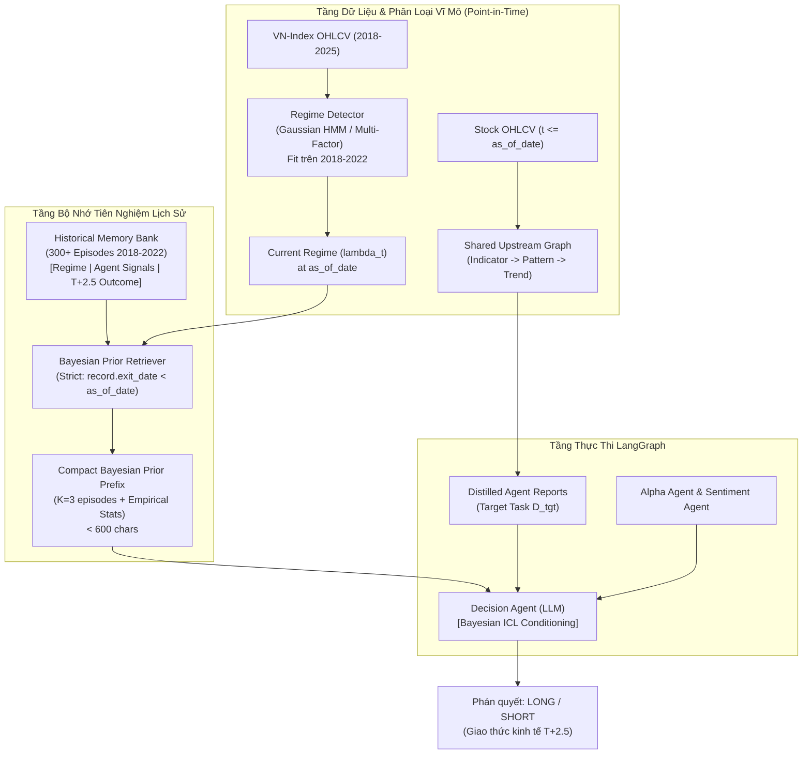

# KẾ HOẠCH NGHIÊN CỨU & TRIỂN KHAI KHÓA LUẬN TỐT NGHIỆP (10 TUẦN)

**Đề tài**: *Regime-Aware Multi-Task Bayesian In-Context Learning for Multi-Agent LLM Stock Trading in the Vietnamese Stock Market*  
**Dựa trên nền tảng**: Bài báo *Multi-Task Bayesian In-Context Learning* (Zhu, Oermann, Cho — ICML 2026) và Hệ thống Giao dịch Đa Agent LangGraph hiện có.  
**Mục tiêu tài liệu**: Thiết lập kế hoạch chi tiết cho **10 tuần** (mở rộng từ 8 tuần ngày 07/10/2026), tập trung vào nâng cấp hệ thống thực tế, kiểm chứng hiệu quả, tính liêm chính dữ liệu và tối ưu tài nguyên theo phạm vi KLTN. Giữ kết quả W1–W4 và cấu trúc phase/task W5; thêm W6–W7 để cải thiện/validation, dời benchmark/thống kê/luận văn sang W8–W10.

---

## MỤC LỤC
1. [Bối cảnh & Mục tiêu Nghiên cứu](#1-bối-cảnh--mục-tiêu-nghiên-cứu)
2. [Cơ sở Lý thuyết & Ánh xạ từ Paper Gốc](#2-cơ-sở-lý-thuyết--ánh-xạ-từ-paper-gốc)
3. [Kiểm toán Hiện trạng Repository (System Audit)](#3-kiểm-toán-hiện-trạng-repository-system-audit)
4. [Kiến trúc Hệ thống Đề xuất (Target Architecture)](#4-kiến-trúc-hệ-thống-đề-xuất-target-architecture)
5. [Thiết kế Thực nghiệm Khoa học Chuẩn KLTN](#5-thiết-kế-thực-nghiệm-khoa-học-chuẩn-kltn)
6. [Các Rào chắn P0 Bắt buộc (Safeguards & Zero-Leakage)](#6-các-rào-chắn-p0-bắt-buộc-safeguards--zero-leakage)
7. [Kế hoạch Thực hiện Chi tiết 10 Tuần (Deliverables Matrix)](#7-kế-hoạch-thực-hiện-chi-tiết-10-tuần-deliverables-matrix)
8. [Danh mục Tệp tin Cần Thêm Mới & Chỉnh Sửa](#8-danh-mục-tệp-tin-cần-thêm-mới--chỉnh-sửa)
9. [Kế hoạch Quản trị Rủi ro & Dự phòng (Contingency Plans)](#9-kế-hoạch-quản-trị-rủi-ro--dự-phòng-contingency-plans)

---

## 1. BỐI CẢNH & MỤC TIÊU NGHIÊN CỨU

### 1.1. Tính cấp thiết của đề tài
- **Thách thức của LLM trong giao dịch định lượng**: Các mô hình ngôn ngữ lớn (LLMs) khi được triển khai trong kiến trúc đa agent (Multi-Agent Trading) thường đưa ra quyết định ở dạng suy luận độc lập không điều kiện (Zero-Shot Unconditioned Reasoning). Khi thị trường chứng khoán Việt Nam chuyển pha mạnh mẽ (Regime Shift) — từ Uptrend thanh khoản cao sang Downtrend sụp đổ hoặc Sideway giằng co — các agent thị giác (Pattern, Trend) liên tục gặp bẫy giá (Bull/Bear Trap), trong khi các chỉ báo kỹ thuật (RSI, MACD) rơi vào trạng thái quá bán/quá mua kéo dài.
- **Giải pháp từ Paper ICML 2026**: Công trình của Zhu, Oermann và Cho (2026) chứng minh rằng việc đưa các tập dữ liệu phụ trợ làm **tiền tố ngữ cảnh (In-Context Prefix)** cho phép transformer thực hiện **suy diễn Bayes phân cấp (Amortized Hierarchical Bayesian Inference)**. Điều này cho phép người dùng điều khiển được phân phối tiên nghiệm (controllable prior) ở test-time mà **không cần fine-tune trọng số**, đồng thời mang lại sự ổn định vượt trội trong môi trường ít dữ liệu hoặc phân phối bị dịch chuyển.
- **Mục tiêu KLTN**: Thích ứng mô hình toán học này vào thị trường chứng khoán Việt Nam bằng cách xem:
  $$\text{Chế độ thị trường vĩ mô (Market Regime)} \iff \text{Siêu tham số tiên nghiệm } \lambda$$
  $$\text{Các chu kỳ giao dịch lịch sử trong quá khứ} \iff \text{Các nhiệm vụ tiên nghiệm } D^{(k)}_{\text{prior}}$$
  $$\text{Cửa sổ giao dịch hiện tại} \iff \text{Nhiệm vụ mục tiêu } D_{\text{tgt}}$$
  nhằm kiểm chứng liệu thông tin lịch sử theo regime có giúp Decision Agent
  ra quyết định kinh tế $T+2.5$ tốt hơn. Bản v1 hiện là ICL có lọc regime và
  tỷ lệ mẫu; chưa chứng minh LLM thực hiện posterior Bayes phân cấp hay
  confidence được hiệu chuẩn. W5–W7 bổ sung thống kê Bayes số học, kiểm
  chất lượng prior và đo đóng góp từng thành phần trước khi kết luận.

### 1.2. Giới hạn phạm vi (Scope Boundary for KLTN)
- **Không thương mại hóa**: Không xây dựng hệ thống đặt lệnh tự động thực tế (broker API gateway), không mô phỏng sổ lệnh khớp liên tục (order book L2/L3), không giao dịch phái sinh/bán khống.
- **Phạm vi dữ liệu**: Tập trung vào dữ liệu Daily EOD (End-Of-Day) của VN-Index và 4 cổ phiếu đại diện các nhóm ngành lớn; tận dụng cache tin tức CafeF có sẵn.
- **Phạm vi hạ tầng**: Khai thác mô hình LLM hosted qua Groq API (giữ nguyên stack hiện tại) kết hợp giải pháp nén token chặt chẽ; chạy thực nghiệm có checkpointing để chống quá tải quota.

---

## 2. CƠ SỞ LÝ THUYẾT & ÁNH XẠ TỪ PAPER GỐC

### 2.1. Tóm tắt mô hình toán học của Paper (Zhu et al. 2026)
Trong bài toán suy diễn tiên nghiệm phân cấp:
1. **Mức tập (Episode-level)**: Rút siêu tham số $\lambda \sim p(\lambda)$ từ phân phối meta-prior. $\lambda$ tham số hóa phân phối tiên nghiệm $p(w \mid \lambda)$ của các tham số ẩn $w$.
2. **Mức nhiệm vụ (Task-level)**: Rút độc lập $K+1$ tham số tác vụ $\{w^{(k)}\}_{k=1}^{K+1} \sim p(w \mid \lambda)$.
   - $K$ tác vụ đầu sinh ra $K$ tập dữ liệu phụ trợ: $D_{\text{prior}} = \{D^{(1)}, \dots, D^{(K)}\}$ với $D^{(k)} = \{(x^{(k)}_m, y^{(k)}_m)\}_{m=1}^M$.
   - Tác vụ thứ $K+1$ là tác vụ mục tiêu: $D_{\text{tgt}} = \{(x_j, y_j)\}_{j=1}^{t-1}$ và điểm truy vấn $x_t$.
3. **Phân phối dự báo hậu nghiệm (PPD)**:
   $$p(y_t \mid x_t, C_{t-1}, D_{\text{prior}}) \propto \int p(\lambda) d\lambda \left[ \int p(y_t \mid x_t, w_{\text{tgt}}) \prod_{j=1}^{t-1} p(y_j \mid x_j, w_{\text{tgt}}) p(w_{\text{tgt}} \mid \lambda) dw_{\text{tgt}} \right] \prod_{k=1}^K \left[ \int p(w^{(k)} \mid \lambda) \prod_{m=1}^M p(y^{(k)}_m \mid x^{(k)}_m, w^{(k)}) dw^{(k)} \right]$$
4. **Cơ chế tiền tố (Prefix Mechanism)**: Đưa toàn bộ $D_{\text{prior}}$ vào chuỗi ngữ cảnh:
   $$\langle\text{prior}\rangle D^{(1)} \dots \langle\text{prior}\rangle D^{(K)} \langle\text{target}\rangle (x_1, y_1), \dots, (x_{t-1}, y_{t-1}), x_t$$
   Transformer học cách trích xuất thông tin tiên nghiệm từ $D_{\text{prior}}$, cho phép thay đổi $D_{\text{prior}}$ ở thời điểm suy luận để điều khiển phân phối dự báo.

### 2.2. Ma trận Ánh xạ (Mapping Matrix) sang Giao dịch Chứng khoán

| Thành phần trong Paper (Zhu et al. 2026) | Thực thể tương đương trong KLTN Stock Trading | Hiện thực kỹ thuật trong Repository |
| :--- | :--- | :--- |
| **Meta-distribution $p(\lambda)$** | Không gian các chế độ thị trường vĩ mô Việt Nam | Bộ 4 trạng thái thị trường VN-Index (Bull, Bear, Choppy, Consolidation). |
| **Episode latent $\lambda$** | Macro-Regime của thị trường tại thời điểm quyết định | Vector đặc trưng: VN-Index MA20/50/200, Realized Volatility 20d, Breadth (% > MA20). |
| **Task latent $w^{(k)}$** | Ma trận hiệu quả/độ tin cậy của các chiến lược trong chu kỳ $k$ | Trọng số thực tế của tín hiệu Trend, Pattern, Alpha, Indicator, Sentiment trong chu kỳ đó. |
| **Prior Task $D^{(k)}_{\text{prior}}$** | Một chu kỳ giao dịch lịch sử $T+2.5$ thuộc cùng chế độ $\lambda$ | Bản ghi gồm vector tín hiệu của 5 agent tại $t_{\text{entry}}$ và kết quả kinh tế thực tế tại $t_{\text{exit}}$. |
| **Target Task $D_{\text{tgt}}$** | Chu kỳ giao dịch hiện tại đang cần dự báo | Báo cáo chi tiết của 5 agent hiện tại trên cửa sổ 45 nến của cổ phiếu mục tiêu. |
| **Prior Prefix $\langle\text{prior}\rangle D_{\text{prior}}$** | Bayesian Regime Prior Prefix (BRPP) | Khối prompt súc tích tóm tắt $K$ chu kỳ tương đồng nhất trong quá khứ kèm thống kê độ tin cậy của agent. |
| **Bayesian Concentration** | Hiệu ứng neo giữ suy luận khi tín hiệu xung đột | Khi 5 agent mâu thuẫn (bất định cao), LLM dựa vào BRPP để phạt nặng các tín hiệu thường xuyên dính bẫy giá trong regime đó. |

### 2.3. Phân định Rạch ròi Nguồn gốc Đóng góp (Contribution Taxonomy)

```
┌─────────────────────────────────────────────────────────────────────────────┐
│ 1. ĐẾN TỪ BÀI BÁO GỐC (Direct from Paper - Zhu et al. ICML 2026)            │
│  - Khung lý thuyết suy diễn Bayes phân cấp bằng In-Context Learning.        │
│  - Cơ chế nạp prior dưới dạng tiền tố tập dữ liệu D_prior trước target task.│
│  - Nguyên lý Bayesian Concentration & thích ứng trong vùng dữ liệu khan hiếm│
│  - Phương pháp kiểm chứng triệt tiêu prior (Ablation on K).                 │
└─────────────────────────────────────┬───────────────────────────────────────┘
                                      │ Thích ứng (Adaptation)
┌─────────────────────────────────────▼───────────────────────────────────────┐
│ 2. THÍCH ỨNG CHO BÀI TOÁN GIAO DỊCH (Domain Adaptation)                     │
│  - Chuyển từ cửa sổ không-thời gian khí tượng ERA5 sang cửa sổ chu kỳ T+2.5.│
│  - Chuyển từ vector số thực đầu vào sang định dạng token hóa dạng bảng      │
│    (Compact Tabular Tokenization) phù hợp với context window của LLM.       │
│  - Quy tắc phân cách thời gian ngặt nghèo (Temporal Cutoff: exit_date < t). │
└─────────────────────────────────────┬───────────────────────────────────────┘
                                      │ Đóng góp mới (Novel Extension)
┌─────────────────────────────────────▼───────────────────────────────────────┐
│ 3. ĐÓNG GÓP MỚI CỦA KHÓA LUẬN (Novel Extension for KLTN)                    │
│  - Point-in-Time Regime Memory Bank: Bộ nhớ chu kỳ giao dịch lịch sử kèm    │
│    vector tín hiệu đa agent cho thị trường Việt Nam.                        │
│  - Cross-Agent Dynamic Reliability Calibration: Cơ chế dùng tiên nghiệm để  │
│    tái định chuẩn trọng số tin cậy giữa Agent Thị giác và Agent Định lượng.  │
│  - Điểm kiểm tra rò rỉ tiên nghiệm (Test Regime Leakage Suite) bảo vệ 100%  │
│    tính khách quan của kết quả nghiên cứu.                                  │
└─────────────────────────────────────────────────────────────────────────────┘
```

---

## 3. KIỂM TOÁN HIỆN TRẠNG REPOSITORY (SYSTEM AUDIT)

### 3.1. Điểm mạnh đã được thẩm định
- **Quy chuẩn kinh tế chặt chẽ**: [core/backtest_engine.py](file:///c:/Users/Legion/OneDrive/Ta%CC%80i%20li%C3%AA%CC%A3u/GitHub/A-Multi-Agent-Large-Language-Model-Approach-to-Price-Driven-Stock-Trading-in-the-Vietnamese-Stock-Ma/core/backtest_engine.py) tuân thủ hợp đồng $T+2.5$ khép kín (mua Open ngày 1, bán Close ngày 3, tính đủ 0.25% phí + 0.10% trượt giá cả 2 chiều, short giữ cash).
- **Chống rò rỉ dữ liệu đã có**:
  - `AlphaSelector`: Chặn dùng nến tương lai qua `point_in_time_df` và `as_of_date` (được verify bởi `tests/test_alpha_leakage.py`).
  - `SentimentStore`: Loại bỏ hoàn toàn bài báo không ngày và bài báo sau ngày cutoff (verify bởi `tests/test_sentiment_leakage.py`).
- **Giao thức ghép cặp (Paired Protocol)**: Pha upstream (Indicator, Pattern, Trend) được tính toán 1 lần duy nhất rồi deep-copy sang các nhánh so sánh đối chứng, triệt tiêu phương sai ngoại lai của LLM.
- **Kiểm thử E2E xác định**: [scripts/run_end_to_end_test.py](file:///c:/Users/Legion/OneDrive/Ta%CC%80i%20li%C3%AA%CC%A3u/GitHub/A-Multi-Agent-Large-Language-Model-Approach-to-Price-Driven-Stock-Trading-in-the-Vietnamese-Stock-Ma/scripts/run_end_to_end_test.py) chạy mượt mà offline 100% pass trong 14.6s.

### 3.2. Điểm nghẽn học thuật (Methodological Gaps cần giải quyết)
1. **Thiếu tính thích ứng theo chế độ thị trường (Zero Regime-Awareness)**:
   - Toàn bộ pipeline hiện tại xử lý từng test point như các sự kiện độc lập trong môi trường dừng (stationary). 
   - Prompt của Decision Agent gán vai trò cố định: *"Alpha Agent có quyền Veto bẫy giá"*, *"Sentiment có trọng số thấp nhất"*. Khi thị trường bước vào Downtrend khốc liệt (như quý 2/2022), mô hình vẫn liên tục bắt đáy sai vì không có dữ liệu tiên nghiệm nhắc nhở rằng xác suất sụp gãy hỗ trợ trong giai đoạn này là trên 70%.
2. **Suy luận Zero-Shot không có bối cảnh lịch sử tương đồng**:
   - Decision Agent chỉ đọc báo cáo của 45 nến hiện tại mà hoàn toàn không có thông tin về việc *"Trong quá khứ, khi các agent đưa ra tổ hợp tín hiệu tương tự dưới điều kiện thị trường tương tự, kết quả thực tế là gì?"*.
3. **Giới hạn tốc độ và ngân sách Token (TPM/RPM Guard)**:
   - Các prompt của Decision Agent hiện đã được distill xuống ~3,500 – 4,000 ký tự. Bất kỳ sự mở rộng ngữ cảnh nào vượt quá 7,500 ký tự đều có nguy cơ kích hoạt mã lỗi HTTP 429 từ Groq API.

---

## 4. KIẾN TRÚC HỆ THỐNG ĐỀ XUẤT (TARGET ARCHITECTURE)

Hệ thống nâng cấp sẽ tích hợp luồng trích xuất chế độ thị trường và truy xuất tiên nghiệm Bayes vào kiến trúc LangGraph hiện có:



### 4.1. Chi tiết 3 Module Mới
1. **`core/regime_detector.py`**:
   - Sử dụng chuỗi log-return và độ biến động lịch sử 20 phiên của VN-Index.
   - Huấn luyện Gaussian HMM (4 trạng thái) trên dữ liệu 2018–2022.
   - Cung cấp hàm `get_market_regime(as_of_date)` trả về: `regime_id`, `regime_name`, `volatility_level`, `trend_strength`.
2. **`core/bayesian_memory.py`**:
   - Kho lưu trữ cấu trúc các chu kỳ lịch sử $T+2.5$ độc lập.
   - Mỗi record gồm:
     ```json
     {
       "episode_id": "FPT_20220415",
       "symbol": "FPT",
       "as_of_date": "2022-04-15",
       "regime": "BEAR_CRASH",
       "agent_signals": {
         "trend": "DOWN",
         "pattern": "BEARISH_ENGULFING",
         "alpha_consensus": "GIẢM",
         "indicator_consensus": "GIẢM",
         "sentiment": "NEUTRAL"
       },
       "outcome": {
         "actual_direction": "DOWN",
         "net_return_pct": -4.2,
         "was_bull_trap": false,
         "result": "LOSS_IF_LONG"
       }
     }
     ```
3. **`core/bayesian_retriever.py`**:
   - Nhận vào `symbol`, `as_of_date`, `current_regime` và tham số $K$ (mặc định $K=3$).
   - Lọc tất cả record trong memory có `record.exit_date < as_of_date` trước xếp hạng/thống kê; chế độ Bayesian lọc thêm `record.regime == current_regime`.
   - Tính toán thống kê Bayes kinh nghiệm:
     - Tỷ lệ false breakout của Trend/Pattern trong regime này.
     - Tỷ lệ thành công của các lệnh LONG trong regime này.
   - Định dạng thành chuỗi Markdown cô đọng (dưới 600 ký tự).

---

## 5. THIẾT KẾ THỰC NGHIỆM KHOA HỌC CHUẨN KLTN

### 5.1. Dữ liệu & Danh mục Cổ phiếu (Universe)
Phạm vi dự kiến trong 10 tuần; cỡ mẫu phải được đối chiếu quota và độ bất định:
- **Tập cổ phiếu (4 mã đại diện)**:
  1. `FPT`: Nhóm Công nghệ / Vốn hóa lớn / Nhạy cảm vừa.
  2. `VNM`: Nhóm Tiêu dùng phòng thủ / Thường xuyên dao động tích lũy mean-reverting.
  3. `VCB`: Nhóm Ngân hàng / Chi phối chỉ số VN-Index lớn nhất.
  4. `MWG`: Nhóm Bán lẻ / Nhạy cảm cao với chu kỳ kinh tế vĩ mô.
- **Tập dữ liệu thời gian**:
  - Giai đoạn Huấn luyện HMM & Khởi tạo Memory Bank: `2018-01-01` $\rightarrow$ `2022-12-31`.
  - Phạm vi ngoài train: `2023-01-01` $\rightarrow$ `2024-12-31`.
    **2023 là development/thăm dò**, gồm pilot đã xem; **2024 là holdout xác nhận**.
    Không dùng outcome/dự báo 2024 chọn ngưỡng, prompt, K hay ứng viên.
    Mẫu holdout chọn theo lịch/eligibility, khóa ở W5; protocol cuối khóa W7.
  - Validation cuốn chiếu trong 2020–2022 dùng model/scaler `historical_prefix`
    fit trước query và purge chu kỳ vượt cutoff; không dùng artifact cuối 2022
    cho query sớm hơn. Memory Bank 852 episode vẫn đóng băng, PIT lọc tại mỗi query.

### 5.2. Các Baseline Đối chứng (Ablation Matrix)
Giữ năm biến thể v1 của pilot để tái lập, so sánh trên cùng điểm ghép cặp:

Bản v1 dùng `signal_match_v1` (bốn nhãn rời rạc), không phải KNN trên đặc
trưng giá liên tục. W6 tích hợp nhánh **`bayesian_v2`** riêng: posterior
thống kê, gate bằng chứng, retrieval/Decision có version. Phương án chính
cho W8 là **sáu nhánh** (năm v1 +v2), upstream một lần dùng chung cả sáu.
Runner/schema/identity v1 hiện khóa năm nhánh nên phải mở hợp đồng mới và
kiểm thử ở W6; không chèn nhánh thứ sáu vào checkpoint W4. W5-11 dự toán
8N HTTP tối thiểu; W7 chỉ khóa ma trận cuối khi quota/thời hạn khả thi.
Nếu cần rút gọn, chốt trước API thành Original/v1/v2 cùng shared upstream,
công bố thay đổi phạm vi; không bỏ đối chứng sau khi thấy kết quả.

```
┌─────────────────────────────────────────────────────────────────────────────┐
│ 1. Original / Zero-Shot (K=0)       : Hệ thống hiện tại trong Repo.         │
│ 2. Random Prior (K=3)               : Lấy ngẫu nhiên 3 tasks lịch sử.       │
│ 3. Recent Prior (K=3)               : Lấy 3 tasks diễn ra gần nhất.         │
│ 4. Similarity-based Prior (K=3)     : Khớp bốn tín hiệu rời rạc v1.        │
│ 5. Proposed Bayesian ICL (K=3)      : Lấy 3 tasks theo Bayesian Macro-Regime│
└─────────────────────────────────────────────────────────────────────────────┘
```

### 5.3. 3 Kịch bản Thử nghiệm Cốt lõi (Core Research Experiments)
1. **Experiment 1: Regime-Shift Robustness (Kiểm định chuyển dịch pha thị trường)**
   - Tập trung vào giai đoạn VN-Index điều chỉnh mạnh và đi ngang tích lũy biên lớn (quý 3–4/2023 và tháng 4/2024).
   - Đo lường mức sụt giảm tài khoản lớn nhất (Max Drawdown) và tỷ lệ tránh bẫy giá mua đuổi (False Breakout Avoidance Rate).
2. **Experiment 2: High-Uncertainty / Low-Evidence Behavior (Vùng bất định cao)**
   - Lọc các test point mà sự đồng thuận giữa các agent $\le 60\%$ (các agent đánh nhau).
   - Đo lường sự thay đổi của phương sai dự báo và mức độ hồi phục độ chính xác khi có Prior Prefix hỗ trợ.
3. **Experiment 3: Sensitivity to Prior Evidence (Ablation trên $K$)**
   - Ưu tiên $K \in \{0, 1, 3\}$; K=5 chỉ là mở rộng nếu có contract mới,
     BRPP ≤600, prompt <6.500 và đủ quota, không là gate bắt buộc.
   - Tách stats-only, examples-only, full prior và gate bằng chứng trên tập
     development. Kiểm giả thuyết giảm sai số/bất định; không mặc định LLM
     có PPD hiệu chuẩn hoặc coi kết quả pilot là bằng chứng shrinkage.

### 5.4. Tiêu chí Đánh giá (Evaluation Metrics)
- **Chỉ số Dự báo**: Accuracy, balanced accuracy, Long hit-rate, số LONG/CASH
  và bất đồng paired. Brier/calibration chỉ tính khi có xác suất được định
  nghĩa và kiểm ngoài thời gian; confidence dạng chữ không là xác suất.
- **Chỉ số Kinh tế (Sau phí 0.25% & trượt giá 0.10%)**: Tỷ suất lợi nhuận kép (Cumulative Return %), Số dư cuối kỳ (VND từ 50,000,000 VND ban đầu), Tỷ lệ Sharpe, Tỷ lệ Sortino, Max Drawdown (MDD %).
- **Kiểm định Ý nghĩa Thống kê**: McNemar Test $p$-value (so sánh tỷ lệ đúng/sai), Wilcoxon Signed-Rank Test (so sánh phân phối lợi nhuận), Block-Bootstrap 95% Confidence Interval.
- **Tiêu chí chính**: chênh return ròng paired so Original trên holdout;
  báo cáo MDD/số giao dịch và CASH làm tham chiếu. Kiểm annualization cho
  return theo chu kỳ trước benchmark. CI/test xử lý phụ thuộc thời gian và
  cùng ngày giữa mã; khai báo so sánh chính và điều chỉnh nhiều so sánh.
  Gate kỹ thuật PASS không yêu cầu lợi nhuận dương hoặc Bayesian vượt Original.
- **Hợp đồng W5-04, 08/10/2026**: primary là ΔR v2–Original từng mã và
  trung bình đều bốn mã (không là return portfolio). Mỗi mã ×nhánh dùng
  tài khoản riêng 50 triệu; thiếu điểm/nhánh thì primary xác nhận chưa tính.
  Report v2 dùng Sharpe/Sortino theo chu kỳ, annualized=null; không dùng
  √252 trên return chu kỳ. Công thức, xử lý biên và version tại
  [README W5](week5/README.md#hợp-đồng-vận-hành-và-đánh-giá--w5-04-chốt-08102026);
  triển khai report/runtime v2 còn thuộc Phase B.

---

## 6. CÁC RÀO CHẮN P0 BẮT BUỘC (SAFEGUARDS & ZERO-LEAKAGE)

Các rào chắn kỹ thuật này phải được khóa chặt bằng code và test trước khi chạy bất kỳ benchmark nào:

| Mã rào chắn | Tên rủi ro | Hậu quả nếu vi phạm | Giải pháp bắt buộc trong Code |
| :---: | :--- | :--- | :--- |
| **P0-1** | **Prior Lookahead Leakage** | Kết quả gian lận, mất tính học thuật do retriever nhìn thấy tương lai. | Kiểm tra cứng: `record.exit_date < current_test_point.as_of_date`, lọc trước ranking/stats. Ném `ValueError` ngay lập tức nếu vi phạm. Viết unit test tự động dò quét. |
| **P0-2** | **Horizon Mismatch** | Tiên nghiệm học sai phân phối, tính toán sai xác suất bẫy giá. | Mọi record lịch sử trong Memory Bank phải được gắn nhãn bằng đúng hàm `compute_round_trip_net_return` ($T+2.5$) của engine. |
| **P0-3** | **Context Window / Quota Overrun** | Groq trả về HTTP 429, gián đoạn backtest, LLM bị "Lost in the middle". | Format BRPP dạng bảng tối đa 600 ký tự. Có cơ chế fallback về `_cap_report` nếu tổng prompt vượt 6,500 ký tự. |
| **P0-4** | **Regime Detector Leakage** | Mô hình regime nhìn thấy biến động tương lai. | Train-validation dùng historical_prefix chỉ fit tới cutoff từng fold/query; model/scaler OOS đóng băng trên train kết thúc trước 2023. Không dùng artifact cuối 2022 cho query train sớm hơn, không refit bằng holdout. |

---

## 7. KẾ HOẠCH THỰC HIỆN CHI TIẾT 10 TUẦN (DELIVERABLES MATRIX)

```
W1 Đặc tả → W2 Regime/Memory → W3 Retriever/Prefix → W4 Tích hợp/Pilot
   → W5 Vận hành/Nền tảng v2 → W6 Thuật toán → W7 Validation/Khóa phiên bản
   → W8 Benchmark → W9 Thống kê/Ablation → W10 Luận văn/Bảo vệ
```

### 📅 TUẦN 1: Đặc tả và dữ liệu — HOÀN THÀNH

- [Checklist/tiến độ](week1/README.md), [kiểm toán dữ liệu](week1/data_audit.md).
- Daily EOD VNINDEX/FPT/VNM/VCB/MWG 2018–2025, nguồn VCI/KBS và manifest/checksum.
- Schema HistoricalTaskRecord/MarketRegimeState; bảo toàn kinh tế T+2.5, PIT và paired.
- CSV W1 là giá điều chỉnh, không dùng trực tiếp cho nhãn/P&L chính thức.

### 📅 TUẦN 2: Regime và Memory Bank — HOÀN THÀNH 17/17

- [Checklist/tiến độ](week2/README.md); đóng ngày 04/10/2026.
- [Gate giá thô 2018–2022](week2/phase_a_price_gate.md), 868 ứng viên/852 hợp lệ.
- [HMM và API PIT](week2/phase_b_regime_detector.md), artifact/prefix train-only.
- [Memory Bank/phát hành/QA/hướng dẫn chạy](week2/phase_c_memory_generation.md):
  852 episode, hash kho `09b48c6192a092b562173e8b3b7eceb44025c6e02454093e34214a730a460949`.
- Biểu đồ train/PIT tại `outputs/vnindex_regimes_2018_2022.png` và `.svg`.
- Nghiệm thu W2: compileall/E2E, 235 unit/38 leakage PASS. Episode quyết định
  2020–2022 vì warm-up; sentiment NEUTRAL vì thiếu tin; chưa mở giá OOS.

### 📅 TUẦN 3: Retriever và BRPP — HOÀN THÀNH 16/16

- [Checklist/tiến độ](week3/README.md); đóng ngày 05/10/2026.
- [API/query/result](week3/retriever_api_contract.md),
  [luật similarity/selection](week3/prior_selection_method.md),
  [thống kê/BRPP](week3/statistics_and_prefix_contract.md).
- Bốn mode, K=0..3/seed=42/same_symbol; lọc exit_date < as_of_date trước ranking.
- Stats từ toàn population cùng regime/scope/cutoff, Original K=0 không BRPP/stats.
- Nghiệm thu W3: compileall/E2E, 339 unit/56 leakage PASS; smoke 288 query +
  288 lượt lặp/32 context. Tích hợp runtime và cap/guard hoàn tất ở W4.

### 📅 TUẦN 4: Tích hợp và kiểm chứng — HOÀN THÀNH 16/16

- [Checklist/tiến độ và p95](week4/README.md),
  [API/vận hành/resume/bàn giao W5](week4/week_close_and_handoff.md).
- State/config, graph/Decision, adapter PIT hai provider, paired năm nhánh,
  walk-forward/checkpoint durable và verifier semantic đã tích hợp.
- Cap báo cáo 4.000, BRPP ≤600, prompt <6.500; prior mặc định tắt.
- Nghiệm thu sau tối ưu 07/10/2026: compileall/E2E, **502 unit/93 leakage PASS**,
  smoke 8 synthetic + 6 observed replay với Decision giả PASS.
- Retrieval p95 Bayesian/Random/Recent/Similarity: **11,559/10,837/10,927/13,235 ms**,
  đều <30 ms trên phiên bản/máy đã đo. Receipt trước/sau giữ nguyên trong
  [ZIP bằng chứng](implementation_evidence.zip); không suy ra hiệu quả đầu tư OOS.
- Đã mở giá OOS riêng VCI/KBS cho bốn mã, kiểm model train-only từ prefix,
  khóa 20 cutoff FPT và triển khai CLI/pacing/telemetry. Chủ tài khoản xác nhận
  quota hai model; preflight text/vision thật PASS. Bản triển khai: compile/E2E,
  521 unit/93 leakage PASS. Pilot **20/20 điểm, 100 Decision structured**, verifier
  offline complete PASS; toàn bộ gate W4 đã đóng. Điểm 16 có ngoại lệ upstream
  chạy lại một lần do người dùng xác nhận, có audit; 75 Decision cũ nguyên byte.
  0 HTTP 429; text 194.218 token, vision 102.034 tính cả reserve chưa rõ kết quả,
  đều dưới 200.000 TPD/model. Chốt lịch/quota riêng trước benchmark W8.

Tiến độ chỉ cập nhật ở README từng tuần. Tài liệu độc lập giữ cho hướng dẫn
vận hành/phương pháp; JSON còn rời là schema/QA/fixture mà code hoặc test cần.
Receipt lịch sử và nhật ký task đã đóng gói nguyên byte trong ZIP bằng chứng,
không tạo thêm file kiểm chứng chỉ để lặp lại cùng kết quả.

### 📅 TUẦN 5: Hoàn thiện vận hành và nền tảng Bayesian v2 — PHASE A PASS, 4/16

- [Checklist, task chi tiết và tiến độ](week5/README.md).
- **W5-01 DONE, 07/10/2026**: verifier offline 20/20, 100 Decision;
  code/nguồn/runtime khớp W4, 15 điểm/75 Decision cũ nguyên byte, audit và
  reserve unknown 5.535 còn đầy đủ. Đã ghi baseline và cách kiểm lại W4;
  compileall/E2E, 521 unit/93 leakage PASS.
- **W5-02 DONE, 07/10/2026**: đối chiếu summary từ 20 checkpoint; bảng
  accuracy/LONG/SHORT/hit-rate/tài khoản/MDD năm nhánh và coverage trong README.
  Cả năm nhánh lỗ; Original accuracy 55%, Bayesian 50%; mẫu đầu 2023, sentiment
  toàn NEUTRAL. Giữ pilot v1; rà annualization ở W5-04.
- **W5-03 DONE, 07/10/2026**: CLI `scripts/analyze_prior_run.py` đọc
  checkpoint/ledger/audit, đối soát 146 HTTP 200 +một unknown và charged
  text 194.218/vision 102.034; giữ reserve 5.535. Trace 1/20 bất đồng,
  chênh return −2,241809 điểm phần trăm; timer/role thiếu để null.
  Verifier 20/20, 82 file bất biến; compileall/E2E, **536 unit/93 leakage PASS**.
- **W5-04 DONE, 08/10/2026; Gate A PASS**: chốt hợp đồng vận hành/v2,
  split train/2023/2024, primary ΔR theo mã và trung bình đều bốn mã;
  metric chu kỳ, annualized=null, evidence/gate và telemetry có version.
  Requirements giao cho W5-05–08/13–15; runtime v2 chưa triển khai.
  Compileall/E2E, 536 unit/93 leakage PASS; 82 file khớp baseline W5-03.
  Tiếp theo W5-05 (Phase B).
- **Kế thừa W4**: CLI pilot, FPT 20 điểm/100 Decision, telemetry/quota và
  cap đã PASS. Kết quả giữ tại `outputs/pilot_fpt_run/`, ledger/audit tại
  `outputs/oos_pilot/`; tổng hợp ở [README W4](week4/README.md).
- **Chẩn đoán 07/10/2026**: 19/20 action v1 giống Original; duy nhất FPT
  20/02/2023 Original CASH nhưng v1 LONG, net −2,3766%. Prior có n=62,
  win-rate 40,3%, ba ví dụ score=1 đều lỗ. Vì vậy cần kiểm cách dùng bằng
  chứng, không chỉ tăng K/support; mẫu này chưa kết luận Bayes thất bại.
- **Mục tiêu mới**: hoàn thiện đường chạy dài, triển khai nền tảng v2 và
  phân hoạch train/2023-development/2024-holdout; không chạy lại pilot hoặc
  sửa bank/model để tính tiến độ. Thay đổi plan chưa là task triển khai DONE.
- **Nhiệm vụ cụ thể**:
  - [x] Phase A, W5-01–04: baseline, chỉ số/telemetry, audit bất đồng, hợp đồng v2 và metric/phân hoạch.
  - [ ] Phase B, W5-05–08: quota, atomic I/O, đối soát upstream, CLI bốn mã và 08.a–d posterior/gate/prefix v2.
  - [ ] Phase C, W5-09–12: coverage, lịch cohort tách pilot/smoke/holdout, ngân sách v1/v2 và manifest/dry-run.
  - [ ] Phase D, W5-13–16: fault/resume/leakage tests, smoke thật giới hạn bốn điểm, nghiệm thu và bàn giao W6.
- **Deliverables cuối W5**: CLI/audit dùng lại được, code Beta–Binomial/gate
  chất lượng/prefix có version và trace kiểm offline; lịch phân hoạch bốn mã,
  nguồn/quota; checkpoint smoke v1 4 điểm/20 Decision và verifier;
  bốn gate kỹ thuật PASS. Hiệu quả v2 còn chờ W6–W9.
- **Điều kiện chuyển W6**: tất cả gate W5 PASS. Nếu quota/thời hạn không đủ,
  chốt nâng quota, gia hạn hoặc mẫu rút gọn theo lịch trước API; ghi rõ thay
  đổi phạm vi. Không đổi model/K/key để né quota hay ép identity checkpoint cũ.
- Chỉ thêm `week5/README.md` làm sổ tiến độ; output runtime gitignore,
  không tạo receipt theo từng task.

### 📅 TUẦN 6: Cải thiện retrieval và cách Decision sử dụng bằng chứng — MỚI, TODO

- **Mục tiêu**: triển khai ứng viên v2 có thể đo được, kế thừa code W5;
  ưu tiên hạn chế đã quan sát thay vì tăng số ví dụ hoặc đổi model tùy ý.
- **Đầu vào bắt buộc**: gate W5 PASS; contract v2 và train/development/holdout
  đã tách, quota cho validation được dự toán. Giới hạn danh sách ứng viên
  trước chạy, không thử vô hạn đến khi thấy lời.
- **Nhiệm vụ cụ thể**:
  - [ ] Thêm đặc trưng giá PIT gọn (biến động, khoảng cách MA, momentum)
    và scaler train-only; lưu auxiliary index/hash riêng, không sửa 852 episode.
    Chốt metric mới, so với signal_match_v1; outcome không tham gia ranking.
  - [ ] Thử độ mới/đa dạng theo ngày, loại ví dụ quá giống nhau; tuổi tính
    tại query. Không ưu tiên WIN/LOSS hoặc cố chọn ba bull trap.
  - [ ] Tính thống kê điều kiện theo regime+tín hiệu với support/uncertainty,
    shrink về population khi support ít theo luật đã khóa. Không coi K=3
    là toàn bộ population hoặc bốn tín hiệu cùng cycle là bốn quan sát.
  - [ ] Cải thiện contract Decision: đối chiếu tín hiệu hiện tại với bằng
    chứng lịch sử, lưu evidence/source và khuyến nghị gốc. Thử stats-only,
    examples-only, full prior; không thêm vòng LLM để ép đồng ý.
  - [ ] Nếu thử policy số học chặn LONG, đặt thành ablation riêng với
    `raw_action`, `executed_action`, lý do và policy hash; ngưỡng chọn bằng
    train/2023. Không gán lợi ích của risk gate thành lợi ích riêng của ICL;
    không ép SHORT theo ca 20/02 hoặc coi win-rate là expected net return.
  - [ ] Mở protocol/schema/runner version mới cho v1+v2 cùng upstream;
    giữ Original prompt và năm nhánh v1, kiểm resume/semantic/caps/p95.
- **Deliverables cuối W6**: code v2 tích hợp trên đường CLI chính, trace
  kiểm được, danh sách ứng viên nhỏ và fixture/validation train PIT;
  compileall/unit/E2E/leakage PASS. Không sửa pilot hoặc chạy holdout 2024.

### 📅 TUẦN 7: Validation và khóa ứng viên/giao thức benchmark — MỚI, TODO

- **Mục tiêu**: chọn phiên bản bằng train/development, phân biệt cải thiện
  thuật toán, prompt và chính sách giao dịch; khóa trước đánh giá cuối.
- **Nhiệm vụ cụ thể**:
  - [ ] Validation cuốn chiếu 2020–2022 có purge/embargo phù hợp horizon,
    model/scaler đúng prefix. Chạy cohort 2023 đã khóa, không mở outcome 2024
    cho người/thuật toán lựa chọn phiên bản; upstream chỉ một lần/point.
  - [ ] So v1/v2/Original và ablation đã định trên common support; đọc
    net return, MDD, balanced accuracy, số giao dịch/CASH và các bất đồng.
    Đánh giá ca LONG bất chấp cảnh báo trên nhiều điểm, không chỉ pilot FPT.
  - [ ] Chốt một ứng viên, tham số/prompt/K/policy/model và mục tiêu kiểm định.
    Nếu không có lợi ích ổn định, ghi rõ và dùng phiên bản đã đăng ký để đo
    holdout; không coi validation thắng là bằng chứng hiệu quả cuối.
  - [ ] Đối chiếu quota cho sáu nhánh; nếu không đủ, chốt phương án rút gọn
    hoặc gia hạn trước API. Giữ ledger chung, unknown reserve và ngân sách
    ablation/smoke/preflight riêng. Hai tuần bổ sung không tăng quota API.
  - [ ] Khóa manifest sources/cohort 2024 từ W5 +code/schema/runtime/config
    cuối, run mới; offline dry-run/verifier/fault và bốn gate kỹ thuật PASS.
- **Deliverables cuối W7**: ứng viên/policy có version, ma trận/cỡ mẫu/lịch
  quota cuối khả thi, lệnh thật chuẩn bị/run/verify/resume và gate mở W8.
  Chưa khóa đủ thì BLOCKED; không đổi checkpoint cũ để tiếp tục cấu hình mới.

### 📅 TUẦN 8: Thực thi Ma trận Đánh giá Toàn diện (Full Benchmark Execution)

- **Mục tiêu**: hoàn thành benchmark bốn mã bằng phiên bản/giao thức W7.
  Giữ cấu trúc công việc benchmark của W6 cũ, dời lịch sang W8.
- **Đầu vào bắt buộc**: gate W7 PASS; cohort 2024 holdout và ma trận đã khóa;
  kết quả 2023 báo riêng là development, pilot/smoke không vào primary sample.
- **Nhiệm vụ cụ thể**:
  - [ ] Chạy `FPT`, `VNM`, `VCB`, `MWG` theo lịch, một upstream/point
    deep-copy cho mọi nhánh; checkpoint/ledger/guard HTTP chung.
  - [ ] Resume phần durable, đối soát unknown, kiểm source/PIT/identity và
    P&L từng mã. Lỗi giữ trong plan, không thay bằng ngày dễ hơn hoặc CASH giả.
  - [ ] Verifier semantic offline toàn run; báo common support, missing,
    structured source và usage/cap thực tế. Không hiệu chỉnh ứng viên từ
    kết quả 2024 rồi gọi lại đó là holdout chưa quan sát.
- **Deliverables cuối W8**: kết quả tại `outputs/bayesian_benchmark/` theo
  cohort/version, đủ common support hoặc ghi rõ thiếu và gate chưa đóng;
  dữ liệu thực nghiệm gitignore, README tiến độ gọn không receipt trùng lặp.

### 📅 TUẦN 9: Phân tích Thống kê, Ablation và Xuất Biểu đồ

- **Mục tiêu**: giữ nhóm việc thống kê của W7 cũ; kết luận từ dữ liệu thực,
  kể cả không cải thiện hoặc độ bất định lớn.
- **Nhiệm vụ cụ thể**:
  - [ ] Sensitivity K=0/1/3 và các ablation đã khóa; K=5 chỉ khi có
    contract/cap/quota và đã đăng ký trước run. Thử thêm sau xem holdout
    phải đánh dấu exploratory, không sửa claim kiểm định chính.
  - [ ] McNemar, Wilcoxon và block-bootstrap CI; bootstrap theo thời gian
    giữ ghép cặp/cụm cùng ngày giữa mã, xét phụ thuộc và nhiều so sánh.
  - [ ] Bảng accuracy/balanced accuracy, kinh tế sau phí/MDD/CASH/participation,
    theo mã/regime; calibration chỉ khi có xác suất định nghĩa hợp lệ.
    Kiểm định không đủ lực thì báo inconclusive, không dùng p>0,05 để nói ngang nhau.
  - [ ] Xuất bảng LaTeX, equity/drawdown và phân bố paired differences;
    dùng vector cho hình khoa học, ≥300 DPI nếu cần raster.
- **Deliverables cuối W9**: `docs/figures/`, `outputs/tables_summary.tex`,
  báo cáo định lượng gắn cohort/config và giới hạn thực nghiệm; không chọn
  chỉ mã/regime thắng để chứng minh giả thuyết.

### 📅 TUẦN 10: Hoàn thiện Luận văn KLTN và Slide Bảo vệ

- **Mục tiêu**: giữ nhóm việc luận văn của W8 cũ, trình bày đóng góp đã có.
- **Nhiệm vụ cụ thể**:
  - [ ] Chương 3: phân biệt Bayes phân cấp từ lý thuyết, ICL v1,
    posterior thống kê v2, retrieval và policy riêng; không khẳng định
    LLM tự thực hiện posterior hiệu chuẩn khi chưa đo được.
  - [ ] Chương 4: bảng/biểu đồ 2024 xác nhận tách 2023 phát triển,
    case studies, kiểm định/CI, chi phí quota và giới hạn tin/replay/proof.
  - [ ] Kết luận, hướng phát triển, kiểm đường dẫn/checksum và khả năng
    tái lập bằng code/data version đã ghim.
  - [ ] 25–30 slide về vấn đề, phương pháp, triển khai, kết quả thực tế và
    giới hạn; không đặt yêu cầu phải có kết quả vượt trội để bảo vệ.
- **Deliverables cuối W10**: toàn văn Word/LaTeX/PDF và slide bảo vệ,
  hướng dẫn chạy/verify; tài liệu tuần đặt tại `docs/plan/week<N>/`.

---

## 8. DANH MỤC TỆP TIN CẦN THÊM MỚI & CHỈNH SỬA

### 8.1. Các tệp tin thêm mới hoàn toàn
1. **`core/regime_detector.py`**:
   - `class MarketRegimeDetector`: Quản lý mô hình HMM và bộ quy tắc phân loại vĩ mô VN-Index.
   - `def classify_regime(df_historical, as_of_date) -> Dict[str, Any]`.
2. **`core/bayesian_memory.py`**:
   - `class HistoricalMemoryStore`: Cấu trúc nạp, lưu và truy vấn các chu kỳ giao dịch lịch sử.
   - `def build_offline_memory_bank(...) -> None`.
3. **`core/bayesian_retriever.py`**:
   - `class BayesianPriorRetriever`: Điều phối việc tìm kiếm và lọc dữ liệu prior theo chế độ.
   - `def format_prior_prefix(tasks, empirical_stats) -> str`.
4. **`tests/test_regime_leakage.py`**:
   - Bộ kiểm thử tự động xác minh: không có bất kỳ tác vụ nào trong quá khứ có `exit_date >= as_of_date` được phép lọt vào tiền tố prior.
5. **`scripts/run_bayesian_ablation.py`**:
   - Runner thực nghiệm chạy tự động 5 baseline trên danh mục cổ phiếu với checkpointing.

### 8.2. Các tệp tin cần chỉnh sửa trong Repo
1. **[agents/agent_state.py](file:///c:/Users/Legion/OneDrive/Ta%CC%80i%20li%C3%AA%CC%A3u/GitHub/A-Multi-Agent-Large-Language-Model-Approach-to-Price-Driven-Stock-Trading-in-the-Vietnamese-Stock-Ma/agents/agent_state.py)**:
   - Thêm các trường kiểu dữ liệu TypedDict: `market_regime`, `prior_tasks`, `bayesian_prior_context`.
2. **[agents/decision_agent.py](file:///c:/Users/Legion/OneDrive/Ta%CC%80i%20li%C3%AA%CC%A3u/GitHub/A-Multi-Agent-Large-Language-Model-Approach-to-Price-Driven-Stock-Trading-in-the-Vietnamese-Stock-Ma/agents/decision_agent.py)**:
   - Chỉnh sửa hàm `_build_prompt_vi` và `_build_prompt_en`: Nhận chuỗi `bayesian_prior_context` và đặt khối tiền tố ngay trước các báo cáo phân tích hiện tại.
   - Bổ sung nguyên tắc suy luận Bayes: Hướng dẫn LLM điều chỉnh độ tin cậy của Agent dựa trên thống kê sai số lịch sử trong cùng regime.
3. **[utils/graph_setup.py](file:///c:/Users/Legion/OneDrive/Ta%CC%80i%20li%C3%AA%CC%A3u/GitHub/A-Multi-Agent-Large-Language-Model-Approach-to-Price-Driven-Stock-Trading-in-the-Vietnamese-Stock-Ma/utils/graph_setup.py)**:
   - Mở rộng cấu hình `ABLATION_CONFIGS` để hỗ trợ cờ `enable_bayesian_prior`.
4. **[core/backtest_engine.py](file:///c:/Users/Legion/OneDrive/Ta%CC%80i%20li%C3%AA%CC%A3u/GitHub/A-Multi-Agent-Large-Language-Model-Approach-to-Price-Driven-Stock-Trading-in-the-Vietnamese-Stock-Ma/core/backtest_engine.py)**:
   - Trong `_run_single`: Tích hợp bước gọi `regime_detector` và `bayesian_retriever`, nạp context vào state trước khi gọi nhánh Decision.
   - Trong `TestPoint`: Lưu lại `regime_name` và `prior_episode_ids` phục vụ thống kê phân nhóm.
5. **[default_config.py](file:///c:/Users/Legion/OneDrive/Ta%CC%80i%20li%C3%AA%CC%A3u/GitHub/A-Multi-Agent-Large-Language-Model-Approach-to-Price-Driven-Stock-Trading-in-the-Vietnamese-Stock-Ma/default_config.py)**:
   - Khai báo các tham số mặc định: `k_prior_tasks: 3`, `regime_model_type: "hmm"`, `memory_store_path: "data_manager/regime_memory_store.json"`.

---

## 9. KẾ HOẠCH QUẢN TRỊ RỦI RO & DỰ PHÒNG (CONTINGENCY PLANS)

| Tình huống rủi ro | Mức độ | Kế hoạch dự phòng (Plan B) |
| :--- | :---: | :--- |
| **Groq API quá tải hoặc quota không đủ** | Cao | Guard tại HTTP, reserve input/output/unknown, backoff theo retry-after; dừng giữ checkpoint và resume sau cửa sổ quota. Đối chiếu giới hạn thực tế trước run. Đổi key cùng tổ chức không reset quota; đổi model hoặc K phải là thí nghiệm/run mới, không fallback giữa ma trận đã khóa. |
| **Gaussian HMM không phân tách rõ chế độ** | Trung bình | Giữ artifact và giao thức đang kiểm định; ghi giới hạn/coverage. Rule-based regime chỉ được đưa vào thí nghiệm đối chứng riêng, chốt và hiệu chỉnh bằng train trước OOS, không thay detector dựa trên kết quả test. |
| **Thiếu tin lịch sử có ngày hợp lệ** | Trung bình | Kiểm coverage từng mã/cutoff; giữ NEUTRAL kèm lý do khi thiếu bằng chứng, bỏ tin không ngày/tương lai. Pilot hiện toàn NEUTRAL; không giả định cache bốn mã đầy đủ hoặc dùng tin hiện tại bù quá khứ. |
| **Benchmark bốn mã vượt thời hạn** | Cao | Tính cỡ mẫu/token/số ngày ở W5-11, khóa lịch ở W5-12; chạy tuần tự có checkpoint/ledger/khóa quota chung. Nếu không khả thi, gia hạn/nâng quota hoặc chốt mẫu rút gọn trước run và công bố phạm vi; không dùng nhiều terminal/key để vượt ngân sách tổ chức. |
| **Upstream chưa rõ kết quả hoặc checkpoint lỗi Windows** | Cao | Dừng để kiểm stage/hash/owner; dùng response durable nếu có, giữ unknown reserve. Không tự replay upstream/Full AMBIGUOUS hoặc xóa lock sống; replay cần xác nhận cụ thể và audit. Retry atomic I/O có giới hạn, giữ bằng chứng cũ. |

---

## 10. KẾT LUẬN

Lộ trình **10 tuần** giữ nền tảng kinh tế/PIT/paired đã nghiệm thu và thêm
thời gian triển khai, kiểm chứng v2 trước benchmark. Đóng góp được xác định
qua code có thể tái lập và thực nghiệm có đối chứng; kết quả tốt, kém hoặc
chưa đủ bằng chứng đều được báo cáo. Không dùng việc chốt tuần/gate kỹ thuật
để thay cho chứng minh ưu thế đầu tư hoặc posterior LLM đã hiệu chuẩn.
