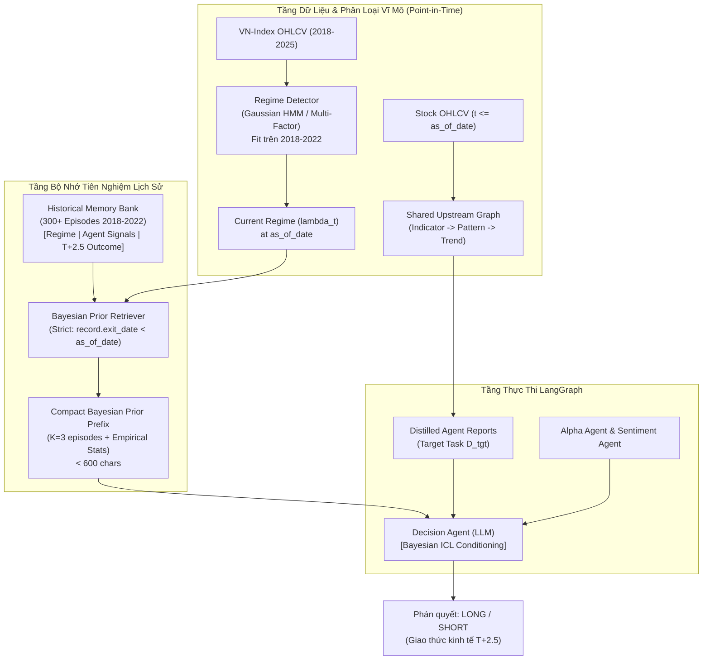

# KẾ HOẠCH NGHIÊN CỨU & TRIỂN KHAI KHÓA LUẬN TỐT NGHIỆP (2 THÁNG)

**Đề tài**: *Regime-Aware Multi-Task Bayesian In-Context Learning for Multi-Agent LLM Stock Trading in the Vietnamese Stock Market*  
**Dựa trên nền tảng**: Bài báo *Multi-Task Bayesian In-Context Learning* (Zhu, Oermann, Cho — ICML 2026) và Hệ thống Giao dịch Đa Agent LangGraph hiện có.  
**Mục tiêu tài liệu**: Thiết lập kế hoạch chi tiết, khả thi, định hướng học thuật cho thời gian 8 tuần (2 tháng), tập trung tối đa vào tính liêm chính dữ liệu (zero leakage), tái lập thực nghiệm và tối ưu tài nguyên theo phạm vi KLTN.

---

## MỤC LỤC
1. [Bối cảnh & Mục tiêu Nghiên cứu](#1-bối-cảnh--mục-tiêu-nghiên-cứu)
2. [Cơ sở Lý thuyết & Ánh xạ từ Paper Gốc](#2-cơ-sở-lý-thuyết--ánh-xạ-từ-paper-gốc)
3. [Kiểm toán Hiện trạng Repository (System Audit)](#3-kiểm-toán-hiện-trạng-repository-system-audit)
4. [Kiến trúc Hệ thống Đề xuất (Target Architecture)](#4-kiến-trúc-hệ-thống-đề-xuất-target-architecture)
5. [Thiết kế Thực nghiệm Khoa học Chuẩn KLTN](#5-thiết-kế-thực-nghiệm-khoa-học-chuẩn-kltn)
6. [Các Rào chắn P0 Bắt buộc (Safeguards & Zero-Leakage)](#6-các-rào-chắn-p0-bắt-buộc-safeguards--zero-leakage)
7. [Kế hoạch Thực hiện Chi tiết 8 Tuần (Deliverables Matrix)](#7-kế-hoạch-thực-hiện-chi-tiết-8-tuần-deliverables-matrix)
8. [Danh mục Tệp tin Cần Thêm Mới & Chỉnh Sửa](#8-danh-mục-tệp-tin-cần-thêm-mới--chỉnh-sửa)
9. [Kế hoạch Quản trị Rủi ro & Dự phòng (Contingency Plans)](#9-kế-hoạch-quản-trị-rủi-ro--dự-phòng-contingency-plans)

---

## 1. BỐI CẢNH & MỤC TIÊU NGHIÊN CỨU

### 1.1. Tính cấp thiết của đề tài
- **Thách thức của LLM trong giao dịch định lượng**: Các mô hình ngôn ngữ lớn (LLMs) khi được triển khai trong kiến trúc đa agent (Multi-Agent Trading) thường đưa ra quyết định ở dạng suy luận độc lập không điều kiện (Zero-Shot Unconditioned Reasoning). Khi thị trường chứng khoán Việt Nam chuyển pha mạnh mẽ (Regime Shift) — từ Uptrend thanh khoản cao sang Downtrend sụp đổ hoặc Sideway giằng co — các agent thị giác (Pattern, Trend) liên tục gặp bẫy giá (Bull/Bear Trap), trong khi các chỉ báo kỹ thuật (RSI, MACD) rơi vào trạng thái quá bán/quá mua kéo dài.
- **Giải pháp từ Paper ICML 2026**: Công trình của Zhu, Oermann và Cho (2026) chứng minh rằng việc đưa các tập dữ liệu phụ trợ làm **tiền tố ngữ cảnh (In-Context Prefix)** cho phép transformer thực hiện **suy diễn Bayes phân cấp (Amortized Hierarchical Bayesian Inference)**. Điều này cho phép người dùng điều khiển được phân phối tiên nghiệm (controllable prior) ở test-time mà **không cần fine-tune trọng số**, đồng thời mang lại sự ổn định vượt trội trong môi trường ít dữ liệu hoặc phân phối bị dịch chuyển.
- **Mục tiêu KLTN**: Thích ứng mô hình toán học này vào thị trường chứng khoán Việt Nam bằng cách xem:
  $$\text{Chế độ thị trường vĩ mô (Market Regime)} \iff \text{Siêu tham số tiên nghiệm } \lambda$$
  $$\text{Các chu kỳ giao dịch lịch sử trong quá khứ} \iff \text{Các nhiệm vụ tiên nghiệm } D^{(k)}_{\text{prior}}$$
  $$\text{Cửa sổ giao dịch hiện tại} \iff \text{Nhiệm vụ mục tiêu } D_{\text{tgt}}$$
  từ đó giúp Decision Agent tự động cập nhật phân phối niềm tin hậu nghiệm (Posterior Belief) về độ tin cậy của từng Agent trước khi ra quyết định kinh tế $T+2.5$.

### 1.2. Giới hạn phạm vi (Scope Boundary for KLTN)
- **Không thương mại hóa**: Không xây dựng hệ thống đặt lệnh tự động thực tế (broker API gateway), không mô phỏng sổ lệnh khớp liên tục (order book L2/L3), không giao dịch phái sinh/bán khống.
- **Phạm vi dữ liệu**: Tập trung vào dữ liệu Daily EOD (End-Of-Day) của VN-Index và 4 cổ phiếu đại diện các nhóm ngành lớn; tận dụng cache tin tức CafeF có sẵn.
- **Phạm vi hạ tầng**: Khai thác mô hình LLM hosted qua Groq API (giữ nguyên stack hiện tại) kết hợp giải pháp nén token chặt chẽ; chạy thực nghiệm có checkpointing để chống quá tải quota.

---

## 2. CƠ SỞ LÝ THUYẾT & ÁNH XẠ TỪ PAPER GỐC

### 2.1. Tóm tắt mô hình toán học của Paper (Zhu et al. 2026)
Trong bài toán suy diễn tiên nghiệm phân cấp:
1. **Mức tập (Episode-level)**: Rút siêu tham số $\lambda \sim p(\lambda)$ từ phân phối meta-prior. $\lambda$ tham số hóa phân phối tiên nghiệm $p(w \mid \lambda)$ của các tham số ẩn $w$.
2. **Mức nhiệm vụ (Task-level)**: Rút độc lập $K+1$ tham số tác vụ $\{w^{(k)}\}_{k=1}^{K+1} \sim p(w \mid \lambda)$.
   - $K$ tác vụ đầu sinh ra $K$ tập dữ liệu phụ trợ: $D_{\text{prior}} = \{D^{(1)}, \dots, D^{(K)}\}$ với $D^{(k)} = \{(x^{(k)}_m, y^{(k)}_m)\}_{m=1}^M$.
   - Tác vụ thứ $K+1$ là tác vụ mục tiêu: $D_{\text{tgt}} = \{(x_j, y_j)\}_{j=1}^{t-1}$ và điểm truy vấn $x_t$.
3. **Phân phối dự báo hậu nghiệm (PPD)**:
   $$p(y_t \mid x_t, C_{t-1}, D_{\text{prior}}) \propto \int p(\lambda) d\lambda \left[ \int p(y_t \mid x_t, w_{\text{tgt}}) \prod_{j=1}^{t-1} p(y_j \mid x_j, w_{\text{tgt}}) p(w_{\text{tgt}} \mid \lambda) dw_{\text{tgt}} \right] \prod_{k=1}^K \left[ \int p(w^{(k)} \mid \lambda) \prod_{m=1}^M p(y^{(k)}_m \mid x^{(k)}_m, w^{(k)}) dw^{(k)} \right]$$
4. **Cơ chế tiền tố (Prefix Mechanism)**: Đưa toàn bộ $D_{\text{prior}}$ vào chuỗi ngữ cảnh:
   $$\langle\text{prior}\rangle D^{(1)} \dots \langle\text{prior}\rangle D^{(K)} \langle\text{target}\rangle (x_1, y_1), \dots, (x_{t-1}, y_{t-1}), x_t$$
   Transformer học cách trích xuất thông tin tiên nghiệm từ $D_{\text{prior}}$, cho phép thay đổi $D_{\text{prior}}$ ở thời điểm suy luận để điều khiển phân phối dự báo.

### 2.2. Ma trận Ánh xạ (Mapping Matrix) sang Giao dịch Chứng khoán

| Thành phần trong Paper (Zhu et al. 2026) | Thực thể tương đương trong KLTN Stock Trading | Hiện thực kỹ thuật trong Repository |
| :--- | :--- | :--- |
| **Meta-distribution $p(\lambda)$** | Không gian các chế độ thị trường vĩ mô Việt Nam | Bộ 4 trạng thái thị trường VN-Index (Bull, Bear, Choppy, Consolidation). |
| **Episode latent $\lambda$** | Macro-Regime của thị trường tại thời điểm quyết định | Vector đặc trưng: VN-Index MA20/50/200, Realized Volatility 20d, Breadth (% > MA20). |
| **Task latent $w^{(k)}$** | Ma trận hiệu quả/độ tin cậy của các chiến lược trong chu kỳ $k$ | Trọng số thực tế của tín hiệu Trend, Pattern, Alpha, Indicator, Sentiment trong chu kỳ đó. |
| **Prior Task $D^{(k)}_{\text{prior}}$** | Một chu kỳ giao dịch lịch sử $T+2.5$ thuộc cùng chế độ $\lambda$ | Bản ghi gồm vector tín hiệu của 5 agent tại $t_{\text{entry}}$ và kết quả kinh tế thực tế tại $t_{\text{exit}}$. |
| **Target Task $D_{\text{tgt}}$** | Chu kỳ giao dịch hiện tại đang cần dự báo | Báo cáo chi tiết của 5 agent hiện tại trên cửa sổ 45 nến của cổ phiếu mục tiêu. |
| **Prior Prefix $\langle\text{prior}\rangle D_{\text{prior}}$** | Bayesian Regime Prior Prefix (BRPP) | Khối prompt súc tích tóm tắt $K$ chu kỳ tương đồng nhất trong quá khứ kèm thống kê độ tin cậy của agent. |
| **Bayesian Concentration** | Hiệu ứng neo giữ suy luận khi tín hiệu xung đột | Khi 5 agent mâu thuẫn (bất định cao), LLM dựa vào BRPP để phạt nặng các tín hiệu thường xuyên dính bẫy giá trong regime đó. |

### 2.3. Phân định Rạch ròi Nguồn gốc Đóng góp (Contribution Taxonomy)

```
┌─────────────────────────────────────────────────────────────────────────────┐
│ 1. ĐẾN TỪ BÀI BÁO GỐC (Direct from Paper - Zhu et al. ICML 2026)            │
│  - Khung lý thuyết suy diễn Bayes phân cấp bằng In-Context Learning.        │
│  - Cơ chế nạp prior dưới dạng tiền tố tập dữ liệu D_prior trước target task.│
│  - Nguyên lý Bayesian Concentration & thích ứng trong vùng dữ liệu khan hiếm│
│  - Phương pháp kiểm chứng triệt tiêu prior (Ablation on K).                 │
└─────────────────────────────────────┬───────────────────────────────────────┘
                                      │ Thích ứng (Adaptation)
┌─────────────────────────────────────▼───────────────────────────────────────┐
│ 2. THÍCH ỨNG CHO BÀI TOÁN GIAO DỊCH (Domain Adaptation)                     │
│  - Chuyển từ cửa sổ không-thời gian khí tượng ERA5 sang cửa sổ chu kỳ T+2.5.│
│  - Chuyển từ vector số thực đầu vào sang định dạng token hóa dạng bảng      │
│    (Compact Tabular Tokenization) phù hợp với context window của LLM.       │
│  - Quy tắc phân cách thời gian ngặt nghèo (Temporal Cutoff: exit_date < t). │
└─────────────────────────────────────┬───────────────────────────────────────┘
                                      │ Đóng góp mới (Novel Extension)
┌─────────────────────────────────────▼───────────────────────────────────────┐
│ 3. ĐÓNG GÓP MỚI CỦA KHÓA LUẬN (Novel Extension for KLTN)                    │
│  - Point-in-Time Regime Memory Bank: Bộ nhớ chu kỳ giao dịch lịch sử kèm    │
│    vector tín hiệu đa agent cho thị trường Việt Nam.                        │
│  - Cross-Agent Dynamic Reliability Calibration: Cơ chế dùng tiên nghiệm để  │
│    tái định chuẩn trọng số tin cậy giữa Agent Thị giác và Agent Định lượng.  │
│  - Điểm kiểm tra rò rỉ tiên nghiệm (Test Regime Leakage Suite) bảo vệ 100%  │
│    tính khách quan của kết quả nghiên cứu.                                  │
└─────────────────────────────────────────────────────────────────────────────┘
```

---

## 3. KIỂM TOÁN HIỆN TRẠNG REPOSITORY (SYSTEM AUDIT)

### 3.1. Điểm mạnh đã được thẩm định
- **Quy chuẩn kinh tế chặt chẽ**: [core/backtest_engine.py](file:///c:/Users/Legion/OneDrive/Ta%CC%80i%20li%C3%AA%CC%A3u/GitHub/A-Multi-Agent-Large-Language-Model-Approach-to-Price-Driven-Stock-Trading-in-the-Vietnamese-Stock-Ma/core/backtest_engine.py) tuân thủ hợp đồng $T+2.5$ khép kín (mua Open ngày 1, bán Close ngày 3, tính đủ 0.25% phí + 0.10% trượt giá cả 2 chiều, short giữ cash).
- **Chống rò rỉ dữ liệu đã có**:
  - `AlphaSelector`: Chặn dùng nến tương lai qua `point_in_time_df` và `as_of_date` (được verify bởi `tests/test_alpha_leakage.py`).
  - `SentimentStore`: Loại bỏ hoàn toàn bài báo không ngày và bài báo sau ngày cutoff (verify bởi `tests/test_sentiment_leakage.py`).
- **Giao thức ghép cặp (Paired Protocol)**: Pha upstream (Indicator, Pattern, Trend) được tính toán 1 lần duy nhất rồi deep-copy sang các nhánh so sánh đối chứng, triệt tiêu phương sai ngoại lai của LLM.
- **Kiểm thử E2E xác định**: [scripts/run_end_to_end_test.py](file:///c:/Users/Legion/OneDrive/Ta%CC%80i%20li%C3%AA%CC%A3u/GitHub/A-Multi-Agent-Large-Language-Model-Approach-to-Price-Driven-Stock-Trading-in-the-Vietnamese-Stock-Ma/scripts/run_end_to_end_test.py) chạy mượt mà offline 100% pass trong 14.6s.

### 3.2. Điểm nghẽn học thuật (Methodological Gaps cần giải quyết)
1. **Thiếu tính thích ứng theo chế độ thị trường (Zero Regime-Awareness)**:
   - Toàn bộ pipeline hiện tại xử lý từng test point như các sự kiện độc lập trong môi trường dừng (stationary). 
   - Prompt của Decision Agent gán vai trò cố định: *"Alpha Agent có quyền Veto bẫy giá"*, *"Sentiment có trọng số thấp nhất"*. Khi thị trường bước vào Downtrend khốc liệt (như quý 2/2022), mô hình vẫn liên tục bắt đáy sai vì không có dữ liệu tiên nghiệm nhắc nhở rằng xác suất sụp gãy hỗ trợ trong giai đoạn này là trên 70%.
2. **Suy luận Zero-Shot không có bối cảnh lịch sử tương đồng**:
   - Decision Agent chỉ đọc báo cáo của 45 nến hiện tại mà hoàn toàn không có thông tin về việc *"Trong quá khứ, khi các agent đưa ra tổ hợp tín hiệu tương tự dưới điều kiện thị trường tương tự, kết quả thực tế là gì?"*.
3. **Giới hạn tốc độ và ngân sách Token (TPM/RPM Guard)**:
   - Các prompt của Decision Agent hiện đã được distill xuống ~3,500 – 4,000 ký tự. Bất kỳ sự mở rộng ngữ cảnh nào vượt quá 7,500 ký tự đều có nguy cơ kích hoạt mã lỗi HTTP 429 từ Groq API.

---

## 4. KIẾN TRÚC HỆ THỐNG ĐỀ XUẤT (TARGET ARCHITECTURE)

Hệ thống nâng cấp sẽ tích hợp luồng trích xuất chế độ thị trường và truy xuất tiên nghiệm Bayes vào kiến trúc LangGraph hiện có:



### 4.1. Chi tiết 3 Module Mới
1. **`core/regime_detector.py`**:
   - Sử dụng chuỗi log-return và độ biến động lịch sử 20 phiên của VN-Index.
   - Huấn luyện Gaussian HMM (4 trạng thái) trên dữ liệu 2018–2022.
   - Cung cấp hàm `get_market_regime(as_of_date)` trả về: `regime_id`, `regime_name`, `volatility_level`, `trend_strength`.
2. **`core/bayesian_memory.py`**:
   - Kho lưu trữ cấu trúc các chu kỳ lịch sử $T+2.5$ độc lập.
   - Mỗi record gồm:
     ```json
     {
       "episode_id": "FPT_20220415",
       "symbol": "FPT",
       "as_of_date": "2022-04-15",
       "regime": "BEAR_CRASH",
       "agent_signals": {
         "trend": "DOWN",
         "pattern": "BEARISH_ENGULFING",
         "alpha_consensus": "GIẢM",
         "indicator_consensus": "GIẢM",
         "sentiment": "NEUTRAL"
       },
       "outcome": {
         "actual_direction": "DOWN",
         "net_return_pct": -4.2,
         "was_bull_trap": false,
         "result": "LOSS_IF_LONG"
       }
     }
     ```
3. **`core/bayesian_retriever.py`**:
   - Nhận vào `symbol`, `as_of_date`, `current_regime` và tham số $K$ (mặc định $K=3$).
   - Lọc tất cả record trong memory có `record.exit_date < as_of_date` trước xếp hạng/thống kê; chế độ Bayesian lọc thêm `record.regime == current_regime`.
   - Tính toán thống kê Bayes kinh nghiệm:
     - Tỷ lệ false breakout của Trend/Pattern trong regime này.
     - Tỷ lệ thành công của các lệnh LONG trong regime này.
   - Định dạng thành chuỗi Markdown cô đọng (dưới 600 ký tự).

---

## 5. THIẾT KẾ THỰC NGHIỆM KHOA HỌC CHUẨN KLTN

### 5.1. Dữ liệu & Danh mục Cổ phiếu (Universe)
Để đảm bảo tính khả thi trong 2 tháng mà vẫn đủ độ tin cậy thống kê cho hội đồng:
- **Tập cổ phiếu (4 mã đại diện)**:
  1. `FPT`: Nhóm Công nghệ / Vốn hóa lớn / Nhạy cảm vừa.
  2. `VNM`: Nhóm Tiêu dùng phòng thủ / Thường xuyên dao động tích lũy mean-reverting.
  3. `VCB`: Nhóm Ngân hàng / Chi phối chỉ số VN-Index lớn nhất.
  4. `MWG`: Nhóm Bán lẻ / Nhạy cảm cao với chu kỳ kinh tế vĩ mô.
- **Tập dữ liệu thời gian**:
  - Giai đoạn Huấn luyện HMM & Khởi tạo Memory Bank: `2018-01-01` $\rightarrow$ `2022-12-31`.
  - Giai đoạn Kiểm định Walk-Forward ngoài mẫu (Out-of-Sample Test): `2023-01-01` $\rightarrow$ `2024-12-31`.

### 5.2. Các Baseline Đối chứng (Ablation Matrix)
Thực hiện so sánh ngang giữa 5 biến thể trên cùng một tập điểm kiểm định ghép cặp (Paired Samples):

```
┌─────────────────────────────────────────────────────────────────────────────┐
│ 1. Original / Zero-Shot (K=0)       : Hệ thống hiện tại trong Repo.         │
│ 2. Random Prior (K=3)               : Lấy ngẫu nhiên 3 tasks lịch sử.       │
│ 3. Recent Prior (K=3)               : Lấy 3 tasks diễn ra gần nhất.         │
│ 4. Similarity-based Prior (K=3)     : Lấy 3 tasks gần nhất theo KNN kỹ thuật│
│ 5. Proposed Bayesian ICL (K=3)      : Lấy 3 tasks theo Bayesian Macro-Regime│
└─────────────────────────────────────────────────────────────────────────────┘
```

### 5.3. 3 Kịch bản Thử nghiệm Cốt lõi (Core Research Experiments)
1. **Experiment 1: Regime-Shift Robustness (Kiểm định chuyển dịch pha thị trường)**
   - Tập trung vào giai đoạn VN-Index điều chỉnh mạnh và đi ngang tích lũy biên lớn (quý 3–4/2023 và tháng 4/2024).
   - Đo lường mức sụt giảm tài khoản lớn nhất (Max Drawdown) và tỷ lệ tránh bẫy giá mua đuổi (False Breakout Avoidance Rate).
2. **Experiment 2: High-Uncertainty / Low-Evidence Behavior (Vùng bất định cao)**
   - Lọc các test point mà sự đồng thuận giữa các agent $\le 60\%$ (các agent đánh nhau).
   - Đo lường sự thay đổi của phương sai dự báo và mức độ hồi phục độ chính xác khi có Prior Prefix hỗ trợ.
3. **Experiment 3: Sensitivity to Prior Evidence (Ablation trên $K$)**
   - Chạy biến thể đề xuất với $K \in \{0, 1, 3, 5\}$.
   - Kiểm chứng giả thuyết suy giảm phương sai giữa các tiền tố (Shrinkage of PPD variability) tương tự như Bảng 7 và Bảng 9 trong bài báo gốc.

### 5.4. Tiêu chí Đánh giá (Evaluation Metrics)
- **Chỉ số Dự báo**: Directional Accuracy (%), Long Hit-rate (%), Brier Score / Confidence Calibration.
- **Chỉ số Kinh tế (Sau phí 0.25% & trượt giá 0.10%)**: Tỷ suất lợi nhuận kép (Cumulative Return %), Số dư cuối kỳ (VND từ 50,000,000 VND ban đầu), Tỷ lệ Sharpe, Tỷ lệ Sortino, Max Drawdown (MDD %).
- **Kiểm định Ý nghĩa Thống kê**: McNemar Test $p$-value (so sánh tỷ lệ đúng/sai), Wilcoxon Signed-Rank Test (so sánh phân phối lợi nhuận), Block-Bootstrap 95% Confidence Interval.

---

## 6. CÁC RÀO CHẮN P0 BẮT BUỘC (SAFEGUARDS & ZERO-LEAKAGE)

Các rào chắn kỹ thuật này phải được khóa chặt bằng code và test trước khi chạy bất kỳ benchmark nào:

| Mã rào chắn | Tên rủi ro | Hậu quả nếu vi phạm | Giải pháp bắt buộc trong Code |
| :---: | :--- | :--- | :--- |
| **P0-1** | **Prior Lookahead Leakage** | Kết quả gian lận, mất tính học thuật do retriever nhìn thấy tương lai. | Kiểm tra cứng: `record.exit_date < current_test_point.entry_date`. Ném `ValueError` ngay lập tức nếu vi phạm. Viết unit test tự động dò quét. |
| **P0-2** | **Horizon Mismatch** | Tiên nghiệm học sai phân phối, tính toán sai xác suất bẫy giá. | Mọi record lịch sử trong Memory Bank phải được gắn nhãn bằng đúng hàm `compute_round_trip_net_return` ($T+2.5$) của engine. |
| **P0-3** | **Context Window / Quota Overrun** | Groq trả về HTTP 429, gián đoạn backtest, LLM bị "Lost in the middle". | Format BRPP dạng bảng tối đa 600 ký tự. Có cơ chế fallback về `_cap_report` nếu tổng prompt vượt 6,500 ký tự. |
| **P0-4** | **Regime Detector Leakage** | Mô hình regime nhìn thấy biến động tương lai. | HMM chỉ được fit một lần duy nhất trên dữ liệu trước 2023. Trong pha walk-forward, chỉ dùng dữ liệu lịch sử tính toán online. |

---

## 7. KẾ HOẠCH THỰC HIỆN CHI TIẾT 8 TUẦN (DELIVERABLES MATRIX)

```
        THÁNG THỨ NHẤT (Nền tảng & Tích hợp)            THÁNG THỨ HAI (Thực nghiệm & Luận văn)
   Tuần 1 ──────► Tuần 2 ──────► Tuần 3 ──────► Tuần 4 ──────► Tuần 5 ──────► Tuần 6 ──────► Tuần 7 ──────► Tuần 8
  [Đặc tả &]   [Regime &]   [Retriever &]  [LangGraph &]  [Pilot FPT &]  [Benchmark]    [Ablation &]   [Hoàn thiện]
  [Data Prep]  [Memory]     [Prefix]       [Unit Tests]   [Quota Tuning] [4 Mã]         [Thống kê]     [Luận văn]
```

### 📅 TUẦN 1: Nghiên cứu, Đặc tả Kỹ thuật & Chuẩn bị Dữ liệu
- **Mục tiêu**: Hoàn thành hồ sơ đặc tả toán học, làm sạch dữ liệu VN-Index và 4 mã cổ phiếu, thiết lập môi trường nghiên cứu.
- **Nhiệm vụ cụ thể**:
  - [x] Đọc và đối chiếu sâu bài báo ICML 2026 với repo hiện tại.
  - [x] Thu thập và làm sạch dữ liệu Daily EOD của VN-Index và 4 mã (FPT, VNM, VCB, MWG) giai đoạn 2018–2025 ([biên bản và giới hạn sử dụng](week1/data_audit.md)).
  - [x] Thiết kế JSON Schema chuẩn cho `HistoricalTaskRecord` và `MarketRegimeState` ([chi tiết tuần 1](week1/README.md)).
  - [x] Soạn thảo tài liệu đặc tả phương pháp nghiên cứu `docs/methodology_spec.md`.
- **Deliverables cuối tuần 1**:
  - File dữ liệu sạch lưu tại `data/historical/` (đã kiểm tra không khuyết thiếu nến).
  - Tài liệu đặc tả kỹ thuật `docs/methodology_spec.md`.

### 📅 TUẦN 2: Xây dựng Module Phân loại Chế độ Thị trường & Historical Memory Bank
- **Mục tiêu**: Xây dựng module nhận diện chế độ thị trường và sinh cơ sở dữ liệu chu kỳ lịch sử cho giai đoạn 2018–2022.
- **Nhiệm vụ cụ thể**:
    - [x] Cài đặt `core/regime_detector.py` (Gaussian HMM 4 trạng thái, fit trên 2018–2022; [đặc tả, artifact và kiểm thử Phase B](../week2/phase_b_regime_detector.md)).
  - [x] Viết script offline trích xuất các chu kỳ giao dịch $T+2.5$ trong giai đoạn 2018–2022: `scripts/run_historical_memory.py`, regime prefix, tín hiệu 5 agent, nhãn ròng và journal tiếp tục ([W2-09 đến W2-12](../week2/phase_c_historical_memory.md)); đã sinh đủ 852 điểm hợp lệ.
  - [x] Lưu trữ và kiểm toán `data_manager/regime_memory_store.json`: 852 episode, manifest/checksum/biên bản bộ đọc và [QA Phase C](../week2/phase_c_memory_generation.md) PASS ngày 04/10/2026. Do warm-up 600 phiên, episode phủ 2020–2022; không có tin lịch sử đủ độ tin cậy nên sentiment NEUTRAL. Đây là kho prior, chưa là kết quả benchmark.
  - [x] Vẽ biểu đồ trực quan hóa các giai đoạn thị trường của VN-Index để đưa vào báo cáo KLTN: PNG 300 DPI/SVG, phân biệt nhãn hồi cứu toàn tập train và 217 ngày nhãn PIT trong kho ([Phase D](../week2/phase_d_week_close.md)).
- **Deliverables cuối tuần 2**:
  - Module `core/regime_detector.py` hoạt động độc lập kèm test.
  - File `data_manager/regime_memory_store.json` đạt chuẩn schema.
  - Biểu đồ `outputs/vnindex_regimes_2018_2022.png`.

**Trạng thái:** W2 hoàn thành ngày 04/10/2026; đủ ba deliverables, compileall/E2E PASS, 235 unit tests và 38 leakage tests PASS. [Biên bản chốt và giới hạn nghiên cứu](../week2/phase_d_week_close.md). Bước tiếp theo là W3.

### 📅 TUẦN 3: Xây dựng Bayesian Prior Retriever & Bộ Định dạng Tiền tố Ngắn gọn
- **Mục tiêu**: Xây dựng module truy xuất tiên nghiệm Bayes point-in-time và tối ưu hóa ngân sách token.
- **Kế hoạch chi tiết**: [16 task trong bốn phase](../week3/README.md), tiếp nối kho 852 episode đã QA của W2. Phase A/B/C hoàn thành, Gate A/B/C offline PASS; API retrieve/stats PIT, formatter BRPP v1 và kiểm ngân sách đã có. W3-12 [smoke kho thật](../week3/prior_smoke.json) PASS 288 query + 288 lượt lặp trên 32 context, bốn mode/hai scope, BRPP lớn nhất 373 ([Phase C](../week3/phase_c_prefix_and_budget.md)). W3-13 hoàn thành mười leakage + hai behavior test mới, suite Bayesian 95 test kiểm ranking/stats/BRPP và JSON/input/bản sao. W3-14 [benchmark](../week3/retrieval_benchmark.json) PASS sau tối ưu sao chép sâu/so snapshot theo profile: p95 Bayesian/Random/Recent/Similarity 15,809 / 14,812 / 14,179 / 18,239 ms, chín test mới; giữ hai lượt FAIL, kho/giá/model không đổi ([Phase D](../week3/phase_d_validation_and_handoff.md)). Tiếp theo W3-15/W3-16. Cap cũ tổng 4.500 vượt trần khi ghép BRPP; cap bàn giao 4.000 dự phòng BRPP đủ 600 cho prompt tối đa 6.289, W4 phải áp dụng cap và guard prompt cuối `<6500`. Chưa chốt Phase D, tích hợp runtime hoặc kết quả giao dịch OOS.
- **Nhiệm vụ cụ thể**:
  - [x] Cài đặt `core/bayesian_retriever.py` hỗ trợ 4 chế độ lấy mẫu: `bayesian_regime`, `random`, `recent`, `similarity`; `retrieve` trả tasks/stats/metadata đầy đủ, Original K=0 không nhận stats.
  - [x] Xây dựng thuật toán tính toán thống kê thực nghiệm (Empirical Win-rate, Trap Probabilities) cho từng regime: population PIT/cùng scope, bốn metric có counts, mẫu số 0=None, không smoothing hoặc diễn giải thành xác suất đã hiệu chuẩn.
  - [x] Hiện thực hóa hàm `format_compact_prior_prefix(tasks, stats)` với template BRPP v1 và guard $\le 600$ ký tự; không truncate. W3-11 PASS kiểm chứng ngân sách/prompt ghép với cấu hình bàn giao, [receipt](../week3/prompt_budget_review.json); chưa là gate ngân sách runtime W4.
  - [x] Viết benchmark đo lường thời gian thực thi: [receipt W3-14](../week3/retrieval_benchmark.json) PASS p95 từng mode <30 ms, 32 query/mode × 1.000 mẫu, cold load/formatter/retrieval+format tách riêng; giữ baseline/profile và kiểm bản sao/zero-leakage sau tối ưu.
- **Deliverables cuối tuần 3**:
  - Module `core/bayesian_retriever.py` hoàn chỉnh.
  - Bộ unit test kiểm tra định dạng và tốc độ sinh tiền tố.

### 📅 TUẦN 4: Tích hợp LangGraph & Bộ Kiểm thử Chống Rò rỉ Dữ liệu
- **Mục tiêu**: Ghép nối luồng tiên nghiệm vào LangGraph state và xây dựng chốt chặn kiểm thử tự động.
- **Nhiệm vụ cụ thể**:
  - [ ] Cập nhật `agents/agent_state.py`: thêm các trường `market_regime`, `prior_tasks`, `bayesian_prior_context`.
  - [ ] Cập nhật `agents/decision_agent.py`: inject BRPP vào prompt reasoning và hướng dẫn suy diễn phân cấp; áp dụng cap báo cáo tổng 4.000 đã kiểm ở W3-11 (hoặc kiểm chứng phương án khác), guard prompt cuối `<6500` sau toàn bộ hướng dẫn.
  - [ ] Cập nhật `utils/graph_setup.py`: bổ sung nhánh ablation `enable_bayesian_prior`.
  - [ ] Cập nhật `core/backtest_engine.py`: gọi retriever tại mỗi test point trước khi kích hoạt Decision Maker.
  - [ ] Viết `tests/test_regime_leakage.py`: kiểm tra nghiêm ngặt điều kiện $t_{\text{prior}} < t_{\text{decision}}$.
  - [ ] Chạy lại toàn bộ unit tests hiện có và `scripts/run_end_to_end_test.py`.
- **Deliverables cuối tuần 4**:
  - Hệ thống tích hợp hoàn chỉnh, không phá vỡ bất kỳ tính năng cũ nào.
  - File test `tests/test_regime_leakage.py` chạy PASS 100%.

### 📅 TUẦN 5: Thử nghiệm Pilot trên FPT & Tối ưu Hạn ngạch Quota
- **Mục tiêu**: Chạy thử nghiệm toàn diện trên 1 cổ phiếu thí điểm để kiểm tra tính ổn định, đo lường chi phí token và bắt lỗi runtime.
- **Nhiệm vụ cụ thể**:
  - [ ] Viết script điều phối thử nghiệm `scripts/run_bayesian_ablation.py`.
  - [ ] Chạy pilot 20 điểm kiểm định trên cổ phiếu `FPT` cho cả 5 biến thể (Original, Random, Recent, Similarity, Bayesian).
  - [ ] Giám sát tỷ lệ lỗi parse JSON, thời gian phản hồi của Groq và hiện tượng chạm trần tốc độ.
  - [ ] Tinh chỉnh độ dài prompt distill nếu phát hiện nguy cơ vượt quota.
- **Deliverables cuối tuần 5**:
  - File kết quả pilot `outputs/pilot_fpt_results.json`.
  - Biên bản đánh giá hiệu năng: xác nhận hệ thống chạy ổn định và an toàn về quota.

### 📅 TUẦN 6: Thực thi Ma trận Đánh giá Toàn diện (Full Benchmark Execution)
- **Mục tiêu**: Hoàn thành toàn bộ các lượt chạy backtest chính thức trên 4 mã cổ phiếu và thu thập đầy đủ dữ liệu thực nghiệm.
- **Nhiệm vụ cụ thể**:
  - [ ] Kích hoạt backtest trên 4 mã: `FPT`, `VNM`, `VCB`, `MWG` trên giai đoạn kiểm định 2023–2024.
  - [ ] Áp dụng cơ chế lưu checkpoint tự động sau mỗi test point để đảm bảo có thể khôi phục ngay nếu rớt mạng.
  - [ ] Kiểm tra tính toàn vẹn của file log và các chỉ số kinh tế sau khi hoàn thành từng mã.
- **Deliverables cuối tuần 6**:
  - Toàn bộ kết quả thực nghiệm thô được lưu trữ tại `outputs/bayesian_benchmark/`.
  - Bảng tổng hợp trạng thái các lượt chạy không phát sinh lỗi.

### 📅 TUẦN 7: Phân tích Thống kê, Nghiên cứu Triệt tiêu (Ablation K) & Xuất Biểu đồ
- **Mục tiêu**: Thực hiện các phép kiểm định thống kê chính quy, chạy thực nghiệm triệt tiêu $K$ và tạo các biểu đồ chuẩn học thuật.
- **Nhiệm vụ cụ thể**:
  - [ ] Chạy thực nghiệm triệt tiêu trên số lượng prior tasks: $K \in \{0, 1, 3, 5\}$.
  - [ ] Tính toán các kiểm định thống kê: McNemar, Wilcoxon Signed-Rank, Block-Bootstrap 95% CI bằng `utils/statistical_tests.py`.
  - [ ] Xuất bảng tổng hợp kết quả định dạng LaTeX bằng script tự động.
  - [ ] Vẽ các biểu đồ học thuật: Đường cong vốn (Equity Curves), Max Drawdown, Phân bố lợi nhuận, Biểu đồ Radar tương thích theo Regime.
- **Deliverables cuối tuần 7**:
  - Thư mục hình ảnh `docs/figures/` chứa toàn bộ biểu đồ vector chất lượng cao (300 DPI).
  - File bảng kết quả LaTeX `outputs/tables_summary.tex`.
  - Báo cáo phân tích định lượng chi tiết.

### 📅 TUẦN 8: Hoàn thiện Báo cáo Luận văn KLTN & Slide Bảo vệ
- **Mục tiêu**: Viết hoàn chỉnh các chương của Luận văn Tốt nghiệp, rà soát tính nhất quán và chuẩn bị slide bảo vệ.
- **Nhiệm vụ cụ thể**:
  - [ ] Soạn thảo Chương 3 (Phương pháp đề xuất): Trình bày mạch lạc mô hình Bayes phân cấp, cơ chế ánh xạ và cấu trúc memory.
  - [ ] Soạn thảo Chương 4 (Kết quả thực nghiệm & Thảo luận): Trình bày các bảng số liệu, biểu đồ và phân tích sâu các ca điển hình (case studies) bẫy giá.
  - [ ] Viết phần Kết luận & Hướng phát triển tương lai.
  - [ ] Thiết kế slide thuyết trình bảo vệ KLTN (khoảng 25–30 slides, tập trung vào tính mới, liêm chính học thuật và kết quả vượt trội).
- **Deliverables cuối tuần 8**:
  - File toàn văn Khóa luận Tốt nghiệp (Word / LaTeX / PDF).
  - Bộ slide báo cáo bảo vệ trước hội đồng chấm KLTN.

---

## 8. DANH MỤC TỆP TIN CẦN THÊM MỚI & CHỈNH SỬA

### 8.1. Các tệp tin thêm mới hoàn toàn
1. **`core/regime_detector.py`**:
   - `class MarketRegimeDetector`: Quản lý mô hình HMM và bộ quy tắc phân loại vĩ mô VN-Index.
   - `def classify_regime(df_historical, as_of_date) -> Dict[str, Any]`.
2. **`core/bayesian_memory.py`**:
   - `class HistoricalMemoryStore`: Cấu trúc nạp, lưu và truy vấn các chu kỳ giao dịch lịch sử.
   - `def build_offline_memory_bank(...) -> None`.
3. **`core/bayesian_retriever.py`**:
   - `class BayesianPriorRetriever`: Điều phối việc tìm kiếm và lọc dữ liệu prior theo chế độ.
   - `def format_prior_prefix(tasks, empirical_stats) -> str`.
4. **`tests/test_regime_leakage.py`**:
   - Bộ kiểm thử tự động xác minh: không có bất kỳ tác vụ nào trong quá khứ có `exit_date >= as_of_date` được phép lọt vào tiền tố prior.
5. **`scripts/run_bayesian_ablation.py`**:
   - Runner thực nghiệm chạy tự động 5 baseline trên danh mục cổ phiếu với checkpointing.

### 8.2. Các tệp tin cần chỉnh sửa trong Repo
1. **[agents/agent_state.py](file:///c:/Users/Legion/OneDrive/Ta%CC%80i%20li%C3%AA%CC%A3u/GitHub/A-Multi-Agent-Large-Language-Model-Approach-to-Price-Driven-Stock-Trading-in-the-Vietnamese-Stock-Ma/agents/agent_state.py)**:
   - Thêm các trường kiểu dữ liệu TypedDict: `market_regime`, `prior_tasks`, `bayesian_prior_context`.
2. **[agents/decision_agent.py](file:///c:/Users/Legion/OneDrive/Ta%CC%80i%20li%C3%AA%CC%A3u/GitHub/A-Multi-Agent-Large-Language-Model-Approach-to-Price-Driven-Stock-Trading-in-the-Vietnamese-Stock-Ma/agents/decision_agent.py)**:
   - Chỉnh sửa hàm `_build_prompt_vi` và `_build_prompt_en`: Nhận chuỗi `bayesian_prior_context` và đặt khối tiền tố ngay trước các báo cáo phân tích hiện tại.
   - Bổ sung nguyên tắc suy luận Bayes: Hướng dẫn LLM điều chỉnh độ tin cậy của Agent dựa trên thống kê sai số lịch sử trong cùng regime.
3. **[utils/graph_setup.py](file:///c:/Users/Legion/OneDrive/Ta%CC%80i%20li%C3%AA%CC%A3u/GitHub/A-Multi-Agent-Large-Language-Model-Approach-to-Price-Driven-Stock-Trading-in-the-Vietnamese-Stock-Ma/utils/graph_setup.py)**:
   - Mở rộng cấu hình `ABLATION_CONFIGS` để hỗ trợ cờ `enable_bayesian_prior`.
4. **[core/backtest_engine.py](file:///c:/Users/Legion/OneDrive/Ta%CC%80i%20li%C3%AA%CC%A3u/GitHub/A-Multi-Agent-Large-Language-Model-Approach-to-Price-Driven-Stock-Trading-in-the-Vietnamese-Stock-Ma/core/backtest_engine.py)**:
   - Trong `_run_single`: Tích hợp bước gọi `regime_detector` và `bayesian_retriever`, nạp context vào state trước khi gọi nhánh Decision.
   - Trong `TestPoint`: Lưu lại `regime_name` và `prior_episode_ids` phục vụ thống kê phân nhóm.
5. **[default_config.py](file:///c:/Users/Legion/OneDrive/Ta%CC%80i%20li%C3%AA%CC%A3u/GitHub/A-Multi-Agent-Large-Language-Model-Approach-to-Price-Driven-Stock-Trading-in-the-Vietnamese-Stock-Ma/default_config.py)**:
   - Khai báo các tham số mặc định: `k_prior_tasks: 3`, `regime_model_type: "hmm"`, `memory_store_path: "data_manager/regime_memory_store.json"`.

---

## 9. KẾ HOẠCH QUẢN TRỊ RỦI RO & DỰ PHÒNG (CONTINGENCY PLANS)

| Tình huống rủi ro | Mức độ | Kế hoạch dự phòng (Plan B) |
| :--- | :---: | :--- |
| **Groq API bị quá tải hoặc chặn Rate Limit 429 liên tục** | Cao | 1. Runner đã có cơ chế backoff số mũ kèm thời gian chờ động.<br>2. Tích hợp fallback sang Ollama chạy local (mô hình Qwen 2.5 7B hoặc 14B) để hoàn thành các điểm test còn lại mà không phụ thuộc internet.<br>3. Giảm $K$ từ 3 xuống 2 để giảm 30% lượng token. |
| **Mô hình Gaussian HMM không phân tách rõ các chế độ thị trường** | Trung bình | Kích hoạt bộ phân loại Chế độ Thị trường dựa trên Luật Đa yếu tố (Rule-based Multi-Factor Regime): dựa trên khoảng cách giữa MA20 và MA200 kèm ngưỡng phân vị của ATR và ADX. Phương pháp này hoàn toàn minh bạch và dễ giải thích trước hội đồng. |
| **Thiếu dữ liệu tin tức CafeF cho các mã mới** | Thấp | Tập trung chặt chẽ vào 4 mã cốt lõi đã có cache đầy đủ (`FPT`, `VNM`, `VCB`, `MWG`). Không mở rộng sang các mã thiếu dữ liệu để tránh làm sai lệch kết quả thực nghiệm. |
| **Thời gian chạy benchmark 4 mã kéo dài quá lâu** | Trung bình | Chia nhỏ tiến trình chạy độc lập cho từng mã bằng các script chạy song song (mỗi mã một terminal riêng với API key phụ nếu cần). Tận dụng file checkpoint để lưu tiến độ tức thì. |

---

## 10. KẾT LUẬN

Bản kế hoạch này cung cấp một lộ trình nghiên cứu học thuật chuẩn mực, khả thi và bám sát thực tế cho Khóa luận Tốt nghiệp trong 2 tháng. Bằng cách kế thừa nguyên vẹn nền tảng kiểm định kinh tế và cấu trúc LangGraph đã hoàn thiện của repository, đồng thời áp dụng chính xác nguyên lý *Multi-Task Bayesian In-Context Learning* từ hội nghị hàng đầu thế giới (ICML 2026), đề tài sẽ sở hữu cả **tính mới về mặt học thuật (Academic Novelty)** lẫn **tính liêm chính về mặt phương pháp (Methodological Rigor)**.
