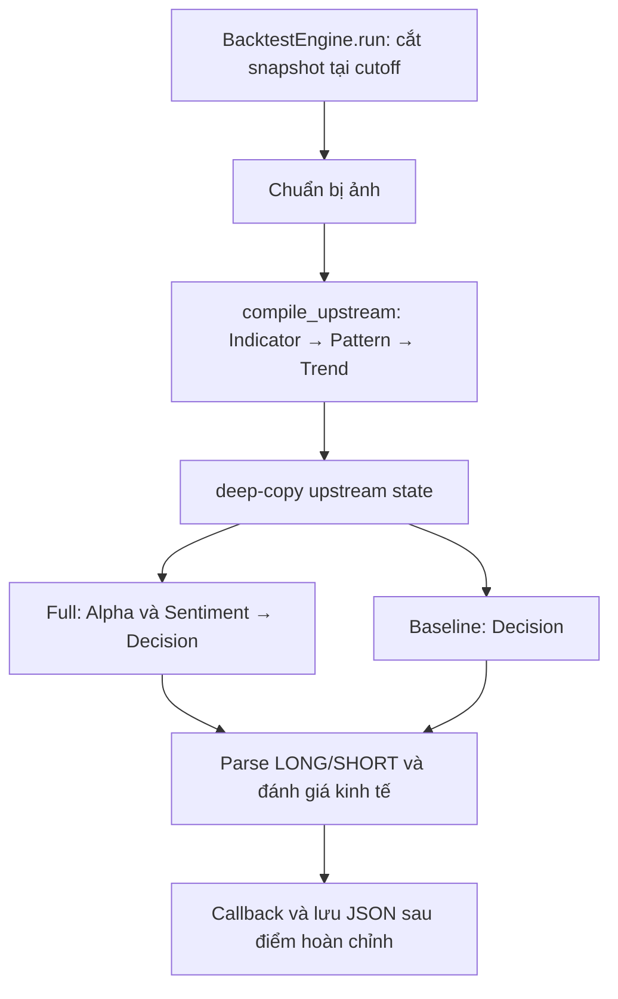
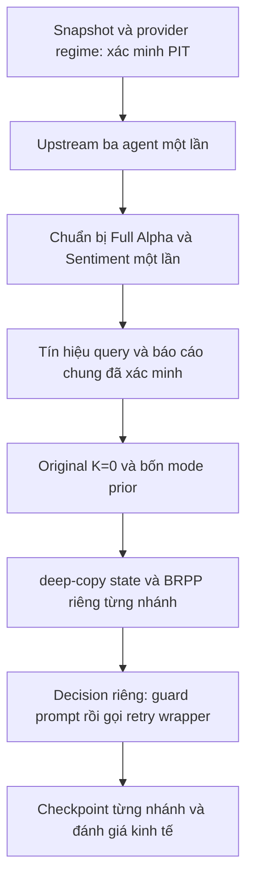

# W4-01 — Kiểm tra đầu vào và bản đồ tích hợp

Khảo sát trên commit nền `516d0ed`, nhánh `docs/prior-runtime-readiness`, ngày
05/10/2026. Bằng chứng máy đọc: [input_readiness.json](input_readiness.json).
Phạm vi task là kiểm chứng đầu vào và nhận diện điểm nối; hợp đồng state/config,
provider PIT và schema checkpoint sẽ chốt lần lượt ở W4-02, W4-03, W4-04.

## 1. Đối chiếu bàn giao W3

| Đầu vào | Cách kiểm / giới hạn |
| --- | --- |
| Kho phát hành | Đối chiếu checksum byte với manifest và QA W2, hash record chuẩn hóa với `records_sha256` |
| Schema và kinh tế | Verifier W3 khởi tạo `BayesianPriorRetriever`; `HistoricalMemory.load()` kiểm toàn bộ 852 record bằng giá thực thi đã QA và `compute_round_trip_net_return` |
| Bằng chứng W3 | So lại 99 hash file bảo vệ và 176 hash file nguồn trong `week_close_review.json`, không sửa receipt lịch sử |
| Archive | Kiểm 852 episode, 852 signal, 217 model prefix; envelope/checksum/liên kết, state/metadata/date và staging khớp kho |
| Artifact regime | Nạp bằng `MarketRegimeDetector.load()` để kiểm định dạng/checksum/tham số; không dùng hàm đọc envelope journal cho artifact model vì hai định dạng hash khác nhau |
| Replay mới | Chạy `scripts.verify_bayesian_prior.verify()` với guard mạng/fit/sinh dữ liệu; chứng minh PIT của nguồn context và kiểm query trên RAM |

Kho có SHA-256
`09b48c6192a092b562173e8b3b7eceb44025c6e02454093e34214a730a460949`;
run signature
`e2f04ef08863e53570589c3a443be16759a7c9e3474074dfa284afcb816f173c`.

| Độ phủ | Số lượng |
| --- | ---: |
| FPT / MWG / VCB / VNM | 211 / 213 / 215 / 213 |
| BULL / BEAR / CHOPPY / CONSOLIDATION | 337 / 191 / 248 / 76 |
| 2020 / 2021 / 2022 | 201 / 329 / 322 |
| WIN_IF_LONG / LOSS_IF_LONG | 344 / 508 |
| Sentiment NEUTRAL | 852 |

Ngày quyết định đầu 2020-06-01, exit cuối 2022-12-30. Thiếu 2018–2019 do warm-up
600 phiên; thiếu tin lịch sử đáng tin cậy. Giữ đúng giới hạn phương pháp W3:
sentiment không phân biệt similarity; stats có counts, không là xác suất LLM
đã hiệu chuẩn; Original không nhận stats/prefix.

**Ranh giới kiểm chứng:** đối chiếu mọi envelope/model link không tương đương
tái tính feature của mọi episode. Verifier replay tính lại nguồn/PIT trên 24
context lịch sử và có tám fixture biên riêng; constructor kiểm schema và nhãn
kinh tế trên toàn bộ kho. Receipt ghi từng mức kiểm này, không suy PIT từ hash đơn lẻ.

## 2. Luồng đang chạy và điểm nối dự kiến

### Backtest ghép cặp hiện có



`_run_paired_point()` gọi `variants=("full", "baseline")`. Field `no_alpha` trong
summary hiện ánh xạ **baseline: tắt cả Alpha và Sentiment**. Không được tự đổi nó
thành `sentiment_only` khi bổ sung prior. `_run_ablation_variants()` hỗ trợ đủ bốn
ablation và deep-copy upstream state trước từng graph Decision.

### Pipeline đầy đủ ngoài đường backtest tách pha

`SetGraph.set_graph()` chạy Indicator → Alpha/Sentiment (nếu bật) → Pattern →
Trend → Decision. Đường này dùng `IndicatorAgentState`, còn graph backtest tách
pha dùng `BacktestAgentState`. W4 phải xét cả hai schema để trường mới không bị
LangGraph loại bỏ; không áp thứ tự tách pha vào live graph một cách ngầm định.

### Điểm cần ghép ở W4 (chưa triển khai)



Retriever chỉ nhận tên regime và tín hiệu, không tự chứng minh model/giá/tin của
query. Caller/provider phải kiểm nguồn trước query; thời điểm node chuẩn bị prior,
kiểu state và trách nhiệm cụ thể còn chốt ở W4-02/03.

## 3. Bản đồ file/hàm và phạm vi ảnh hưởng

| Điểm hiện có | Hành vi xác nhận | Đầu việc tiếp theo |
| --- | --- | --- |
| `agents/agent_state.py`: `IndicatorAgentState` | Chưa có market_regime/prior_tasks/bayesian_prior_context | W4-02/05: contract và typed state; không đưa nhãn query vào state |
| `utils/graph_setup.py`: `BacktestAgentState` | Thêm điều khiển sentiment store/window/alpha/ablation; prior chưa có | W4-05: bảo toàn trường xuyên graph |
| `resolve_ablation_config`, `ABLATION_CONFIGS` | Hai cờ Alpha/Sentiment, bốn mode; alias include_alpha có kiểm conflict | W4-02/05: prior config là chiều độc lập |
| `compile_upstream()` | Indicator → Pattern → Trend một lần | W4-10: tiếp tục tái sử dụng và kiểm call-count |
| `compile_decision()` | Graph có Alpha node nếu Alpha hoặc Sentiment bật; Full gọi lại chuẩn bị này theo nhánh | W4-08/10: tách chuẩn bị Full khỏi năm Decision nghiên cứu |
| `set_graph()` | Entry point pipeline đầy đủ hiện có | W4-08: tương thích mặc định không prior |
| `BacktestEngine._init_graphs()` | Khởi tạo text/vision LLM và bốn graph ablation | W4-11: nạp retriever một lần khi bật nghiên cứu, không ở mỗi query |
| `_prepare_window()`, `run()` | Window hiển thị; snapshot `df.iloc[:end_idx]`, as_of là nến cuối | W4-03/09: kiểm snapshot, nguồn và ngày trước khi agent dùng |
| `_get_actual_direction()` | Engine có toàn df để lấy Open(t+1)/Close(t+3), nhãn net return | W4-03/11: giữ outcome ngoài state/query/prompt; hiện outcome được tính trước paired call nhưng không truyền vào initial state |
| `_run_ablation_variants()` | Upstream một lần, deep copy, graph theo ablation; lỗi nhánh gây dừng | W4-10/11: dùng cùng Full reports cho năm prior branches |
| `_run_paired_point()` | Return Full state/time và Baseline state/time | W4-11: giữ return tuple cũ, không nhét năm nhánh vào hai slot |
| `create_final_trade_decider()` | Distill/cap, builder VI/EN, structured/text API qua `_invoke_with_retry` | W4-06/07: BRPP và guard cuối trước API |
| `_save()` | `open(..., "w")`/json.dump; lỗi lưu chỉ in cảnh báo, không atomic | W4-04/12: contract ghi atomic và lỗi lưu rõ ở đường nghiên cứu |
| `web_interface.py` | Web run daily `1 ngày`, callback/result dùng dataclass và `to_json_compatible` | W4-11/14: regression keys/types, không làm hỏng frontend cũ |
| `scripts/run_ablation_matrix.py` | Atomic checkpoint/resume các điểm hoàn chỉnh đủ bốn ablation | W4-04/12: tham khảo ghi atomic; không đủ để resume một nhánh dở |
| `core/run_robustness.py` | Resume theo tiền tố điểm chung của các scenario | Giữ semantics sweep cũ, không coi là checkpoint năm prior branches |
| `core/historical_runner.py` | Journal episode/signals; PrefixRegimeProvider có verify_only | W4-03/09: tái dùng kiểm nguồn prefix, không sinh episode/model để bù nguồn |

Giữ kinh tế: LONG mua Open(t+1), tất toán Close(t+3), SHORT giữ cash; fee=0,0025
và slippage=0,001 cả mua/bán. Kiểm daily `1d`/`1 ngày` ra lookahead=3;
default `1 day` hiện ra lookahead=1. Đây là điểm phải quyết định rõ ở W4-02,
không sửa alias/default trong task khảo sát này.

## 4. Output, callback, web JSON và lưu tiến độ

Receipt lưu danh sách field chính xác lấy từ AST của ba dataclass trên commit nền:
`TestPoint`, `PartialSummary`, `BacktestSummary`. Khi đổi schema phải đối chiếu
snapshot này thay vì chỉ xem vài field trong bảng sau.

| Lớp/biên giao tiếp | Hợp đồng hiện có cần giữ |
| --- | --- |
| `TestPoint` | test_id/window, actual direction/net return/entry/exit; pred/confidence/rr/source/error của Full/No-Alpha; cash/equity/cost/P&L |
| `PartialSummary` | n_completed, số valid/correct, accuracy/lift, equity/P&L/Sharpe/MDD của hai nhánh |
| `BacktestSummary` | symbol/timeframe/window/step/dates, metric hai nhánh, significance và test_points |
| Callback `run()` | completed, total, latest=`asdict(tp)`, partial=`asdict(partial)` |
| JSON đang chạy | symbol, timeframe, window_size, step, updated_at, partial, test_points |
| JSON cuối | `asdict(BacktestSummary)`; thay payload tạm bằng summary |
| Web status | status, step, partial, test_points, summary, error, latest |
| Web result | summary hoặc error, qua `to_json_compatible` trước jsonify |

`BacktestEngine.run()` bắt đầu `test_points=[]`; không đọc lại result_path và
không phục hồi reports/upstream/nhánh thành công khi dừng giữa một điểm.
Runner bốn ablation riêng có resume tiền tố điểm complete, đối chiếu symbol,
n_tests/window/step và data_start/data_end. Việc đối chiếu ngày đầu/cuối chưa
là hash nội dung giá; cũng chưa chứa bank/model/config provenance cho prior.
Không dùng checkpoint cũ như proof nghiên cứu mới mà tự điền metadata còn thiếu.

## 5. Nguồn kiểm thử tái lập và phụ thuộc archive

| Nguồn | Tái lập từ Git | Cách dùng / giới hạn |
| --- | --- | --- |
| `tests/test_paired_protocol.py`, `test_4way_ablation.py`, `test_ablation_matrix.py` | Có | Fake graph/mock chứng minh call-count, deep copy, ablation semantics và resume điểm hoàn chỉnh |
| `test_backtest_token_budget.py`, `test_bayesian_prompt_budget.py` | Có | Capture prompt; test legacy còn ngưỡng ≤7.500, chưa thay runtime guard `<6500` |
| `test_account_pnl.py`, execution/leakage suites | Có | Nhãn và chi phí từ engine; không dùng fixture Close-to-Close |
| `tests/bayesian_test_support.py` | Có | Kho tạm và nhãn tính bằng engine thật; loader giá được giả lập, không cần archive 852 episode |
| `test_bayesian_prior_smoke.py` | Có | Kiểm receipt và ca nguồn/query sai; không cần archive local để chạy unit suite |
| `scripts/run_end_to_end_test.py` | Có | OHLCV/tin tổng hợp, text/vision LLM xác định, cwd tạm; không cần API credentials |
| `scripts/verify_bayesian_prior.py` | Cần thêm archive local | Replay kho thật; cần episodes/signals/regimes/news/parser/run manifest đã đóng băng |

Archive hiện có đủ 852/852/217 file tại `outputs/historical_memory_run/`, bị
gitignore. Clone mới không tự có archive; thiếu/sai checksum phải chặn replay
với chẩn đoán. Unit/E2E fixture vẫn chạy được. Không gọi LLM, fit HMM hoặc sinh
episode mới để tạo bằng chứng thay thế.

Để chạy lại replay, dùng **output mới** riêng và giữ byte receipt W3:

```powershell
py -3.13 -X utf8 scripts/verify_bayesian_prior.py --output docs/plan/week4/input_replay_rerun.json
```

Helper khảo sát dùng trong lần này được ghi path/hash tại `verification_helper`
trong receipt; không là module runtime hoặc điều kiện để clone mới chạy unit tests.
Replay verifier W3 và các API validator là nguồn kiểm chứng được track trong repo.

## 6. Gate còn mở và ranh giới task

| Gate | Kết luận khảo sát | Task chịu trách nhiệm tiếp theo |
| --- | --- | --- |
| Kho/QA/nhãn W2 và API W3 | Đủ đầu vào để khóa hợp đồng W4 | W4-02 |
| Cap/guard runtime | Chưa PASS; cap hiện tại tổng 4.500, log 7.500 và chưa chặn tổng prompt | W4-06/07 |
| Prompt ghép thử W3 | Cap cũ + BRPP cho 6.565 VI / 6.582 EN; cap bàn giao 4.000 có reserve đầy đủ BRPP 600 tối đa 6.289 | W4 kiểm lại đường runtime, không lấy fixture W3 làm runtime PASS |
| PIT regime caller | Replay prefix khả dụng; chưa có provider tích hợp cho query/OOS | W4-03/09 |
| Model toàn train | Train end 2022-12-30; metadata `RESEARCH_ONLY`, price basis `UNVERIFIED`; không dùng cho query trước cuối train hoặc tự coi đủ proof OOS | W4-03: chốt nguồn và validator cần bổ sung |
| Giá thô kiểm định 2023–2024 | BLOCKED: execution manifest PASS chỉ phủ 2018-01-01→2022-12-31 | Trước W5 pilot; FPT+VNINDEX trước pilot, đủ bốn mã trước W6 |
| State/config/checkpoint nghiên cứu | Chưa có; schema và resume nhánh còn mở | W4-02/04/05/12 |

Giá tín hiệu W1 có CSV 2018–2025 không mở được gate giá thực thi ngoài mẫu.
Chỉ dùng vnstock/VCI và vnstock/KBS theo policy nguồn đã khóa. W4-01 không tải
lại dữ liệu, sửa model/kho/nhãn, thêm state/config hoặc gọi API LLM thật.

## 7. Baseline và kết quả kiểm chứng

**W4-01 hoàn thành ngày 05/10/2026.** Trên baseline `516d0ed`, đầu vào/nguồn
được kiểm lại trước và sau gate, hash không đổi. Replay mới có **32 context,
288 query + 288 lượt lặp**, đủ bốn mode/hai scope và Original K=0; prefix tối
đa **373 ký tự**, loader giá đúng một lần/mã, không đọc JSON/giá trong query,
không gọi mạng, fit model hoặc sinh episode. Kết quả: 176 complete, 64 empty,
16 partial, 32 disabled theo metadata retrieval.

| Gate chạy mới | Kết quả |
| --- | --- |
| Compileall | PASS, tiến trình 0,121 giây |
| Unit toàn hệ thống | 339/339 PASS, thời gian suite 48,455 giây |
| E2E xác định | PASS, thời gian pipeline 7,0 giây |
| Leakage | 56/56 PASS, thời gian suite 5,130 giây |

Receipt ghi lệnh/mã thoát/thời gian toàn tiến trình, đường dẫn/hash log và
261 hash file nguồn/bằng chứng bảo vệ. Thời gian suite/pipeline trong bảng
không bao gồm toàn bộ khởi động tiến trình Python. Lệnh gate tại [Phase D](phase_d_validation_handoff.md).

Phạm vi commit: biên bản, receipt, tiến độ W4/master/README; `.gitattributes`
thêm quy tắc giữ nguyên byte JSON receipt W4 khi checkout. Không thay runtime,
kho/model/giá/tin hoặc sửa receipt W2/W3. Không bổ sung test trùng implementation
cho task khảo sát; dùng bộ gate hiện có và verifier thật.

PASS của W4-01 chỉ áp dụng khảo sát/đầu vào. **Gate A, runtime integration,
runtime budget và giá OOS chưa PASS**; W4-02..04 vẫn mở. Bước tiếp theo là W4-02:
khóa state/config từ bản đồ này, không bỏ qua quyết định về alias timeframe,
chiều prior/ablation và ranh giới báo cáo chung.
