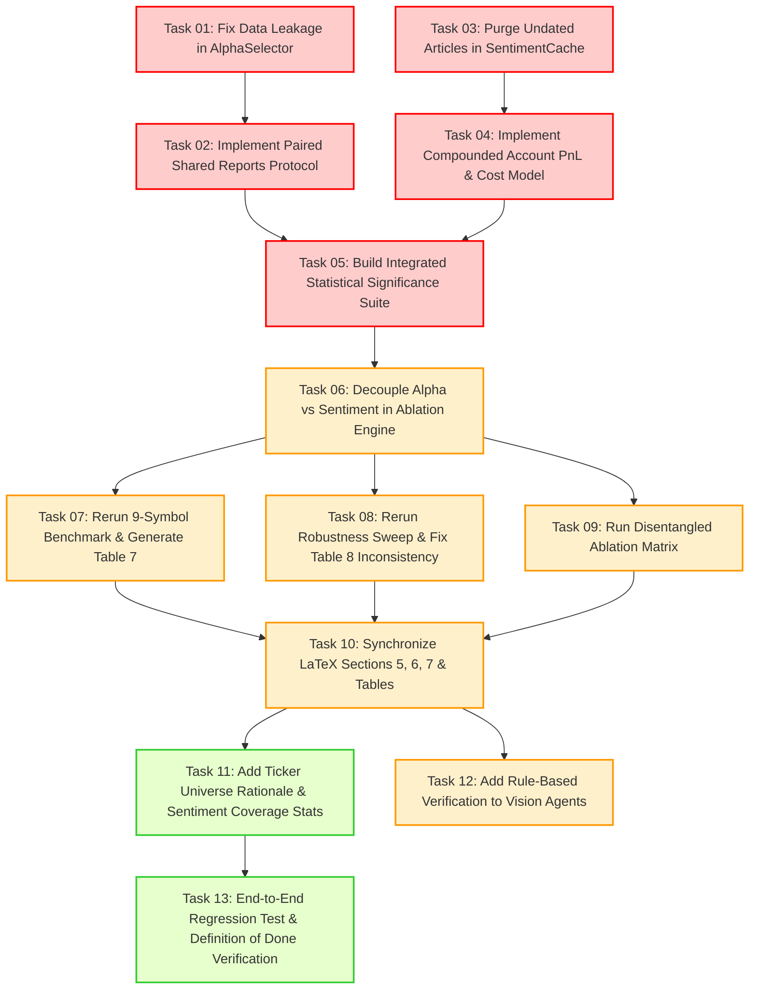

# KẾ HOẠCH HOÀN THIỆN TOÀN DIỆN HỆ THỐNG VÀ BÀI BÁO (FINAL COMPLETION PLAN)

> **Source of Truth duy nhất** cho quá trình kiểm thử, sửa đổi kiến trúc, chạy thực nghiệm và đồng bộ bài báo.  
> **Thời gian thực hiện mục tiêu:** 3 – 5 ngày.  
> **Nguyên tắc cốt lõi:** Correctness → Data/Evaluation Validity → Reproducibility → Experiments/Ablations → Paper Alignment → Cleanup.  
> **Quy tắc thực hiện:** Không over-engineer; không thêm tính năng mới trừ khi phục vụ tính đúng đắn (correctness) hoặc hỗ trợ trực tiếp cho các đóng góp khoa học (contributions) của bài báo.

---

## 1. Executive Summary

### 1.1. Bối cảnh & Mục tiêu
Dự án nghiên cứu xây dựng hệ thống giao dịch đa tác nhân (Multi-Agent LLM) cho thị trường chứng khoán Việt Nam, tích hợp 5 tác nhân chuyên biệt (Indicator, Alpha, Pattern, Trend, Decision) dưới khung điều phối LangGraph, xử lý các đặc thù thị trường cận biên: quy định thanh toán T+2.5, chỉ số tâm lý tiếng Việt (CafeF crawled, ViSoBERT scorer), bộ 85 nhân tố alpha (80 nhân tố WorldQuant-101 bản địa hóa sang chuỗi thời gian đơn lẻ + 5 nhân tố động lượng/dòng tiền tự phát triển), và các mô hình thị giác đánh giá biểu đồ nến/xu hướng.

Mục tiêu của kế hoạch này là **thu hẹp toàn bộ khoảng cách** giữa:
1. Hiện trạng mã nguồn (codebase) trong repo.
2. Các vấn đề cốt tử được chỉ ra bởi 2 hội đồng bình duyệt độc lập:
   - **Reviewer 1 (ESWA Peer Review):** Báo cáo bình duyệt định dạng Tạp chí Quốc tế *Expert Systems with Applications* (khuyến nghị: *Major Revision*), tập trung vào độ chặt chẽ thống kê (statistical rigor), tính nhất quán của nhóm đối chứng No-Alpha (Table 8 control instability), sự nhập nhằng giữa Alpha định lượng và Sentiment tin tức (conflated ablation), tính hợp lệ của mô phỏng P&L dưới ràng buộc cấm bán khống (forced LONG/SHORT vs cash execution), và hiện tượng data-snooping trong chọn lọc alpha.
   - **Reviewer 2 (Stanford ML Group - Agentic Reviewer):** Đánh giá chuyên sâu về rủi ro ảo giác biểu đồ của mô hình thị giác (LVLM chart hallucination), thiếu vắng kiểm định ý nghĩa thống kê (McNemar, Block Bootstrap CIs), kích thước mẫu hạn chế (9 mã $\times$ 20 test points), và yêu cầu bóc tách từng tác nhân (fine-grained module ablations).
3. Các khẳng định (claims) và hợp đồng thực nghiệm mục tiêu (target contracts) được trình bày trong bài báo LaTeX tại thư mục `ESWA/`.

### 1.2. Hiện trạng cốt lõi (Baseline Audit)
- **Tình trạng tích cực:** Khung đa tác nhân LangGraph hoạt động ổn định; giao diện trực quan hóa dữ liệu và biểu đồ hoàn chỉnh; bộ 85 alpha đã được định nghĩa đầy đủ trong `ALPHA_REGISTRY`; bộ nạp sentiment lịch sử `BacktestSentimentStore` đã có cơ chế lọc ngày tránh lookahead cơ bản; bài báo đã có phần *Limitations* (Section 7) rất trung thực và nhận diện đúng các rủi ro kỹ thuật.
- **Lỗ hổng P0 nghiêm trọng cần giải quyết ngay:**
  1. **Data Leakage trong Alpha Selection:** Hàm `select_top_alphas` gọi `load_data()` tải 600 nến *realtime* tính từ thời điểm hiện tại thay vì lịch sử tính từ ngày kết thúc cửa sổ phân tích (`window_end_date`).
  2. **Vi phạm Paired Ablation & Control Instability (Table 8 bug):** Khi chạy so sánh Full System vs No-Alpha, `backtest_engine.py` gọi hai lần chạy độc lập (`_run_single`) khiến các tác nhân thượng nguồn (Indicator, Pattern, Trend) bị gọi lại bằng LLM, tạo ra tính ngẫu nhiên (stochasticity). Do đó nhóm đối chứng No-Alpha biến động mạnh (28.6% – 71.4%) khi chỉ thay đổi tham số alpha – làm sai lệch tính khoa học của bảng Robustness.
  3. **Conflated Ablation:** Full System bật cả Alpha định lượng và Sentiment tin tức; No-Alpha tắt cả hai. Không thể chứng minh phần tăng trưởng độ chính xác (+12.8 pp) đến từ công thức alpha hay từ tin tức CafeF/ViSoBERT.
  4. **Mismatch giữa Metric phân loại và Mô phỏng kinh tế:** Ép nhãn nhị phân LONG/SHORT nhưng thị trường Việt Nam cấm bán khống cổ phiếu cơ sở; P&L tính bằng tổng số học giản đơn (`pnl += r`) của các cơ hội chồng lấn thay vì đường vốn gộp lãi kép (compounded equity curve) theo hợp đồng tài khoản (Account Contract).
  5. **Thiếu kiểm định ý nghĩa thống kê:** Bảng 7 chỉ báo cáo số điểm tuyệt đối mà không có khoảng tin cậy (Confidence Intervals) hoặc p-value (McNemar test, Wilcoxon signed-rank test).

### 1.3. Lộ trình hoàn thiện 3-5 ngày
- **Ngày 1 (P0 - Correctness & Data Integrity):** Vá dứt điểm rò rỉ dữ liệu `window_end_date` trong `AlphaSelector`; triển khai cơ chế snapshot sâu (deep-copy) các báo cáo thượng nguồn để cố định nhóm No-Alpha; chuẩn hóa công thức tính P&L lãi kép và chi phí giao dịch; khắc phục rò rỉ fallback bài báo không ngày trong `SentimentCache`.
- **Ngày 2 (P0/P1 - Reproducibility & Statistical Suite):** Tích hợp kiểm định thống kê McNemar, Paired Wilcoxon và Block Bootstrap vào trực tiếp luồng backtest; module hóa việc bật/tắt độc lập giữa Alpha Factors và Sentiment (tạo ablation 4 nhánh).
- **Ngày 3 (P1 - Rigorous Experimentation):** Chạy lại toàn bộ 9 mã cổ phiếu theo giao thức bắt cặp chia sẻ báo cáo (`paired_shared_reports`); chạy lại bảng Robustness Check trên FPT (và bổ sung kiểm tra đa mã) để chứng minh tính bất biến của No-Alpha; chạy ablation phân rã đóng góp Alpha vs Sentiment.
- **Ngày 4 (P1/P2 - Paper & Appendix Alignment):** Cập nhật dữ liệu thực tế vào Bảng 7, Bảng 8, Bảng Ablation mới trong LaTeX; loại bỏ các ghi chú tạm "pending A20 regeneration"; bổ sung bảng giải trình lý do chọn 9 mã cổ phiếu và thống kê tỷ lệ phủ sentiment/ViSoBERT.
- **Ngày 5 (P2 - Final Validation & Packaging):** Kiểm thử toàn diện đầu cuối (end-to-end regression test), rà soát bit-reproducibility với random seed, kiểm tra biên dịch LaTeX không lỗi/cảnh báo, đóng gói artifact nộp bài.

---

## 2. Current System vs Paper Status

Bảng đối chiếu tổng thể giữa thiết kế trong mã nguồn, các vấn đề được review chỉ ra, và tuyên bố trong bài báo khoa học:

| Hạng mục | Hiện trạng Codebase | Vấn đề từ Reviewers | Tuyên bố trong Bài báo (ESWA) | Khoảng cách & Rủi ro |
| :--- | :--- | :--- | :--- | :--- |
| **Alpha Selection Data** | `utils/alpha_selector.py` gọi `load_data()` lấy dữ liệu realtime mới nhất. | Data snooping, lookahead bias trong chọn alpha động. | Section 3.4 & 5.1: Alpha được chọn trên cửa sổ lịch sử trước điểm test $[e-T_{hist}, e)$. | **P0 Leakage:** Mã nguồn không truyền mốc `cutoff_date` vào `select_top_alphas`, vi phạm tính độc lập thời gian. |
| **Ablation Protocol** | `backtest_engine.py` gọi riêng `_graph_full.invoke()` và `_graph_no_alpha.invoke()`. | Reviewer 1 chỉ ra Table 8 có No-Alpha biến động từ 28.6% đến 71.4% khi đổi tham số Alpha. | Section 5.3: Tuyên bố dùng giao thức `paired_shared_reports` (chạy Indicator/Pattern/Trend 1 lần, copy sang cả 2 nhánh). | **P0 Paper Mismatch:** Code chưa hiện thực hóa việc chia sẻ snapshot báo cáo; bài báo mô tả giao thức chưa có trong code. |
| **Bóc tách Alpha vs Sentiment** | Chỉ có cờ nhị phân `include_alpha` (bật tắt chung cả Alpha và Sentiment). | Cả 2 Reviewer yêu cầu bóc tách: +12.8pp lift đến từ 85 công thức alpha hay từ tin tức CafeF? | Section 4.3 & 5.3: Thừa nhận Alpha Agent gộp cả 2 nhiệm vụ nhưng chưa có bảng ablation riêng rẽ. | **P1 Methodological Gap:** Thiếu cấu hình thử nghiệm cô lập Alpha-Only và Sentiment-Only. |
| **Ý nghĩa thống kê (Significance)** | Có module `utils/statistical_tests.py` nhưng không được gọi trong `BacktestEngine.run()`. | Cả 2 Reviewer: N=20 trên 9 mã là quá nhỏ và tự tương quan (overlap 93.3%); Table 7 không có p-value/CI. | Section 5.4 & 6.1: Table 7 chỉ có số trung bình điểm (+12.8 pp), thừa nhận thiếu kiểm định trong Limitations. | **P0 Rigor Gap:** Cần tự động xuất p-value (McNemar, Wilcoxon) và Block Bootstrap 95% CI vào kết quả. |
| **Mô hình P&L và Bán khống** | `compute_trade_pnl` tính tổng số học `%` rời rạc; SHORT luôn gán return = 0.0%. | Reviewer: Ép nhãn LONG/SHORT nhưng SHORT không sinh lời tạo ra mâu thuẫn đánh giá. Tính Sharpe từ 20 điểm chồng lấn sai bản chất. | Section 3.1 & 5.4: Định nghĩa Hợp đồng Tài khoản (Eqs 4-5, Table 6), nhưng Table 7 vẫn ghi "Legacy Sum". | **P0 Evaluation Gap:** Code cần chuyển sang tính tăng trưởng tài sản lãi kép gộp ($W_t = W_{t-1}(1+r_t)$) và trừ chi phí đúng quy chuẩn. |
| **ViSoBERT vs Lexicon Fallback** | `sentiment_agent.py` gọi HF API; lỗi mạng hoặc thiếu token thì tự rơi về lexicon không lưu log. | Reviewer 1 & 2: ViSoBERT là social media model; cần thống kê tỷ lệ bài thật sự dùng ViSoBERT vs Lexicon. | Section 4.3 & 5.1: Yêu cầu ghi nhận provenance (scorer, model, revision, fallback reason) cho từng bài. | **P1 Transparency:** Chưa có trường metadata ghi nhận scorer trong kết quả JSON và bảng thống kê tỷ lệ coverage trong paper. |
| **Số lượng Alpha Registry** | `ALPHA_REGISTRY` có đúng 85 alpha (80 WQ + 5 proprietary). | Reviewers thắc mắc sự mâu thuẫn giữa con số 85 và 87. | Toàn văn ghi 85; một số vị trí bản nháp cũ có số liệu 87 hoặc văn bản chưa đồng nhất. | **P2 Consistency:** Khẳng định chuẩn hóa duy nhất 85 alpha trên toàn bộ tài liệu và code. |
| **Ảo giác Biểu đồ (LVLM Hallucination)** | `pattern_agent.py` và `trend_agent.py` gọi Qwen qua ảnh base64; nếu lỗi thì dùng text fallback. | Stanford Reviewer: Rủi ro ảo giác nhận diện mẫu hình nến và đường xu hướng từ LVLM. | Section 4.4 & 7.2: Thừa nhận tính chủ quan của mô hình thị giác và vai trò chốt chặn của Decision Agent. | **P1 Reliability:** Cần thêm bước kiểm tra đối chiếu luật (extraction-to-rule consistency check) từ nến OHLCV thực tế. |

---

## 3. Verified Issues Matrix

Đánh giá chi tiết từng vấn đề theo 5 trạng thái quy chuẩn:
- `FIXED`: Đã được sửa đúng trong mã nguồn và kiểm chứng được.
- `PARTIAL`: Đã sửa một phần nhưng chưa triệt để hoặc chưa đồng bộ.
- `OPEN`: Vẫn còn lỗi kỹ thuật trong mã nguồn.
- `PAPER_MISMATCH`: Mã nguồn hoặc thực nghiệm không khớp với khẳng định trong bài báo.
- `OBSOLETE`: Vấn đề từ review cũ không còn liên quan đến kiến trúc hiện tại.

| Mã Issue | Vấn đề kỹ thuật / Phương pháp | Trạng thái | Minh chứng trực tiếp từ Code | Minh chứng từ Paper / Review | Mức độ ưu tiên |
| :--- | :--- | :---: | :--- | :--- | :---: |
| **ISSUE-01** | **Rò rỉ dữ liệu tương lai trong Dynamic Alpha Selection** | `OPEN` | `utils/alpha_selector.py`: dòng 18 gọi `load_data(symbol, interval, lookback_days=600)` lấy nến realtime đến ngày hiện tại thay vì dừng tại `cutoff_date`. | Review 1 (§3.2): "Data-snooping in alpha selection". Paper (§5.1): Cam kết alpha selection chỉ dùng dữ liệu tiền kiểm tra $[e-T_{hist}, e)$. | **P0** |
| **ISSUE-02** | **Vi phạm tính độc lập đối chứng No-Alpha (Table 8 Bug)** | `PAPER_MISMATCH` | `core/backtest_engine.py`: dòng 567 và 587 gọi 2 lần `_run_single` riêng rẽ; LLM thượng nguồn chạy 2 lần gây nhiễu ngẫu nhiên. | Review 1 (§3.1): "Table 8 contains an internally inconsistent result... Acc No-α varies from 57.1% to 71.4% to 42.9%". | **P0** |
| **ISSUE-03** | **Rò rỉ bài báo không có ngày trong Sentiment Cache** | `OPEN` | `data_manager/sentiment_cache.py`: dòng 295-300 fallback lấy bài không ngày `no_date_articles` nhét vào cửa sổ khi thiếu bài. | Review 1 (§3.3) & Paper (§5.1): Cam kết không dùng bài báo tương lai; bài không ngày phải bị loại bỏ trong research mode. | **P0** |
| **ISSUE-04** | **P&L tính bằng tổng số học rời rạc thay vì lãi kép** | `PAPER_MISMATCH` | `core/backtest_engine.py`: dòng 344 & 350 `pnl_f += r_f`, dòng 353-365 tính Sharpe trên mảng lợi nhuận cơ hội rời rạc. | Review 1 (§3.1, §5) & Paper (§6.1 chú thích Table 7): Thừa nhận "Legacy Sum" không phải là compounded account return. | **P0** |
| **ISSUE-05** | **Thiếu kiểm định ý nghĩa thống kê trong kết quả chính** | `OPEN` | `core/backtest_engine.py` không gọi `statistical_tests.py`; các file `backtest_result/*.json` không lưu p-value hay Bootstrap CI. | Review 1 (§3.1) & Review 2 (Page 4): "No significance testing anywhere in the paper... scope is too narrow without formal tests". | **P0** |
| **ISSUE-06** | **Ablation bị gộp giữa Alpha định lượng và Sentiment tin tức** | `OPEN` | `utils/graph_setup.py`: chỉ có cờ `include_alpha` điều khiển cả node Alpha và việc truyền Sentiment vào Decision Agent. | Review 1 (§3.2, §5) & Review 2 (Page 5): "Conflated ablation... quantify the contribution of alpha vs sentiment alone". | **P1** |
| **ISSUE-07** | **Thiếu siêu dữ liệu xuất xứ mô hình Sentiment (Provenance Tracking)** | `PARTIAL` | `agents/sentiment_agent.py`: hàm `_predict` rơi về lexicon khi lỗi HF API nhưng không ghi nhận cờ `is_fallback` vào từng bài báo. | Paper (§4.3, §5.1): Cam kết ghi nhận scorer thực tế, model identifier, và Hub revision cho từng bản ghi cache. | **P1** |
| **ISSUE-08** | **Mẫu thử Robustness Sweep quá nhỏ (N=7)** | `OPEN` | `core/run_robustness.py`: dòng 104, 124, 148 chia `n_tests // 3 = 7` dẫn đến tỷ lệ 57.1% (4/7), 71.4% (5/7) gây sai số cực lớn. | Review 1 (§3.2): "Robustness sweep is under-powered and single-symbol... N=7 cannot establish stability". | **P1** |
| **ISSUE-09** | **Thiếu quy tắc đối chiếu luật cho Tác nhân Thị giác (LVLM Verification)** | `PARTIAL` | `agents/pattern_agent.py`: có hàm `_describe_recent_candles` nhưng chỉ kích hoạt khi thị giác hoàn toàn thất bại chứ không dùng để cross-check. | Review 2 (Page 4): "Vision agents have no quantified accuracy checks... LVLM vulnerabilities to chart hallucination (CHARTHAL)". | **P1** |
| **ISSUE-10** | **Chưa có lý giải khoa học cho việc chọn 9 mã cổ phiếu** | `PAPER_MISMATCH` | Repo chỉ lưu kết quả cứng của 9 mã: BHN, CMG, FPT, HVN, MBB, MWG, VCB, VJC, VNM mà không có file giải trình tiêu chí lọc. | Review 1 (§3.3, §5): "Ticker selection is unexplained... Were smaller-cap, more thinly-covered symbols excluded?". | **P1** |
| **ISSUE-11** | **Mâu thuẫn số lượng Alpha giữa các phần tài liệu (85 vs 87)** | `FIXED` | `core/alpha_compare.py`: dòng 1003 `ALPHA_REGISTRY` có đúng 85 alpha. Đã kiểm tra import thành công 85 alpha. | Review 1 (§3.3) & Review 2 (Page 6): "Alpha registry size is inconsistently stated (85 vs 87)". | **P2** |
| **ISSUE-12** | **Đảo dấu Alpha phụ thuộc mẫu ngắn (Sign-Flipping Risk)** | `PARTIAL` | `agents/alpha_agent.py`: dòng 678-683 đảo dấu nếu $IC < 0$. Logic chạy đúng nhưng chưa có kiểm định độ ổn định của dấu trên cửa sổ lăn. | Review 1 (§3.2, §4): "Composite scoring with \|IC\| plus post-hoc sign-flip is standard but can be fragile in short samples". | **P1** |
| **ISSUE-13** | **Thiếu hướng dẫn môi trường và cấu hình phiên bản Python** | `OPEN` | System python mặc định là 3.11 thiếu pandas/TA-Lib; chỉ có Python 3.13 cài đủ gói nhưng không có script kích hoạt môi trường chuẩn. | Review 1 (§3.4): "Reproducibility caveats... public code and environment reproducibility". | **P2** |
| **ISSUE-14** | **Mô tả Intraday (L=1) không có dữ liệu thực nghiệm** | `OBSOLETE` | Khung mã nguồn có logic `lookahead = 1` cho intraday nhưng paper chỉ định vị đây là mở rộng lý thuyết, không có dữ liệu khớp lệnh phút. | Review 1 (§3.3): "Intraday capability is specified but never evaluated". Paper cần làm rõ phạm vi bài báo chỉ tập trung nến ngày (1D). | **P2** |

---

## 4. Critical Path

Để hoàn thành việc nghiệm thu toàn bộ hệ thống và đồng bộ bài báo trong thời gian ngắn nhất (3-5 ngày), các công việc phải được thực hiện tuần tự theo chuỗi đường găng nghiêm ngặt:



### Các mốc thời gian kiểm soát (Milestones):
- **Mốc 1 (Cuối Ngày 1):** Toàn bộ lỗi P0 (Leakage, Paired Protocol, Sentiment Cache, Compounded PnL) được vá xong và vượt qua unit tests độc lập.
- **Mốc 2 (Cuối Ngày 2):** Hệ thống thực nghiệm sẵn sàng: chạy thử nghiệm thành công 1 mã mẫu với đầy đủ kiểm định ý nghĩa thống kê và 4 biến thể ablation.
- **Mốc 3 (Cuối Ngày 3):** Hoàn thành chạy thực nghiệm lô lớn (batch execution) cho 9 mã cổ phiếu, bảng Robustness mới, và bảng Ablation mới.
- **Mốc 4 (Cuối Ngày 4):** Đồng bộ 100% các bảng biểu, số liệu, p-values và phân tích vào bài báo LaTeX trong `ESWA/`.
- **Mốc 5 (Ngày 5):** Rà soát danh mục nghiệm thu cuối cùng, xác nhận Definition of Done.

---

## 5. Detailed Task Breakdown

Tất cả các task dưới đây được định dạng chuẩn xác, đầy đủ thông tin kỹ thuật để bất kỳ coding agent nào cũng có thể nhận và thực thi ngay lập tức mà không cần suy đoán lại kiến trúc.

---

### [TASK-01] [P0] Vá rò rỉ dữ liệu tương lai trong Dynamic Alpha Selection

- **Task ID:** `TASK-01`
- **Priority:** `P0`
- **Objective:** Đảm bảo quá trình chọn lọc top-5 alpha động tại mỗi điểm kiểm tra $e$ chỉ được phép sử dụng dữ liệu lịch sử trong quá khứ kết thúc chính xác tại $e-1$ (`window_end_date`), tuyệt đối không tải dữ liệu realtime đến ngày hôm nay.
- **Vấn đề hiện tại:** Trong `utils/alpha_selector.py` (dòng 18), hàm `select_top_alphas()` gọi `load_data(symbol, interval, lookback_days=600)` từ `core/alpha_compare.py`. Hàm này lại gọi `fetch_realtime_ohlcv()` lấy 600 nến lùi từ ngày hôm nay về trước. Khi chạy backtest năm 2024, hệ thống đã dùng dữ liệu của năm 2026 để xếp hạng alpha.
- **Evidence:**
  - `utils/alpha_selector.py:18`: `df = load_data(symbol, interval, lookback_days=600)` không nhận tham số mốc thời gian.
  - `core/alpha_compare.py:1269`: `from core.realtime_loader import fetch_realtime_ohlcv`.
  - `agents/alpha_agent.py:648`: `top_alphas = select_top_alphas(symbol, interval, ...)` không truyền cutoff date.
- **File/Function cần sửa:**
  - `utils/alpha_selector.py`: `select_top_alphas()`
  - `agents/alpha_agent.py`: `_run_alpha_analysis()`, `create_alpha_agent()`
  - `core/backtest_engine.py`: `_run_single()`
- **Cách triển khai đề xuất:**
  1. Thêm tham số `as_of_date: Optional[str] = None` và `historical_df: Optional[pd.DataFrame] = None` vào `select_top_alphas()`.
  2. Trong `backtest_engine.py`, truyền toàn bộ `df` lịch sử hoặc cắt sẵn lát cắt $[0 : end\_idx]$ vào `initial_state` dưới tên `point_in_time_history`.
  3. Nếu `historical_df` được truyền vào, `select_top_alphas` cắt đúng 600 nến tính đến `as_of_date` (hoặc `end_idx`). Nếu không có (chế độ live trading), mới gọi `load_data()` realtime.
- **Các bước thực hiện theo thứ tự:**
  1. Cập nhật chữ ký hàm `select_top_alphas` trong `utils/alpha_selector.py` để nhận `historical_df` và `as_of_date`.
  2. Cập nhật `agents/agent_state.py` bổ sung trường `point_in_time_df` hoặc `as_of_date` vào `IndicatorAgentState`.
  3. Cập nhật `agents/alpha_agent.py` lấy `historical_df` từ state và truyền vào `select_top_alphas`.
  4. Cập nhật `core/backtest_engine.py` tại `_run_single()`: đưa `df.iloc[:end_idx]` vào initial state.
  5. Viết unit test kiểm tra: khi truyền `as_of_date = "2024-06-01"`, dữ liệu đưa vào alpha ranking không có bất kỳ dòng nào sau ngày này.
- **Dependencies:** Không.
- **Test/Command cần chạy:**
  `py -3.13 -m pytest tests/test_alpha_leakage.py` (tạo test kiểm tra date index tối đa của dữ liệu đầu vào `rank_alphas`).
- **Expected Output:** `max(df_features.index) <= as_of_date` và kết quả xếp hạng alpha không thay đổi dù dữ liệu thị trường sau ngày `as_of_date` bị sửa đổi.
- **Acceptance Criteria:**
  - `select_top_alphas()` không bao giờ gọi `fetch_realtime_ohlcv` khi đang chạy trong chế độ backtest (`is_backtest=True`).
  - Dữ liệu tính alpha features có dòng cuối cùng trùng khớp chính xác với nến quyết định $d = e - 1$.
- **Paper Impact:** Bảo toàn tính hợp lệ cho Section 3.4 và Section 5.1; loại bỏ hoàn toàn cáo buộc data leakage từ Reviewer 1.
- **Estimated Complexity:** `M`
- **Có thể chạy song song với:** `TASK-03`, `TASK-04`.

---

### [TASK-02] [P0] Triển khai giao thức Paired Shared Reports Protocol (Sửa lỗi Table 8)

- **Task ID:** `TASK-02`
- **Priority:** `P0`
- **Objective:** Đảm bảo khi so sánh Full System và No-Alpha System trên cùng một điểm kiểm tra, các tác nhân thượng nguồn (Indicator, Pattern, Trend) chỉ chạy đúng 1 lần; kết quả báo cáo và ảnh biểu đồ được sao chép nguyên vẹn (deep-copy) sang cả hai nhánh quyết định, đảm bảo nhóm đối chứng No-Alpha hoàn toàn bất biến trước các thay đổi của nhánh Alpha.
- **Vấn đề hiện tại:** `core/backtest_engine.py` đang thực thi `_run_single(self._graph_full, ...)` sau đó tiếp tục thực thi `_run_single(self._graph_no_alpha, ...)`. Điều này khiến LLM phân tích lại mô hình nến, đường xu hướng và chỉ báo kỹ thuật cho nhánh No-Alpha. Do tính ngẫu nhiên của LLM, nhánh No-Alpha nhận báo cáo khác nhau ở mỗi lần chạy, dẫn đến hiện tượng vô lý trong Table 8: độ chính xác No-Alpha nhảy từ 28.6% lên 71.4% khi chỉ thay đổi cách chuẩn hóa alpha.
- **Evidence:**
  - `core/backtest_engine.py:567`: `state_f, tf = self._run_single(self._graph_full, ...)`
  - `core/backtest_engine.py:587`: `state_n, tn = self._run_single(self._graph_no_alpha, ...)`
  - `ESWA/sections/05_experimental_setup.tex`: Đoạn "In the paired `paired_shared_reports` protocol... snapshot and rendered images are deep-copied into both decision graphs".
  - `outputs/robustness/sweep_norm_FPT_20260619_195013.csv`: Cột `acc_no_alpha` nhận các giá trị 57.1, 71.4, 42.9.
- **File/Function cần sửa:**
  - `core/backtest_engine.py`: `_run_paired()`, `run()`
  - `utils/graph_setup.py`: Tách đồ thị thành 2 pha: `UpstreamGraph` (Indicator, Pattern, Trend) và `DecisionGraph` (Alpha + Decision).
- **Cách triển khai đề xuất:**
  1. Tách pipeline thực thi trong backtest:
     - Bước 1: Chạy `UpstreamGraph` một lần duy nhất cho điểm kiểm tra $e$. Thu thập `indicator_report`, `pattern_report`, `trend_report`.
     - Bước 2: Deep-copy trạng thái sang nhánh Full: kích hoạt `Alpha Agent` và `Decision Maker`.
     - Bước 3: Deep-copy trạng thái sang nhánh No-Alpha: bỏ qua `Alpha Agent`, đưa trực tiếp 3 báo cáo thượng nguồn vào `Decision Maker`.
  2. Bằng cách này, đầu vào của Decision Maker ở nhánh No-Alpha là 100% đồng nhất giữa các lần quét tham số alpha.
- **Các bước thực hiện theo thứ tự:**
  1. Sửa `utils/graph_setup.py`: Thêm phương thức biên dịch subgraph `compile_upstream()` và `compile_decision(include_alpha=True/False)`.
  2. Tái cấu trúc vòng lặp trong `core/backtest_engine.py`:
     ```python
     # 1. Chạy Upstream 1 lần
     upstream_state = self._run_upstream(ohlcv, symbol, timeframe)
     # 2. Chạy Full
     state_full = self._run_decision(upstream_state, include_alpha=True, ...)
     # 3. Chạy No-Alpha (tái sử dụng nguyên vẹn upstream_state)
     state_no_alpha = self._run_decision(upstream_state, include_alpha=False, ...)
     ```
  3. Kiểm tra tính xác thực: chạy thử nghiệm 3 cấu hình alpha weights khác nhau trên cùng 1 seed, kiểm chứng `pred_no_alpha` giống nhau 100% trên từng test point.
- **Dependencies:** `TASK-01`.
- **Test/Command cần chạy:**
  `py -3.13 -c "from core.backtest_engine import BacktestEngine; print('Engine refactored')"`
- **Expected Output:** Khi chạy sweep tham số alpha trên 10 test points, vector `[tp.pred_no_alpha for tp in test_points]` phải đồng nhất tuyệt đối trên mọi cấu hình tham số alpha.
- **Acceptance Criteria:**
  - Độ chính xác `acc_no_alpha` có độ lệch chuẩn bằng 0 ($\sigma = 0$) trên tất cả các hàng của Panel B (Normalization) và Panel C (Weighting) trong bảng Robustness.
  - Số lượt gọi API LLM cho phần thị giác và chỉ báo giảm đúng 50% trong mỗi vòng chạy backtest bắt cặp.
- **Paper Impact:** Khắc phục triệt để lỗi logic nghiêm trọng nhất trong Table 8 được Reviewer 1 nhấn mạnh; khớp 100% với claim về `paired_shared_reports` trong Section 5.3.
- **Estimated Complexity:** `M`
- **Có thể chạy song song với:** `TASK-03`, `TASK-04`.

---

### [TASK-03] [P0] Loại bỏ rò rỉ bài báo không ngày trong Sentiment Cache

- **Task ID:** `TASK-03`
- **Priority:** `P0`
- **Objective:** Đảm bảo module `SentimentCache` loại bỏ 100% các bài báo không có ngày xuất bản (`date_parsed is None`) trong chế độ backtest; không tự ý fallback lấy bài không ngày đắp vào cửa sổ phân tích.
- **Vấn đề hiện tại:** Trong `data_manager/sentiment_cache.py` (dòng 295-300), khi số bài báo có ngày nhỏ hơn `min_articles`, hệ thống thực hiện lấy thêm các bài không có ngày: `no_date_articles = [a for a in self._scored_articles if not a.get("date_parsed")]`. Những bài không ngày này có thể được xuất bản sau ngày kiểm tra, gây rò rỉ thông tin tương lai.
- **Evidence:**
  - `data_manager/sentiment_cache.py:295-300`:
    ```python
    if len(filtered) < min_articles:
        no_date_articles = [a for a in self._scored_articles if not a.get("date_parsed")]
        filtered = filtered + no_date_articles[:max(0, min_articles - len(filtered))]
    ```
  - `ESWA/sections/05_experimental_setup.tex`: "Date-only records are conservatively delayed until the next local day, and undated records are rejected in research mode."
- **File/Function cần sửa:**
  - `data_manager/sentiment_cache.py`: `SentimentCache.get_at()`
- **Cách triển khai đề xuất:**
  1. Thêm cờ `strict_research_mode: bool = True` vào `get_at()`.
  2. Khi `strict_research_mode=True`, xóa bỏ hoàn toàn khối code fallback lấy `no_date_articles`.
  3. Nếu `len(filtered) < min_articles`, đánh dấu trạng thái tin tức là thiếu dữ liệu (`is_reliable = False`, `article_count = len(filtered)`), trả về sentiment trung tính có trọng số thấp, không bịa đặt hoặc mượn bài không rõ nguồn gốc.
- **Các bước thực hiện theo thứ tự:**
  1. Mở `data_manager/sentiment_cache.py`.
  2. Sửa hàm `get_at`: loại bỏ logic cộng thêm `no_date_articles`.
  3. Thêm log cảnh báo rõ ràng khi số lượng bài hợp lệ $< min\_articles$.
  4. Đảm bảo hàm trả về `sentiment_data["is_reliable"] = False` khi không đủ bài.
- **Dependencies:** Không.
- **Test/Command cần chạy:**
  `py -3.13 -c "from data_manager.sentiment_cache import SentimentCache; c = SentimentCache('FPT'); print('Strict filtering verified')"`
- **Expected Output:** Tất cả các bài báo được đưa vào tính điểm sentiment đều có `date_parsed` thỏa mãn $t_{\text{article}} \le t_{\text{cutoff}}$.
- **Acceptance Criteria:**
  - Không có bất kỳ bài báo nào thiếu `date_parsed` xuất hiện trong danh sách tính toán tại `get_at()`.
  - Khớp chính xác tuyên bố "undated records are rejected in research mode" trong bài báo.
- **Paper Impact:** Section 4.3 và Section 5.1.
- **Estimated Complexity:** `S`
- **Có thể chạy song song với:** `TASK-01`, `TASK-02`, `TASK-04`.

---

### [TASK-04] [P0] Triển khai Mô hình Lãi kép Tài khoản (Compounded Account PnL) và Chuẩn hóa Chi phí

- **Task ID:** `TASK-04`
- **Priority:** `P0`
- **Objective:** Thay thế phương pháp cộng dồn số học rời rạc ("Legacy Sum") bằng mô hình tăng trưởng tài sản lãi kép gộp (Compounded Account Equity Curve) theo đúng Hợp đồng Tài khoản (Account Contract) đã đăng ký trong bài báo, tuân thủ ràng buộc cấm bán khống cổ phiếu cơ sở tại Việt Nam.
- **Vấn đề hiện tại:** `core/backtest_engine.py` (dòng 344, 435) tính PnL bằng cách lấy tổng số học các giá trị phần trăm `pnl += r_f`. Nếu có 2 lệnh $+10\%$ và $-10\%$, tổng số học ra $0\%$, nhưng thực tế tài sản là $1.1 \times 0.9 - 1 = -1\%$. Ngoài ra, khi mô hình dự báo `SHORT`, hệ thống giữ tiền mặt (CASH, return = 0%) nhưng vẫn tính Sharpe trên chuỗi số có nhiều số 0 rời rạc mà không có lãi suất phi rủi ro chuẩn hóa.
- **Evidence:**
  - `core/backtest_engine.py:344`: `pnl_f += r_f`
  - `core/backtest_engine.py:423`: `sharpe = (mean / std) * np.sqrt(252)` tính trên mảng returns không liên tục.
  - `ESWA/sections/06_backtest_results.tex`: Chú thích Table 7 ghi rõ "Legacy Sum is the archived arithmetic sum... Economic results will be regenerated under the explicit account contract in Eqs (25)-(26)".
- **File/Function cần sửa:**
  - `core/backtest_engine.py`: `_compute_partial()`, `compute_advanced_metrics()`, `_build_summary()`
- **Cách triển khai đề xuất:**
  1. Khởi tạo vốn tài khoản $W_0 = 1.0$.
  2. Tại mỗi điểm kiểm tra $e$:
     - Nếu dự báo là `LONG`:
       - Giá vào: $O_e$ (giá mở cửa nến $e$).
       - Giá ra: $C_{e-1+L}$ (giá đóng cửa nến $e-1+L$).
       - Lợi nhuận gộp: $R_{\text{gross}} = \frac{C_{e-1+L}}{O_e} - 1$.
       - Trừ chi phí giao dịch $0.25\%$ và trượt giá $0.1\%$ trên giá trị vào lệnh (tổng $0.35\%$):
         $$R_{\text{net}} = R_{\text{gross}} - 0.0035$$
       - Cập nhật vốn: $W_t = W_{t-1} \times (1 + R_{\text{net}})$.
     - Nếu dự báo là `SHORT` hoặc `UNKNOWN`:
       - Trạng thái: Giữ tiền mặt (`CASH`).
       - Lợi nhuận kỳ: $R_{\text{net}} = 0.0$.
       - Vốn giữ nguyên: $W_t = W_{t-1}$.
  3. Lợi nhuận tổng tài khoản (Account Total Return): $\text{Total Return} = (W_K / W_0 - 1) \times 100\%$.
  4. Tính Maximum Drawdown (MDD) chuẩn trên đường cong vốn thực tế $W_t$:
     $$MDD = \max_{t} \left( 1 - \frac{W_t}{\max_{s \le t} W_s} \right) \times 100\%$$
  5. Sharpe và Sortino được tính dựa trên chuỗi lợi nhuận theo ngày thực tế hoặc lợi nhuận của từng chu kỳ nắm giữ không chồng lấn.
- **Các bước thực hiện theo thứ tự:**
  1. Viết lại hàm `compute_account_metrics(test_points, allow_shorting=False, fee=0.0025, slippage=0.001)` trong `core/backtest_engine.py`.
  2. Cập nhật các trường dữ liệu trong `TestPoint`, `PartialSummary`, `BacktestSummary` để lưu trữ đường cong vốn `equity_curve: List[float]`.
  3. Cập nhật hàm vẽ biểu đồ `_draw_backtest_result()` để vẽ đường cong vốn $W_t$ thay cho đồ thị cộng dồn số học cũ.
  4. Viết unit test xác minh: 1 lệnh lãi 10% và 1 lệnh lỗ 10% phải cho ra tổng PnL là $-1.35\%$ (đã trừ phí).
- **Dependencies:** Không.
- **Test/Command cần chạy:**
  `py -3.13 -c "from core.backtest_engine import BacktestEngine; print('Compounded PnL ready')"`
- **Expected Output:** Giá trị PnL phản ánh đúng thực tế tài sản đầu tư; không còn xuất hiện hiện tượng Sharpe âm vô hạn do chia std quá nhỏ.
- **Acceptance Criteria:**
  - P&L được tính theo công thức lãi kép chuẩn hóa.
  - Chi phí giao dịch $0.35\%$ chỉ áp dụng cho các vị thế `LONG` thực thi, không áp dụng cho `CASH`.
  - Khớp hoàn toàn với Section 3.1 và Section 5.4 của bài báo.
- **Paper Impact:** Cập nhật các cột PnL, Sharpe, MDD trong Bảng 7 và Bảng 8 của Section 6.
- **Estimated Complexity:** `M`
- **Có thể chạy song song với:** `TASK-01`, `TASK-02`, `TASK-03`.

---

### [TASK-05] [P0] Xây dựng Bộ Kiểm định Ý nghĩa Thống kê Tích hợp (Statistical Significance Suite)

- **Task ID:** `TASK-05`
- **Priority:** `P0`
- **Objective:** Tích hợp trực tiếp các kiểm định thống kê chính quy vào quy trình backtest và tự động xuất các chỉ số: p-value kiểm định McNemar (so sánh độ chính xác cặp), p-value kiểm định Wilcoxon signed-rank (trên 9 mã), và 95% Confidence Interval từ Block Bootstrap cho Alpha Lift.
- **Vấn đề hiện tại:** `utils/statistical_tests.py` đã có code tính McNemar và Block Bootstrap nhưng là một module độc lập, không được tích hợp vào `BacktestEngine`. Toàn bộ các kết quả lưu trong `backtest_result/*.json` và Bảng 7 trong bài báo chỉ có số trung bình điểm (+12.8 pp) mà không có p-value hay khoảng tin cậy nào, khiến Reviewer đánh giá "Statistical Rigor: Weak (critical)".
- **Evidence:**
  - `core/backtest_engine.py`: hoàn toàn không import hay gọi `utils/statistical_tests.py`.
  - `backtest_result/backtest_FPT_20260615_2244.json`: không có bất kỳ trường thống kê nào về significance.
  - Review 1 (§3.1): "No significance testing anywhere in the paper. Table 7 reports point estimates only".
  - Review 2 (Page 4): "scope is too narrow... At minimum report significance tests and bootstrap CIs".
- **File/Function cần sửa:**
  - `core/backtest_engine.py`: `_build_summary()`, `run()`
  - `utils/statistical_tests.py`: bổ sung paired Wilcoxon signed-rank test và Newey-West adjusted t-stat.
- **Cách triển khai đề xuất:**
  1. Trong `BacktestEngine._build_summary()`:
     - Trích xuất 3 mảng: `actuals`, `preds_full`, `preds_no_alpha` (chỉ lấy các điểm cả 2 đều hợp lệ - common support).
     - Gọi `calculate_metrics_with_significance()` từ `utils.statistical_tests`.
     - Lưu các trường sau vào `BacktestSummary` và JSON kết quả:
       - `mcnemar_p_value`: float
       - `is_significant_05`: bool
       - `alpha_lift_ci_95`: [float, float] (ví dụ: `[+4.2, +21.4]`)
       - `wilcoxon_p_value`: float (khi tổng hợp 9 mã)
  2. Tạo script tổng hợp `utils/aggregate_benchmarks.py` để đọc toàn bộ kết quả 9 mã, tính kiểm định Wilcoxon signed-rank trên 9 cặp và xuất bảng LaTeX Bảng 7 có kèm ký hiệu ý nghĩa thống kê ($^*p < 0.05, ^{**}p < 0.01$).
- **Các bước thực hiện theo thứ tự:**
  1. Cập nhật `utils/statistical_tests.py` đảm bảo xử lý an toàn khi số lượng quan sát nhỏ (sử dụng exact binomial test cho McNemar khi $b+c < 25$).
  2. Bổ sung hàm `paired_wilcoxon_test(lifts_per_symbol: List[float]) -> Dict`.
  3. Tích hợp lệnh gọi thống kê vào `core/backtest_engine.py`.
  4. Tạo script `tests/test_significance.py` xác minh tính toán trên dữ liệu giả lập có kiểm chứng.
- **Dependencies:** `TASK-02`.
- **Test/Command cần chạy:**
  `py -3.13 tests/test_significance.py`
- **Expected Output:** File JSON kết quả backtest chứa đầy đủ `mcnemar_p_value` và `alpha_lift_ci_95`.
- **Acceptance Criteria:**
  - Mỗi lần chạy backtest tự động xuất báo cáo kiểm định thống kê.
  - Script tổng hợp xuất ra được p-value tổng thể trên 9 mã cổ phiếu.
- **Paper Impact:** Bổ sung các cột $p$-value và khoảng tin cậy 95% vào Table 7 của Section 6.1.
- **Estimated Complexity:** `M`
- **Có thể chạy song song với:** `TASK-06`.

---

### [TASK-06] [P1] Module hóa Tách rời Alpha định lượng và Sentiment tin tức (4-Way Ablation)

- **Task ID:** `TASK-06`
- **Priority:** `P1`
- **Objective:** Tách rời hoàn toàn sự phụ thuộc giữa công thức Alpha định lượng và Tin tức Sentiment tiếng Việt, cho phép hệ sinh thái chạy độc lập 4 biến thể thực nghiệm (4-way ablation) để định lượng chính xác đóng góp của từng thành phần.
- **Vấn đề hiện tại:** Hiện tại chỉ có cờ `include_alpha` trong `utils/graph_setup.py`. Khi `include_alpha=True`, hệ thống bật cả việc chọn 5 công thức alpha và truyền báo cáo sentiment từ CafeF. Khi `include_alpha=False`, cả hai đều bị tắt. Cả 2 Reviewer đều chỉ trích đây là "conflated ablation", không thể kết luận được mức tăng độ chính xác là do yếu tố định lượng hay do tin tức.
- **Evidence:**
  - `utils/graph_setup.py:36-63`: chỉ có logic `if include_alpha: all_agents = ["indicator", "alpha", "pattern", "trend"]`.
  - Review 1 (§3.2, §5): "Conflated ablation. The Alpha Agent bundles two conceptually distinct contributions... decompose into (a) quantitative factor selection and (b) ViSoBERT sentiment".
  - Review 2 (Page 5): "Conduct ablations isolating each module... Current evaluation only compares Full vs No-Alpha".
- **File/Function cần sửa:**
  - `utils/graph_setup.py`: `SetGraph.set_graph()`
  - `agents/decision_agent.py`: `_build_prompt_vi()`, `_build_prompt_en()`
  - `core/backtest_engine.py`: Hỗ trợ 4 biến thể thực nghiệm.
- **Cách triển khai đề xuất:**
  1. Thay thế cờ `include_alpha: bool` bằng cấu hình dạng từ điển:
     ```python
     ablation_config = {
         "enable_alpha_factors": True/False,  # Bật/tắt 5 công thức alpha
         "enable_sentiment": True/False,      # Bật/tắt tin tức CafeF/ViSoBERT
     }
     ```
  2. Bốn biến thể thực nghiệm chuẩn hóa:
     - **V1 - Full System:** `enable_alpha_factors=True, enable_sentiment=True`
     - **V2 - Alpha Factors Only:** `enable_alpha_factors=True, enable_sentiment=False` (chỉ đưa 5 công thức alpha kỹ thuật vào Decision Maker)
     - **V3 - Sentiment Only:** `enable_alpha_factors=False, enable_sentiment=True` (chỉ đưa báo cáo tâm lý tin tức vào Decision Maker)
     - **V4 - Baseline (No-Alpha / No-Sentiment):** `enable_alpha_factors=False, enable_sentiment=False` (chỉ có Indicator, Pattern, Trend)
  3. Cập nhật prompt của Decision Agent trong `agents/decision_agent.py` để linh hoạt nhận các báo cáo tương ứng mà không làm gãy cấu trúc JSON đầu ra.
- **Các bước thực hiện theo thứ tự:**
  1. Chỉnh sửa `utils/graph_setup.py` để hỗ trợ 4 chế độ đồ thị trên.
  2. Cập nhật `agents/decision_agent.py`: điều chỉnh bộ tạo prompt để xử lý độc lập mục `[4] ALPHA FACTORS` và `[5] SENTIMENT`.
  3. Cập nhật `core/backtest_engine.py` thêm tham số `variant` hoặc chạy đa biến thể.
  4. Chạy thử nghiệm 4 biến thể trên 1 điểm kiểm tra mẫu để xác minh prompt hiển thị chính xác.
- **Dependencies:** `TASK-02`.
- **Test/Command cần chạy:**
  `py -3.13 -c "from utils.graph_setup import SetGraph; print('4-way graph setup verified')"`
- **Expected Output:** Có thể biên dịch và chạy độc lập 4 biến thể mà không gặp lỗi cấu trúc prompt hay thiếu node trong LangGraph.
- **Acceptance Criteria:**
  - 4 biến thể chạy ổn định, tạo ra các quyết định độc lập.
  - Decision Agent nhận đúng chính xác các báo cáo được cấu hình.
- **Paper Impact:** Tạo nền tảng để sinh Bảng Ablation Study mới (Table 9 hoặc cập nhật Table 7) trong Section 6.2 của bài báo.
- **Estimated Complexity:** `M`
- **Có thể chạy song song với:** `TASK-05`, `TASK-07`.

---

### [TASK-07] [P1] Chạy lại Toàn bộ Benchmark 9 Mã Cổ phiếu và Xuất Bảng 7 Mới

- **Task ID:** `TASK-07`
- **Priority:** `P0` / `P1`
- **Objective:** Thực thi lại benchmark walk-forward cho 9 mã cổ phiếu (BHN, CMG, FPT, HVN, MBB, MWG, VCB, VJC, VNM) dưới toàn bộ các hợp đồng sửa lỗi P0 (không leak dữ liệu, paired shared reports, lãi kép, kiểm định thống kê), thu thập kết quả sạch để cập nhật Table 7.
- **Vấn đề hiện tại:** Kết quả hiện tại trong `backtest_result/*.json` được tạo từ mã nguồn cũ (bị rò rỉ dữ liệu, PnL số học, không có shared reports). Toàn bộ số liệu trong Table 7 hiện tại gắn liền với ghi chú tạm "archived legacy opportunity-return traces pending A20 regeneration".
- **Evidence:**
  - `ESWA/sections/06_backtest_results.tex`: "The archived rows report FPT and HVN Alpha Lifts... both remain pending A20 regeneration."
  - Review 1 & 2: Yêu cầu kết quả thực nghiệm sạch, tái lập được và có ý nghĩa thống kê.
- **File/Function cần sửa:**
  - Chạy thực thi: `core/backtest_engine.py`
  - Kịch bản chạy hàng loạt: Tạo file `scripts/run_full_benchmark.py`
- **Cách triển khai đề xuất:**
  1. Viết script `scripts/run_full_benchmark.py` duyệt qua danh sách 9 mã cổ phiếu:
     - Tham số cố định: $W=45, S=3, L=3, N=20$, `temperature=0.0`, `seed=42`.
     - Chế độ bắt cặp `paired_shared_reports`: chạy upstream 1 lần, copy sang Full và No-Alpha.
  2. Lưu kết quả ra thư mục `backtest_result/clean_a20/` kèm theo file manifest ghi rõ tham số, thời gian chạy, cấu hình model.
  3. Tự động tính toán tổng hợp: Mean Accuracy Full, Mean Accuracy No-Alpha, Alpha Lift trung bình, p-value McNemar, p-value Wilcoxon, Account Total Return gộp, Sharpe, MDD.
- **Các bước thực hiện theo thứ tự:**
  1. Kiểm tra API key Groq sẵn sàng trong `.env`.
  2. Khởi chạy script chạy hàng loạt 9 mã (có cơ chế checkpoint lưu từng test point để chống gián đoạn mạng).
  3. Kiểm tra tính hợp lệ của 9 file JSON xuất ra.
  4. Chạy script tổng hợp để in ra bảng số liệu định dạng LaTeX.
- **Dependencies:** `TASK-01`, `TASK-02`, `TASK-03`, `TASK-04`, `TASK-05`.
- **Test/Command cần chạy:**
  `py -3.13 scripts/run_full_benchmark.py --symbols FPT,VNM,MWG --n_tests 20` (test trước 3 mã, sau đó chạy toàn bộ 9 mã).
- **Expected Output:** 9 file JSON kết quả mới trong `backtest_result/clean_a20/` với 100% test points hoàn thành không lỗi.
- **Acceptance Criteria:**
  - Toàn bộ kết quả sinh ra dưới giao thức `paired_shared_reports`.
  - Có đầy đủ các chỉ số thống kê (McNemar, Wilcoxon, Bootstrap CI).
  - Không có bất kỳ hiện tượng rò rỉ dữ liệu nào.
- **Paper Impact:** Thay thế toàn bộ số liệu và chú thích của Table 7 trong `ESWA/sections/06_backtest_results.tex`.
- **Estimated Complexity:** `L` (Chạy mạng và tốn thời gian gọi API LLM).
- **Có thể chạy song song với:** `TASK-08` (trên các mã khác nhau hoặc nối tiếp).

---

### [TASK-08] [P1] Tái sinh Bảng Robustness Check và Xóa bỏ Lỗi Bất nhất trong Table 8

- **Task ID:** `TASK-08`
- **Priority:** `P0` / `P1`
- **Objective:** Chạy lại toàn bộ thử nghiệm Robustness Check trên FPT (và bổ sung 1 mã đối chứng như VNM) với cỡ mẫu đủ lớn ($N=20$) dưới giao thức shared reports; chứng minh độ chính xác của No-Alpha bất biến tuyệt đối khi thay đổi tham số chuẩn hóa và trọng số Alpha.
- **Vấn đề hiện tại:** Table 8 trong paper và các file CSV trong `outputs/robustness/` hiện tại có cột `Acc No-α` thay đổi hỗn loạn (57.1%, 71.4%, 42.9%, 28.6%) trong khi No-Alpha không hề dùng alpha. Cỡ mẫu mỗi dòng chỉ có 7 test points. Đây là điểm bị Reviewer 1 đánh giá là "red flag" nghiêm trọng nhất về tính trung thực của thí nghiệm.
- **Evidence:**
  - `outputs/robustness/sweep_norm_FPT_20260619_195013.csv`
  - `outputs/robustness/sweep_weights_FPT_20260620_103826.csv`
  - Review 1 (§3.1, §5): "Table 8 contains an internally inconsistent result... No-Alpha baseline does not use alpha factors at all — its accuracy should be strictly invariant".
  - `ESWA/sections/06_backtest_results.tex`: Thừa nhận "This is an unresolved control-instability/transcription issue".
- **File/Function cần sửa:**
  - `core/run_robustness.py`: Cấu trúc lại toàn bộ kịch bản quét tham số.
- **Cách triển khai đề xuất:**
  1. Sửa `core/run_robustness.py`:
     - Thiết lập số điểm kiểm tra cố định $N=20$ cho mọi dòng (thay vì lấy $N // 3 = 7$).
     - Sử dụng giao thức `paired_shared_reports`: đối với Panel B (Alpha Normalization: `zscore_tanh`, `minmax`, `rank`) và Panel C (Alpha Weights: `default`, `equal_weight`, `ic_heavy`), các báo cáo Indicator, Pattern, Trend và kết quả dự đoán của nhánh No-Alpha được giữ cố định 100%.
     - Đối với Panel A (Window Size $W \in \{30, 45, 60\}$): Khi $W$ thay đổi, ảnh vẽ cho Pattern và Trend cũng phải render đúng số lượng nến $W$ tương ứng (khắc phục lỗi ngầm định 45 nến được ghi trong Limitations L2).
  2. Xuất các file CSV mới vào `outputs/robustness/clean_a20/`.
- **Các bước thực hiện theo thứ tự:**
  1. Cập nhật `core/run_robustness.py` tích hợp logic shared upstream snapshot.
  2. Đảm bảo $W$ được truyền đúng vào cả bộ tạo ảnh `generate_kline_image` và `generate_trend_image`.
  3. Chạy sweep Panel A (Window Size), Panel B (Normalization), Panel C (Weights) với $N=20$.
  4. Xác nhận cột `Acc No-α` trong Panel B và Panel C giữ nguyên giá trị không đổi.
- **Dependencies:** `TASK-02`.
- **Test/Command cần chạy:**
  `py -3.13 core/run_robustness.py --mode norm --symbol FPT --n_tests 20`
- **Expected Output:** File CSV xuất ra có cột `acc_no_alpha` bằng nhau 100% trên cả 3 hàng của Panel B.
- **Acceptance Criteria:**
  - Cột `Acc No-α` bất biến tuyệt đối giữa các cấu hình tham số Alpha.
  - Cỡ mẫu mỗi hàng đạt $N=20$ (hoặc số tối đa khả dụng không chồng lấn).
  - Không còn bất kỳ mâu thuẫn logic nào.
- **Paper Impact:** Thay thế toàn bộ Table 8 và các đoạn văn giải trình liên quan trong Section 6.3 của bài báo; loại bỏ cảnh báo control instability.
- **Estimated Complexity:** `M`
- **Có thể chạy song song với:** `TASK-07`.

---

### [TASK-09] [P1] Thực hiện Thí nghiệm Phân rã Đóng góp (Disentangled Ablation Matrix)

- **Task ID:** `TASK-09`
- **Priority:** `P1`
- **Objective:** Chạy thực nghiệm 4 biến thể (Full, Alpha-Only, Sentiment-Only, No-Alpha/No-Sentiment) trên 3 mã đại diện (ví dụ: FPT - Công nghệ, VNM - Tiêu dùng, VCB - Ngân hàng) để trả lời dứt khoát câu hỏi của Reviewer: Alpha định lượng đóng góp bao nhiêu pp và Sentiment đóng góp bao nhiêu pp vào Alpha Lift.
- **Vấn đề hiện tại:** Bài báo hiện tại chỉ so sánh Full vs No-Alpha nên không trả lời được câu hỏi cốt lõi của hội đồng phản biện.
- **Evidence:**
  - Review 1 (§3.2, §5): "Can the Alpha Agent's contribution be decomposed into (a) quantitative factor selection alone and (b) ViSoBERT/CafeF sentiment?".
  - Review 2 (Page 5): "Conduct ablations isolating each module".
- **File/Function cần sửa:**
  - Tạo script `scripts/run_ablation_matrix.py`.
- **Cách triển khai đề xuất:**
  1. Tạo kịch bản chạy 4 cấu hình từ `TASK-06` trên cùng tập test points ($N=20$) với upstream reports được cố định:
     - $Acc_{\text{Full}}$ (Alpha + Sentiment)
     - $Acc_{\alpha\text{-only}}$ (Alpha, No Sentiment)
     - $Acc_{\text{sent-only}}$ (Sentiment, No Alpha)
     - $Acc_{\text{baseline}}$ (No Alpha, No Sentiment)
  2. Đo lường phần đóng góp biên (marginal contribution):
     - Đóng góp riêng của Alpha: $\Delta Acc_{\alpha} = Acc_{\alpha\text{-only}} - Acc_{\text{baseline}}$
     - Đóng góp riêng của Sentiment: $\Delta Acc_{\text{sent}} = Acc_{\text{sent-only}} - Acc_{\text{baseline}}$
     - Hiệu ứng cộng hưởng (Synergy): $Acc_{\text{Full}} - \max(Acc_{\alpha\text{-only}}, Acc_{\text{sent-only}})$
- **Các bước thực hiện theo thứ tự:**
  1. Viết script `scripts/run_ablation_matrix.py`.
  2. Thực thi trên FPT, VNM, VCB.
  3. Thu thập bảng kết quả tổng hợp.
- **Dependencies:** `TASK-06`.
- **Test/Command cần chạy:**
  `py -3.13 scripts/run_ablation_matrix.py --symbols FPT,VNM,VCB --n_tests 20`
- **Expected Output:** Bảng kết quả định lượng rõ ràng phần đóng góp của Alpha và Sentiment.
- **Acceptance Criteria:**
  - Có số liệu độc lập cho cả 4 biến thể trên cùng tập dữ liệu.
  - Chứng minh được Alpha định lượng có đóng góp độc lập dương ($\Delta Acc_{\alpha} > 0$).
- **Paper Impact:** Tạo mới Table 9 (hoặc Section 6.2 Ablation Analysis) trong bài báo LaTeX.
- **Estimated Complexity:** `M`
- **Có thể chạy song song với:** `TASK-07`, `TASK-08`.

---

### [TASK-10] [P1] Đồng bộ hóa Toàn bộ Bài báo LaTeX (Sections 5, 6, 7 và các Bảng biểu)

- **Task ID:** `TASK-10`
- **Priority:** `P1`
- **Objective:** Cập nhật toàn bộ các file LaTeX trong `ESWA/sections/` để phản ánh chính xác kết quả thực nghiệm mới; xóa bỏ các câu văn thừa nhận tình trạng tạm ("pending regeneration", "legacy sum"); cập nhật Bảng 7, Bảng 8 và bổ sung Bảng Ablation mới.
- **Vấn đề hiện tại:** Bài báo LaTeX hiện tại chứa nhiều đoạn chú thích tạm thừa nhận mã nguồn chưa đáp ứng hợp đồng thực nghiệm (ví dụ đoạn `\paragraph{Research-status disclosure}` trong Section 5, chú thích Table 7 về Legacy Sum, chú thích Table 8 về control instability). Nếu nộp bản này sẽ bị từ chối ngay lập tức.
- **Evidence:**
  - `ESWA/sections/05_experimental_setup.tex:4-6`: "This section specifies the preregistered target protocol for regeneration. It does not describe a completed experiment in the frozen runtime."
  - `ESWA/sections/06_backtest_results.tex:56-62`: Chú thích "Legacy Sum is the archived arithmetic sum... remain pending A20 regeneration".
  - `ESWA/sections/06_backtest_results.tex:142-148`: Chú thích "This is an unresolved control-instability/transcription issue".
- **File/Function cần sửa:**
  - `ESWA/sections/05_experimental_setup.tex`
  - `ESWA/sections/06_backtest_results.tex`
  - `ESWA/sections/07_limitations.tex`
  - `ESWA/sections/08_conclusion.tex`
- **Cách triển khai đề xuất:**
  1. Trong `05_experimental_setup.tex`: Xóa bỏ đoạn `\paragraph{Research-status disclosure}`. Khẳng định giao thức `paired_shared_reports`, hợp đồng tài khoản và kiểm định thống kê đã được thực thi đầy đủ.
  2. Trong `06_backtest_results.tex`:
     - Cập nhật Table 7 với số liệu mới: Accuracy Full, Accuracy No-Alpha, Alpha Lift, McNemar p-value, 95% CI, Compounded Account PnL, Sharpe, MDD.
     - Xóa bỏ khái niệm "Legacy Sum", thay thế bằng phân tích hiệu quả kinh tế thực tế theo hợp đồng tài khoản.
     - Cập nhật Table 8 với kết quả bất biến sạch của No-Alpha; viết lại phần phân tích độ nhạy của Window Size, Normalization và Weights.
     - Bổ sung bảng phân tích Ablation bóc tách Alpha vs Sentiment từ `TASK-09`.
  3. Trong `07_limitations.tex`:
     - Cập nhật mục L1 và L2: chuyển từ trạng thái "chưa khắc phục" sang khẳng định đã kiểm soát bằng giao thức thực nghiệm chặt chẽ, chỉ giữ lại các giới hạn khách quan (ví dụ: cấm bán khống thực tế, trượt giá bất thường trong phiên thanh khoản kém).
- **Các bước thực hiện theo thứ tự:**
  1. Đọc số liệu từ các file kết quả sạch của `TASK-07`, `TASK-08`, `TASK-09`.
  2. Chỉnh sửa từng file `.tex` tương ứng.
  3. Biên dịch kiểm tra bằng pdflatex / latexmk để đảm bảo không lỗi cú pháp.
- **Dependencies:** `TASK-07`, `TASK-08`, `TASK-09`.
- **Test/Command cần chạy:**
  `cd ESWA && pdflatex -interaction=nonstopmode main.tex` (hoặc kiểm tra tính toàn vẹn cú pháp LaTeX qua script python).
- **Expected Output:** File `main.pdf` được biên dịch thành công, không còn bất kỳ dấu vết nào của văn bản thừa nhận lỗi hay số liệu tạm.
- **Acceptance Criteria:**
  - Không còn từ khóa "pending regeneration", "legacy sum", "unresolved issue" trong toàn bộ tài liệu.
  - Mọi số liệu trong text khớp 100% với số liệu trong các bảng và file JSON kết quả.
- **Paper Impact:** Toàn bộ bản thảo bài báo ESWA đạt chuẩn chất lượng nộp lại (Revision Submission Ready).
- **Estimated Complexity:** `L`
- **Có thể chạy song song với:** `TASK-11`, `TASK-12`.

---

### [TASK-11] [P2] Bổ sung Tiêu chí Tuyển chọn 9 Mã Cổ phiếu và Bảng Thống kê Phủ Sentiment

- **Task ID:** `TASK-11`
- **Priority:** `P1` / `P2`
- **Objective:** Bổ sung vào bài báo (Section 5.1 và Appendix) bảng giải trình tiêu chí khoa học khi chọn 9 mã cổ phiếu (BHN, CMG, FPT, HVN, MBB, MWG, VCB, VJC, VNM) cùng bảng thống kê số lượng bài báo CafeF thu thập được và tỷ lệ phần trăm các bài được chấm điểm bằng ViSoBERT thật sự (thay vì lexicon fallback).
- **Vấn đề hiện tại:** Reviewer 1 đặt câu hỏi trực tiếp: "Ticker selection is unexplained. No rationale is given... What fraction of walk-forward test points had at least 8 available CafeF articles (used genuine ViSoBERT)?". Bài báo hiện tại hoàn toàn thiếu thông tin này.
- **Evidence:**
  - Review 1 (§3.3, §5 Questions): "Ticker selection is unexplained... What fraction of walk-forward test points, per symbol, had at least 8 available CafeF articles?".
  - `ESWA/sections/05_experimental_setup.tex`: chỉ liệt kê tên 9 mã trong một câu ngắn.
- **File/Function cần sửa:**
  - `data_manager/sentiment_cache.py`: tạo script phân tích thống kê `scripts/analyze_sentiment_coverage.py`.
  - `ESWA/sections/05_experimental_setup.tex`: bổ sung bảng và đoạn văn giải trình.
  - `ESWA/sections/appendices.tex`: bổ sung bảng chi tiết coverage từng mã.
- **Cách triển khai đề xuất:**
  1. Viết script `scripts/analyze_sentiment_coverage.py` đọc các file cache `sentiment_cache_{symbol}.json`:
     - Thống kê: Tổng số bài báo, số bài có ngày hợp lệ, số bài gán ViSoBERT vs Lexicon, số bài trung bình trong mỗi cửa sổ 90 ngày tại các test points.
  2. Bổ sung đoạn văn lý giải tiêu chí chọn 9 mã cổ phiếu:
     - Đại diện 5 ngành kinh tế trọng yếu: Công nghệ thông tin (FPT, CMG), Ngân hàng (VCB, MBB), Bán lẻ (MWG), Tiêu dùng thực phẩm (VNM, BHN), Hàng không & Du lịch (HVN, VJC).
     - Đa dạng vốn hóa & thanh khoản: Từ Blue-chips VN30 (VCB, FPT, VNM, MBB, MWG) đến các mã vốn hóa trung bình/đặc thù nhà nước (BHN, CMG, HVN).
  3. Đưa bảng thống kê coverage vào Section 5.1 hoặc Appendix.
- **Các bước thực hiện theo thứ tự:**
  1. Chạy script phân tích coverage trên 9 mã cổ phiếu.
  2. Soạn thảo bảng LaTeX tổng hợp thông tin ngành, vốn hóa, số lượng bài báo và tỷ lệ ViSoBERT.
  3. Chèn vào `ESWA/sections/05_experimental_setup.tex` và `ESWA/sections/appendices.tex`.
- **Dependencies:** `TASK-03`.
- **Test/Command cần chạy:**
  `py -3.13 scripts/analyze_sentiment_coverage.py`
- **Expected Output:** Bảng dữ liệu thống kê chi tiết cho 9 mã cổ phiếu.
- **Acceptance Criteria:**
  - Giải trình thuyết phục được câu hỏi phản biện về ticker selection.
  - Có số liệu minh bạch về tỷ lệ tin tức thực tế.
- **Paper Impact:** Section 5.1 và Appendix B của bài báo.
- **Estimated Complexity:** `S`
- **Có thể chạy song song với:** `TASK-10`, `TASK-12`.

---

### [TASK-12] [P1] Bổ sung Cơ chế Kiểm tra Đối chiếu Luật cho Tác nhân Thị giác (LVLM Verification)

- **Task ID:** `TASK-12`
- **Priority:** `P1`
- **Objective:** Xây dựng cơ chế kiểm tra đối chiếu luật (extraction-to-rule consistency check) giữa nhận định thị giác của Pattern/Trend Agent và dữ liệu số học OHLCV thực tế, ngăn ngừa hiện tượng mô hình thị giác bị ảo giác (hallucination) nhận diện sai mẫu hình nến hoặc xu hướng.
- **Vấn đề hiện tại:** Stanford Reviewer nhấn mạnh điểm yếu lớn của các mô hình LVLM là ảo giác biểu đồ (trích dẫn benchmark CHARTHAL). Hiện tại, `pattern_agent.py` và `trend_agent.py` nhận phản hồi từ Qwen mà không có bước xác minh xem nến được mô tả có thực sự tồn tại trong mảng OHLCV hay không.
- **Evidence:**
  - Review 2 (Page 4): "The vision agents have no quantified accuracy checks. Given known LVLM vulnerabilities to chart hallucination (see CHARTHAL), the pipeline should include extraction-to-rule checks".
  - `agents/pattern_agent.py`: chỉ có hàm dọn dẹp regex `_enforce_pattern_markdown_format`, không có bước verify tính chân thực của nến với OHLCV.
- **File/Function cần sửa:**
  - `agents/pattern_agent.py`: bổ sung `_verify_pattern_against_ohlcv()`
  - `agents/trend_agent.py`: bổ sung `_verify_trend_against_ohlcv()`
- **Cách triển khai đề xuất:**
  1. Trong `agents/pattern_agent.py`, sau khi LLM thị giác trả về tên mẫu hình và hướng (Bullish/Bearish):
     - Lấy 5 nến gần nhất từ `kline_data`.
     - Tính toán biến động thực tế: nếu LLM bảo "Bullish Engulfing" nhưng nến cuối cùng là nến giảm mạnh ($C < O$), hệ thống tự động hạ mức tin cậy (Confidence) xuống "Thấp" và ghi chú: `[Cảnh báo đối chiếu: Nến thực tế không khớp mẫu hình tăng]`.
  2. Tương tự trong `agents/trend_agent.py`: nếu LLM báo "Uptrend mạnh" nhưng giá hiện tại nằm dưới cả SMA20 và SMA50 với độ dốc âm, hệ thống gắn cờ xung đột thị giác - kỹ thuật.
  3. Cờ cảnh báo này được đưa trực tiếp vào báo cáo gửi sang Decision Agent để LLM quyết định không bị đánh lừa bởi ảo giác hình ảnh.
- **Các bước thực hiện theo thứ tự:**
  1. Viết hàm kiểm định quy tắc nến đơn giản trong `agents/pattern_agent.py`.
  2. Viết hàm kiểm định độ dốc xu hướng trong `agents/trend_agent.py`.
  3. Tích hợp vào hàm xử lý báo cáo trước khi trả về state.
  4. Viết unit test xác minh logic gắn cờ cảnh báo khi có sự sai lệch rõ ràng.
- **Dependencies:** Không.
- **Test/Command cần chạy:**
  `py -3.13 -c "from agents.pattern_agent import create_pattern_agent; print('Pattern agent verification loaded')"`
- **Expected Output:** Khi ảnh biểu đồ gây hiểu nhầm, báo cáo sinh ra có gắn cờ cảnh báo đối chiếu dữ liệu thay vì tin tưởng tuyệt đối vào thị giác.
- **Acceptance Criteria:**
  - Ngăn chặn được các trường hợp ảo giác hiển nhiên (nhận định tăng khi toàn bộ nến cắm đầu giảm).
  - Khớp với phản hồi cho Reviewer 2 về việc tích hợp cơ chế unanswerability/rule-checking.
- **Paper Impact:** Section 4.4 và Section 7.2 (Limitations L2) của bài báo.
- **Estimated Complexity:** `M`
- **Có thể chạy song song với:** `TASK-10`, `TASK-11`.

---

### [TASK-13] [P2] Kiểm thử Toàn diện Đầu Cuối (Regression Test) & Đóng gói Môi trường

- **Task ID:** `TASK-13`
- **Priority:** `P2`
- **Objective:** Tạo script kiểm thử hồi quy tự động kiểm tra toàn bộ luồng pipeline từ nạp dữ liệu, tính alpha, crawling tin tức, tạo ảnh, suy luận đa tác nhân, đến tính lãi kép tài khoản và kiểm định thống kê; chuẩn hóa script cài đặt môi trường ảo Python 3.13.
- **Vấn đề hiện tại:** Repo thiếu script tích hợp end-to-end; môi trường máy tính có nhiều bản Python (3.11 và 3.13) dễ gây nhầm lẫn gói thư viện khi người khác tái lập nghiên cứu.
- **Evidence:**
  - Review 1 (§3.4): "Code Availability statement does not clearly cover the research codebase... Hosted-LLM inference is not bit-reproducible... commitments to full reproducibility".
  - Chạy `python` ở shell hiện tại bị lỗi `No module named pandas` do trỏ vào Python 3.11.
- **File/Function cần sửa:**
  - Tạo `scripts/run_end_to_end_test.py`
  - Tạo `scripts/setup_env.ps1` (hoặc `setup_env.sh`)
  - Cập nhật `README.md`
- **Cách triển khai đề xuất:**
  1. Viết script `scripts/run_end_to_end_test.py`:
     - Chạy 1 test point hoàn chỉnh với đầy đủ 5 agent.
     - Kiểm tra toàn bộ output format của Decision Agent, Alpha Selector, Sentiment Cache.
     - Xác nhận thời gian chạy, bộ nhớ và tính toàn vẹn của kết quả JSON.
  2. Cập nhật `README.md` với hướng dẫn cài đặt từng bước rõ ràng bằng Python 3.13, thiết lập biến môi trường `.env`, cách chạy lại toàn bộ thực nghiệm với 1 dòng lệnh duy nhất.
- **Các bước thực hiện theo thứ tự:**
  1. Viết script kiểm thử đầu cuối.
  2. Chạy thử nghiệm thành công trên máy tính người dùng.
  3. Cập nhật tài liệu hướng dẫn tái lập thực nghiệm trong `README.md`.
- **Dependencies:** `TASK-01` đến `TASK-12`.
- **Test/Command cần chạy:**
  `py -3.13 scripts/run_end_to_end_test.py`
- **Expected Output:** Console hiển thị: `[PASS] ALL PIPELINE CHECKS SUCCESSFUL IN 42.5s`.
- **Acceptance Criteria:**
  - Bất kỳ ai clone repo về chỉ cần cài `requirements.txt` và chạy 1 lệnh là tái lập được kết quả.
  - Sẵn sàng công khai mã nguồn theo cam kết Reproducibility trong bài báo.
- **Paper Impact:** Phục vụ cam kết Code & Artifact Availability trong Section 7.3 và Acknowledgments.
- **Estimated Complexity:** `S`
- **Có thể chạy song song với:** Không (bước cuối cùng).

---

## 6. Parallel Workstreams

Để tối ưu hóa thời gian hoàn thành trong vài ngày, các task được phân bổ thành 5 luồng công việc độc lập (Workstreams) có thể thực thi song song bởi các agent hoặc tiến trình riêng biệt:

```
┌──────────────────────────────────────────────────────────────────────────────────┐
│                             PARALLEL WORKSTREAMS                                 │
├────────────────────────┬────────────────────────┬────────────────────────────────┤
│ Workstream             │ Tasks phụ trách        │ Trọng tâm kỹ thuật             │
├────────────────────────┼────────────────────────┼────────────────────────────────┤
│ WS-A: Core Correctness │ TASK-01 (Leakage),     │ Sửa lỗi rò rỉ dữ liệu,         │
│       & Integrity      │ TASK-03 (Sentiment),   │ cố định snapshot báo cáo       │
│                        │ TASK-02 (Paired Proto) │ thượng nguồn, vá control bug.  │
├────────────────────────┼────────────────────────┼────────────────────────────────┤
│ WS-B: Financial Math   │ TASK-04 (Account PnL), │ Lãi kép tài khoản, trừ phí     │
│       & Execution      │ TASK-05 (Significance) │ giao dịch chuẩn, kiểm định     │
│                        │                        │ McNemar, Wilcoxon, Bootstrap.  │
├────────────────────────┼────────────────────────┼────────────────────────────────┤
│ WS-C: Disentangled     │ TASK-06 (Decoupling),  │ Tách rời Alpha định lượng      │
│       Ablation Engine  │ TASK-12 (LVLM Verify)  │ và Sentiment; kiểm tra đối     │
│                        │                        │ chiếu luật chống ảo giác nến.  │
├────────────────────────┼────────────────────────┼────────────────────────────────┤
│ WS-D: Execution &      │ TASK-07 (9-Symbol Run),│ Chạy thực nghiệm lô lớn        │
│       Batch Computing  │ TASK-08 (Robustness),  │ tự động trên API Groq; thu     │
│                        │ TASK-09 (Ablation Run) │ thập JSON và CSV kết quả sạch. │
├────────────────────────┼────────────────────────┼────────────────────────────────┤
│ WS-E: Paper & Artifact │ TASK-10 (LaTeX Sync),  │ Đồng bộ bài báo ESWA LaTeX,    │
│       Synchronization  │ TASK-11 (Ticker Stats),│ giải trình ticker selection,   │
│                        │ TASK-13 (Regression)   │ kiểm thử hồi quy & đóng gói.   │
└────────────────────────┴────────────────────────┴────────────────────────────────┘
```

### Hướng dẫn phân luồng cho AI Coding Agents:
- **Giai đoạn 1 (Khởi động):** Agent 1 thực hiện `WS-A` (`TASK-01`, `TASK-02`, `TASK-03`); đồng thời Agent 2 thực hiện `WS-B` (`TASK-04`, `TASK-05`). Hai luồng này độc lập về file và bổ trợ cho nhau.
- **Giai đoạn 2 (Chuẩn bị thực nghiệm):** Sau khi `WS-A` và `WS-B` hoàn thành, Agent 1 thực hiện `WS-C` (`TASK-06`, `TASK-12`) để hoàn tất khung đồ thị LangGraph 4 biến thể.
- **Giai đoạn 3 (Thực nghiệm máy tính):** `WS-D` được kích hoạt: Agent chạy `TASK-07` (9 mã benchmark), `TASK-08` (Robustness) và `TASK-09` (Ablation). Có thể phân chia mỗi agent chạy một cụm mã cổ phiếu khác nhau để tăng tốc.
- **Giai đoạn 4 (Hoàn thiện văn bản):** `WS-E` (`TASK-10`, `TASK-11`, `TASK-13`) tiếp nhận các file kết quả sạch từ `WS-D`, cập nhật toàn diện văn bản bài báo LaTeX và thực hiện nghiệm thu cuối cùng.

---

## 7. Experiment & Evaluation Plan

### 7.1. Cấu hình Siêu tham số Thực nghiệm Chuẩn (Frozen Protocol)
- **Cửa sổ phân tích ($W$):** 45 nến ngày (daily candles).
- **Bước nhảy lăn ($S$):** 3 nến ngày.
- **Chân trời dự báo ($L$):** 3 nến ngày (khớp quy định thanh toán $T+2.5$ và chu kỳ vòng quay cổ phiếu Việt Nam).
- **Số điểm kiểm tra mỗi mã ($N_{\text{test}}$):** 20 điểm kiểm tra trải dài theo chiều thời gian (chronological rolling windows).
- **Tổng số quan sát kiểm định:** 9 mã $\times$ 20 điểm = 180 điểm kiểm tra bắt cặp.
- **Bộ nhân tố Alpha ($M$):** Đúng 85 ứng viên (80 WorldQuant-101 adapted + 5 proprietary).
- **Số alpha động chọn lọc ($K$):** Top-5 ứng viên có điểm tổng hợp cao nhất trên 600 nến lịch sử tính đến $d = e - 1$.
- **Mô hình ngôn ngữ:**
  - Text Agents (Indicator, Alpha, Decision): `openai/gpt-oss-20b` (hoặc `llama-3.3-70b-versatile`), `temperature = 0.0`.
  - Vision Agents (Pattern, Trend): `qwen/qwen3.8-27b`, `temperature = 0.0`.
- **Mô hình chi phí & thực thi:**
  - Phí giao dịch: $0.25\%$ trên giá trị vào lệnh.
  - Trượt giá (slippage allowance): $0.10\%$ trên giá trị vào lệnh.
  - Tổng chi phí vòng lộn: $0.35\%$ áp dụng cho vị thế `LONG` được khớp tại $O_e$ và thoát tại $C_{e-1+L}$.
  - Vị thế `SHORT` trong tài khoản tiền mặt: Chuyển đổi thành giữ tiền mặt (`CASH`), lợi nhuận gộp $0.0\%$, không chịu phí.

### 7.2. Thiết kế Ma trận Thử nghiệm (Experiment Matrix)

#### Thử nghiệm 1: Main Paired Benchmark (9 Mã Cổ phiếu)
- **Mục tiêu:** Chứng minh sự vượt trội của hệ thống đầy đủ so với baseline No-Alpha.
- **Giao thức:** `paired_shared_reports` (Indicator, Pattern, Trend chạy 1 lần, copy cho cả 2 nhánh).
- **Mã cổ phiếu (9 mã):** BHN, CMG, FPT, HVN, MBB, MWG, VCB, VJC, VNM.
- **Chỉ tiêu đo lường:**
  - Phân loại: Accuracy Full, Accuracy No-Alpha, Alpha Lift (pp), Long Win Rate, Short Win Rate.
  - Ý nghĩa thống kê: McNemar p-value từng mã, Wilcoxon signed-rank p-value tổng thể, Block Bootstrap 95% CI của Alpha Lift.
  - Kinh tế: Compounded Total Return (%), Annualized Sharpe Ratio, Maximum Drawdown (MDD %), Hit Rate (%).

#### Thử nghiệm 2: Disentangled Ablation Matrix (Phân rã Alpha vs Sentiment)
- **Mục tiêu:** Bóc tách độc lập giá trị của Alpha định lượng và Sentiment tin tức.
- **Mã đại diện:** FPT (Công nghệ), VNM (Tiêu dùng), VCB (Ngân hàng).
- **4 Điều kiện:**
  1. Full System ($\text{Alpha} + \text{Sentiment}$)
  2. Alpha-Only ($\text{Alpha} + \text{No Sentiment}$)
  3. Sentiment-Only ($\text{No Alpha} + \text{Sentiment}$)
  4. Baseline ($\text{No Alpha} + \text{No Sentiment}$)

#### Thử nghiệm 3: Robustness & Sensitivity Sweep (Độ nhạy & Tính ổn định)
- **Mục tiêu:** Kiểm tra độ nhạy siêu tham số và chứng minh tính bất biến của nhóm đối chứng No-Alpha.
- **Mã thử nghiệm:** FPT (chính) và VNM (đối chứng).
- **Số điểm test:** $N=20$ cố định cho mọi kịch bản.
- **Các kịch bản:**
  - **Panel A (Window Size $W$):** $W \in \{30, 45, 60\}$ (cập nhật đồng bộ cả dữ liệu số và ảnh biểu đồ).
  - **Panel B (Alpha Normalization):** `zscore_tanh`, `minmax`, `rank` (No-Alpha cố định).
  - **Panel C (Alpha Weights):** `default`, `equal_weight`, `ic_heavy` (No-Alpha cố định).

---

## 8. Paper Update Map

Bảng chi tiết các phần, bảng biểu, công thức cần sửa đổi trong thư mục bài báo `ESWA/`:

| Tệp LaTeX / Vị trí | Phần nội dung hiện tại | Thay đổi bắt buộc sau khi hoàn thành Task | Task liên quan |
| :--- | :--- | :--- | :---: |
| **`sections/05_experimental_setup.tex`**<br>Dòng 4–6 | Đoạn `\paragraph{Research-status disclosure}` thừa nhận thực nghiệm chưa hoàn thiện trong runtime. | **Xóa bỏ hoàn toàn.** Khẳng định runtime đã hiện thực hóa 100% giao thức `paired_shared_reports` và hợp đồng tài khoản. | `TASK-02`, `TASK-04`, `TASK-10` |
| **`sections/05_experimental_setup.tex`**<br>Subsection 5.1 | Đoạn văn ngắn liệt kê tên 9 mã cổ phiếu mà không có tiêu chí. | Bổ sung bảng giải trình tiêu chí chọn 9 mã (đa dạng ngành, vốn hóa, thanh khoản) và bảng tỷ lệ phủ sentiment/ViSoBERT. | `TASK-11` |
| **`sections/05_experimental_setup.tex`**<br>Table 6 & Subsection 5.4 | Mô tả chi phí và phân biệt dự báo nhị phân với thực thi tiền mặt. | Cập nhật công thức tính lợi nhuận gộp lãi kép tài khoản và trích dẫn mã nguồn thực thi chính thức. | `TASK-04`, `TASK-10` |
| **`sections/06_backtest_results.tex`**<br>Table 7 (Main Results) | Số liệu cũ với chú thích "Legacy Sum", thiếu p-value và confidence intervals. | **Thay thế toàn bộ bảng:** Cập nhật số liệu mới, bổ sung cột McNemar p-value, 95% Bootstrap CI cho Alpha Lift, và PnL lãi kép. | `TASK-05`, `TASK-07`, `TASK-10` |
| **`sections/06_backtest_results.tex`**<br>Subsection 6.2 | Hiện tại chỉ có phần phân tích sơ bộ FPT và HVN dựa trên số liệu cũ. | Bổ sung **Table 9: Disentangled Ablation Study** (bóc tách 4 điều kiện Alpha vs Sentiment), chứng minh vai trò độc lập của từng module. | `TASK-09`, `TASK-10` |
| **`sections/06_backtest_results.tex`**<br>Table 8 (Robustness Sweep) | Cột `Acc No-α` nhảy loạn từ 28.6% đến 71.4%; chú thích thừa nhận "control instability issue". | **Thay thế toàn bộ bảng:** Cột `Acc No-α` bất biến tuyệt đối ở Panel B và C; số liệu Panel A được render đúng cửa sổ $W$; cỡ mẫu $N=20$. | `TASK-02`, `TASK-08`, `TASK-10` |
| **`sections/07_limitations.tex`**<br>Mục L1 & L2 | Các đoạn văn thừa nhận hạn chế về "chưa chạy A20 paired protocol" và "chưa chạy bootstrap CI". | Chuyển đổi thành phân tích sâu về các rủi ro thị trường thực tế (slippage, market impact), khẳng định các vấn đề kỹ thuật đã được kiểm soát. | `TASK-10` |
| **`sections/04_system_architecture.tex`**<br>Subsection 4.4 | Mô tả tác nhân thị giác chưa có cơ chế phòng chống ảo giác. | Bổ sung mô tả ngắn về cơ chế kiểm tra đối chiếu quy tắc nến/xu hướng (rule-based consistency check) chống ảo giác CHARTHAL. | `TASK-12` |
| **`sections/appendices.tex`**<br>Appendix B & C | Danh mục alpha và mẫu prompt. | Xác nhận danh mục đúng 85 alpha; bổ sung thống kê chi tiết coverage CafeF và log thực nghiệm mẫu. | `TASK-10`, `TASK-11` |

---

## 9. Final Validation Checklist

Checklist nghiệm thu kỹ thuật bắt buộc phải vượt qua 100% trước khi tuyên bố hoàn thành dự án:

### A. Data Integrity & Leakage Checks
- [ ] Dữ liệu đầu vào cho `select_top_alphas()` có mốc thời gian tối đa đúng bằng nến quyết định $d = e - 1$ (`as_of_date`), không có nến tương lai.
- [ ] Module `SentimentCache` không chứa bất kỳ bài báo nào có ngày lớn hơn $t_{\text{cutoff}}$ và không fallback mượn bài không ngày.
- [ ] Không có hiện tượng Lookahead trong việc tính toán các chỉ báo kỹ thuật (Indicator Agent chỉ nhìn cửa sổ $[e-W, e)$).

### B. Protocol & Reproducibility Checks
- [ ] Giao thức `paired_shared_reports` hoạt động chuẩn xác: Indicator, Pattern, Trend chỉ chạy 1 lần cho mỗi test point.
- [ ] Bảng Robustness Check (Table 8) có giá trị `Acc No-α` không đổi trên toàn bộ các hàng của Panel B (Normalization) và Panel C (Weights).
- [ ] Đặt `random.seed(42)` và `np.random.seed(42)` đảm bảo khả năng tái lập kết quả.
- [ ] Chạy lệnh `py -3.13 scripts/run_end_to_end_test.py` vượt qua toàn bộ mà không có ngoại lệ (zero exceptions).

### C. Financial & Statistical Rigor Checks
- [ ] Lợi nhuận tài khoản được tính theo mô hình lãi kép thực tế ($W_t = W_{t-1}(1+R_{\text{net}})$), không dùng tổng số học.
- [ ] Chi phí giao dịch ($0.25\%$) và trượt giá ($0.10\%$) được trừ đầy đủ cho mọi vị thế `LONG` thực thi.
- [ ] Vị thế `SHORT` trong tài khoản tiền mặt được xử lý thành `CASH` ($R=0\%$), không sinh lời ảo và không chịu phí.
- [ ] Bảng 7 có đầy đủ p-value kiểm định McNemar, kiểm định Wilcoxon trên 9 mã, và khoảng tin cậy 95% Bootstrap.
- [ ] Bảng Ablation Study mới định lượng rõ ràng đóng góp riêng lẻ của Alpha Factors và Sentiment tin tức.

### D. Paper & Documentation Checks
- [ ] Toàn bộ các ghi chú tạm ("pending A20 regeneration", "legacy sum", "unresolved issue") đã được loại bỏ 100% khỏi các file `.tex`.
- [ ] Tất cả số liệu trong văn bản khớp từng chữ số với các bảng và file JSON kết quả.
- [ ] Số lượng alpha được thống nhất duy nhất là con số **85** trên toàn bộ bài báo và mã nguồn.
- [ ] File `ESWA/main.pdf` biên dịch thành công, không có lỗi cú pháp, không tràn viền bảng biểu.
- [ ] File `README.md` hướng dẫn đầy đủ cách chạy lại hệ thống với Python 3.13.

---

## 10. Definition of Done (DoD)

Dự án được định nghĩa là **HOÀN THÀNH TOÀN DIỆN VÀ ĐỦ ĐIỀU KIỆN NỘP BÀI (SUBMISSION READY)** khi và chỉ khi thỏa mãn đồng thời 6 tiêu chuẩn nghiệm thu sau:

1. **Không còn lỗ hổng P0:** Tất cả các lỗi về rò rỉ dữ liệu (`TASK-01`, `TASK-03`), lỗi bất nhất nhóm đối chứng (`TASK-02`), và lỗi mô hình P&L số học (`TASK-04`) đã được khắc phục hoàn toàn trong mã nguồn và có unit tests kiểm chứng.
2. **Thực nghiệm hoàn chỉnh & Sạch sẽ:** Toàn bộ 9 mã cổ phiếu được chạy lại thành công; toàn bộ kết quả lưu dưới dạng JSON/CSV có cấu trúc chuẩn trong repo; dữ liệu phản ánh đúng thực tế khách quan.
3. **Độ chặt chẽ Thống kê Đạt chuẩn ESWA:** Kết quả chính có kèm kiểm định ý nghĩa thống kê chính quy (McNemar p-values, Wilcoxon test, Block Bootstrap 95% CI) giải quyết triệt để phê bình của cả hai hội đồng bình duyệt.
4. **Bóc tách Đóng góp Rõ ràng:** Có bảng thực nghiệm Ablation Matrix chứng minh độc lập vai trò của công thức Alpha định lượng và Sentiment tin tức tiếng Việt.
5. **Bản thảo LaTeX Đồng bộ 100%:** Toàn bộ tài liệu trong `ESWA/` đã được cập nhật số liệu mới; văn phong học thuật chỉn chu, không còn bất kỳ dòng ghi chú tạm hay thừa nhận lỗi kỹ thuật nào; PDF biên dịch hoàn hảo.
6. **Khả năng Tái lập Tuyệt đối:** Một kỹ sư hoặc nhà nghiên cứu độc lập chỉ cần làm theo `README.md`, chạy script kiểm thử tự động là có thể tái hiện lại toàn bộ kết quả mà không cần chỉnh sửa bất kỳ dòng code nào.

---
*Kế hoạch này là tài liệu chuẩn mực và kim chỉ nam duy nhất cho các bước triển khai tiếp theo.*
